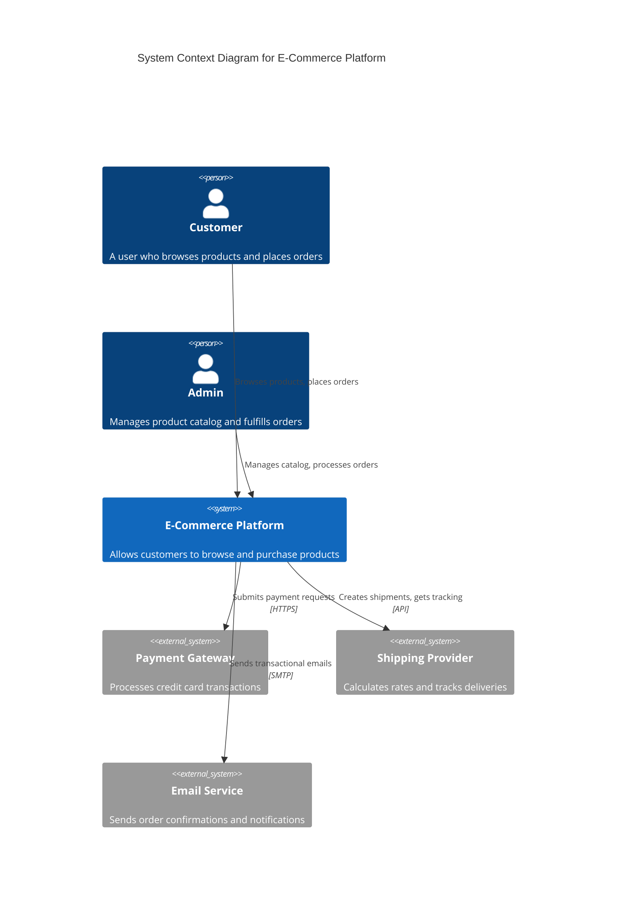
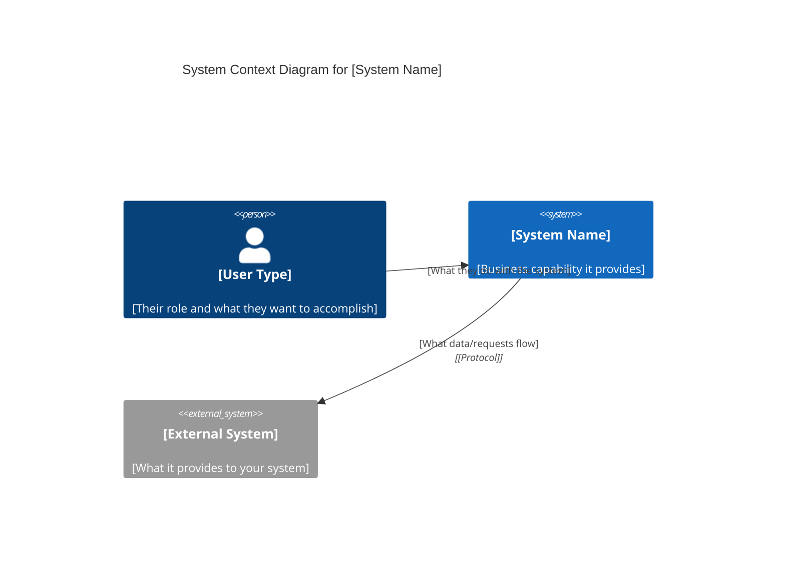
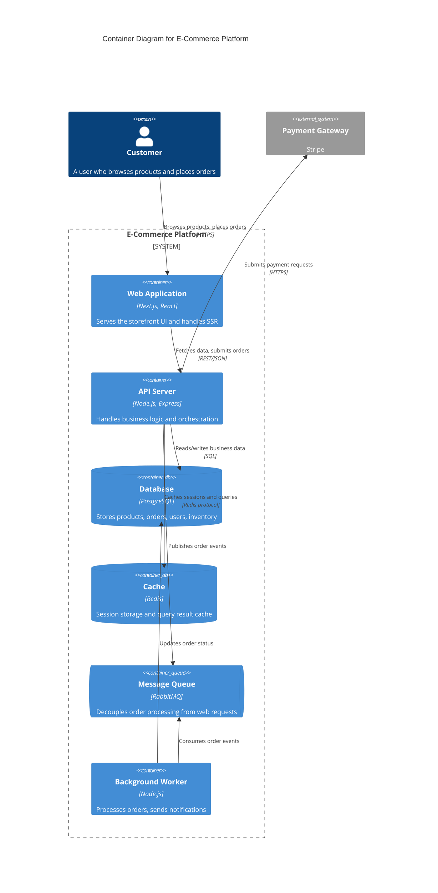
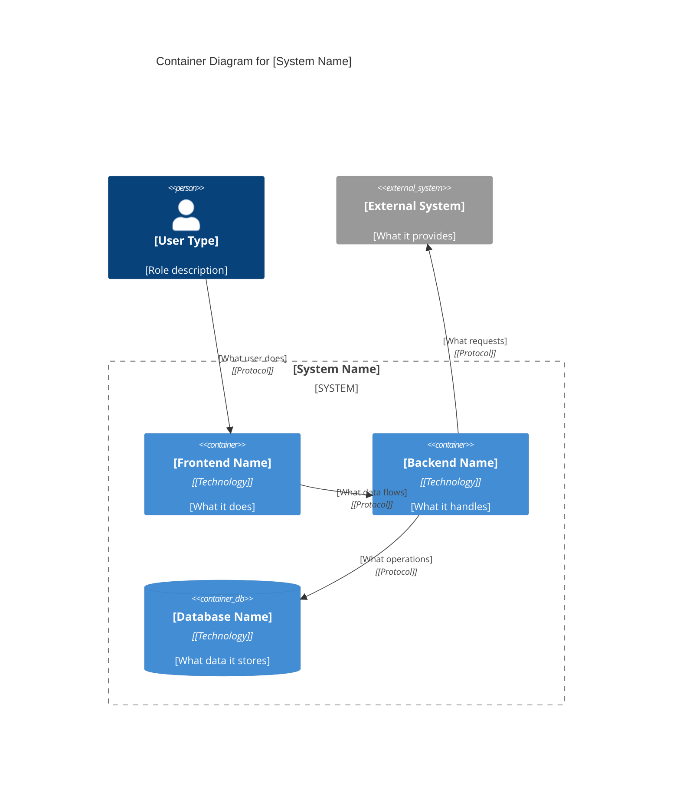
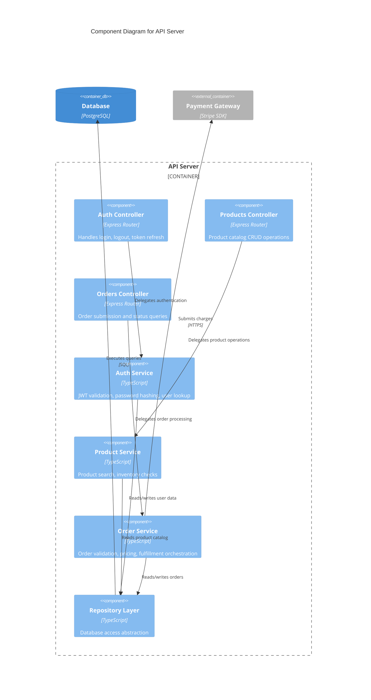
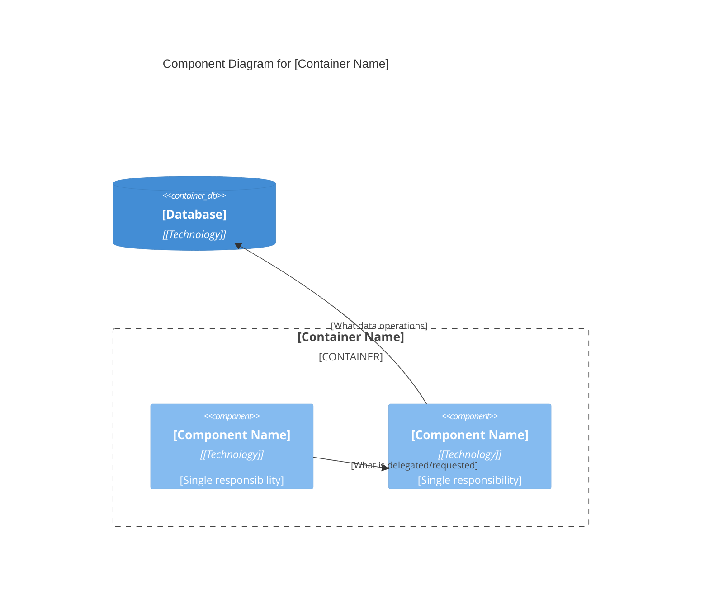

# C4 Model Diagrams with Mermaid

Generate C4 diagrams using Mermaid's C4 syntax. These render in GitHub, VS Code, and most markdown viewers.

## Table of Contents

1. [Purpose and Audience](#purpose-and-audience)
2. [Basics](#basics)
3. [Context Diagram](#context-diagram)
4. [Container Diagram](#container-diagram)
5. [Component Diagram](#component-diagram)
6. [Writing Good Descriptions](#writing-good-descriptions)
7. [Common Mistakes to Avoid](#common-mistakes-to-avoid)
8. [Styling](#styling)
9. [Diagram Checklist](#diagram-checklist)

---

## Purpose and Audience

Each C4 diagram level serves a different audience. Design for your readers.

| Level | Audience | What They Need |
|-------|----------|----------------|
| Context | Everyone (including non-technical) | System scope, who uses it, what it depends on |
| Container | Developers and architects | Technology landscape, deployment units, data flow |
| Component | Developers on specific containers | Internal structure, key abstractions, responsibilities |

**Key principle**: A diagram should be understandable by its intended audience without verbal explanation. If you need to explain it in person, the diagram is incomplete.

---

## Basics

### Required Import

Always start C4 diagrams with:

```
C4Context
```
or
```
C4Container
```
or
```
C4Component
```

### Element Types

| Element | Syntax | Use For |
|---------|--------|---------|
| Person | `Person(id, "Name", "Description")` | Users, actors |
| System | `System(id, "Name", "Description")` | Your system (Context level) |
| System_Ext | `System_Ext(id, "Name", "Description")` | External systems |
| Container | `Container(id, "Name", "Technology", "Description")` | Apps, databases, etc. |
| Container_Ext | `Container_Ext(id, "Name", "Technology", "Description")` | External containers |
| ContainerDb | `ContainerDb(id, "Name", "Technology", "Description")` | Databases |
| ContainerQueue | `ContainerQueue(id, "Name", "Technology", "Description")` | Message queues |
| Component | `Component(id, "Name", "Technology", "Description")` | Internal components |

### Relationships

```
Rel(from, to, "Label")
Rel(from, to, "Label", "Technology")
BiRel(a, b, "Label")  # Bidirectional
```

**Relationship labels should describe what flows through them**, not just that a connection exists:
- Bad: `Rel(api, db, "Uses")`
- Good: `Rel(api, db, "Reads/writes customer orders", "SQL")`

Include protocol/technology when it helps understanding: "REST/HTTPS", "SQL", "gRPC", "WebSocket".

### Boundaries

```
System_Boundary(id, "Label") {
  # elements inside
}

Container_Boundary(id, "Label") {
  # elements inside
}

Enterprise_Boundary(id, "Label") {
  # elements inside
}
```

---

## Context Diagram

Shows system scope, users, and external dependencies. This is the "big picture" view.

### Purpose

Answer these questions:
- What is the system and what does it do?
- Who uses it?
- What external systems does it depend on?
- What external systems depend on it?

### Guidance

- Focus on **what** the system does, not **how** it does it
- Include all distinct user types (customer, admin, support staff)
- Show dependencies on external systems (payment, email, auth providers, etc.)
- **Keep technology details out** - this level is about scope and relationships
- A non-technical stakeholder should understand this diagram

### Example



### Template



---

## Container Diagram

Shows the high-level technology building blocks and how they communicate.

### Purpose

Answer these questions:
- What are the major technology components?
- How do they communicate with each other?
- Where does data live?
- What would a new developer need to understand the tech landscape?

### Guidance

- A **container is a separately deployable/runnable unit** - not specifically a Docker container
- Examples: web application, mobile app, serverless function, database, file system, message queue, batch job
- Show **major technology choices** for each container (framework, language, database type)
- Show data flow direction explicitly in relationship labels
- External people/systems from the Context diagram can appear here for clarity, but outside the system boundary.

### Example



### Template



---

## Component Diagram

Shows the internal structure of a single container.

### Purpose

Answer these questions:
- What are the major abstractions inside this container?
- How do they interact?
- Where does each responsibility live?

### Guidance

- **Only create component diagrams for containers that warrant it** - not every container needs one
- Components should map to **real abstractions in your codebase**: controllers, services, repositories, handlers
- If your component diagram looks like your class diagram, you've gone too deep
- Focus on architecturally significant components, not every class
- Consider: does this diagram help a developer understand the container, or does it just add maintenance burden?

### When to Skip Component Diagrams

- Simple CRUD containers with obvious structure
- Containers that follow a well-known pattern (e.g., standard MVC)
- When the Container diagram already provides sufficient detail

### Example



### Template



---

## Writing Good Descriptions

The description field is critical for diagram clarity. Bad descriptions make diagrams ambiguous.

### By Element Type

| Element | Description Should Include | Bad Example | Good Example |
|---------|---------------------------|-------------|--------------|
| Person | Role and goals | "User" | "Customer who browses and purchases products" |
| System | Business capability provided | "The system" | "Allows customers to manage their finances" |
| Container | Responsibility + key technology | "API" | "Handles authentication and user management" |
| Component | Single responsibility | "Service class" | "Validates orders and calculates pricing" |

### Tips

- Start with a verb: "Handles...", "Stores...", "Processes...", "Sends..."
- Be specific about what data or operations: "Stores customer profiles and order history"
- Avoid circular definitions: don't say "The Auth Service handles authentication"
- If you can't write a clear description, the abstraction might be unclear

---

## Common Mistakes to Avoid

### Vague Relationship Labels

- Bad: "Uses", "Calls", "Sends data"
- Good: "Submits payment requests", "Reads customer profiles", "Publishes order events"

### Missing Descriptions

Every element needs a description. An element without context is ambiguous.

### Technology Overload

Don't list every library. Focus on primary technologies that define the container.
- Bad: "Node.js, Express, Lodash, Moment, Winston, Jest"
- Good: "Node.js, Express"

### Inconsistent Abstraction Level

Don't mix high-level and low-level elements. If you show "Email Service" as a box, don't also show "SMTPTransport" as a separate box in the same diagram.

### Showing Every Relationship

Focus on architecturally significant interactions. Not every function call needs a line.

### Orphan Elements

Every element should have at least one relationship. If it doesn't connect to anything, should it be on this diagram?

### Stale Diagrams

A wrong diagram is worse than no diagram. If you can't maintain it, consider whether you need it.

---

## Styling

CRITICAL: All diagrams MUST follow strict vertical orientation:
- Use "graph TD" (top-down) directive for flow diagrams
- NEVER use "graph LR" (left-right)
- Maximum node width should be 3-4 words
- C4 diagrams have 1-3 shapes in a row, and max two boundaries 

### Update Styles (Optional)

```mermaid
C4Context
    title Styled Diagram

    UpdateElementStyle(customer, $bgColor="blue", $fontColor="white")
    UpdateRelStyle(customer, system, $textColor="red", $lineColor="red")
```

### Layout Direction

```mermaid
C4Container
    title Left to Right Layout

    UpdateLayoutConfig($c4ShapeInRow="3", $c4BoundaryInRow="1")
```

---

## Diagram Checklist

Before finalizing a diagram, verify:

### All Diagrams

- [ ] Title follows pattern: "[Diagram Type] for [System/Container Name]"
- [ ] Every element has a meaningful description
- [ ] Every relationship has a label describing what flows through it
- [ ] External systems/people are marked with `_Ext` suffix
- [ ] No orphan elements (everything has at least one relationship)
- [ ] Diagram is understandable without verbal explanation

### Context Diagrams

- [ ] All user types are represented
- [ ] All external system dependencies are shown
- [ ] No technology details (save for Container level)
- [ ] A non-technical person could understand the scope

### Container Diagrams

- [ ] Each container is a separately deployable unit
- [ ] Technology choices are shown for each container
- [ ] Data stores are clearly identified (database vs cache vs queue)
- [ ] Data flow direction is clear from relationship labels

### Component Diagrams

- [ ] Components map to real code abstractions
- [ ] This diagram adds value beyond the Container diagram
- [ ] Not too granular (not a class diagram)
- [ ] Only created for containers that warrant this detail
