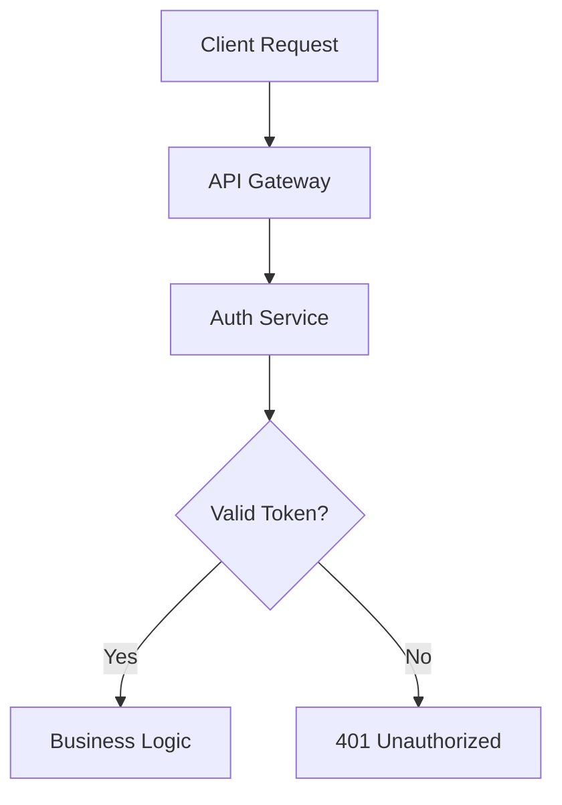
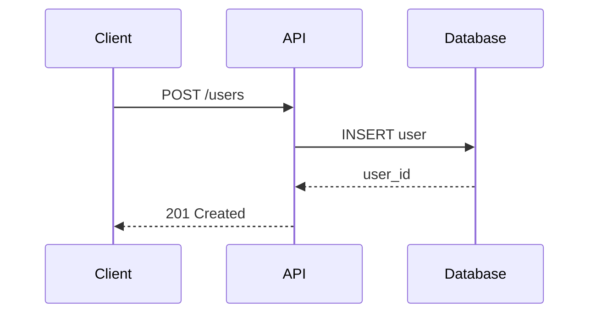
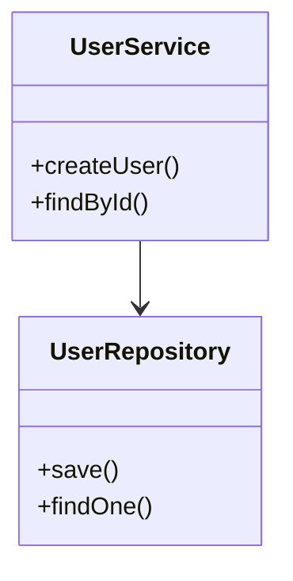
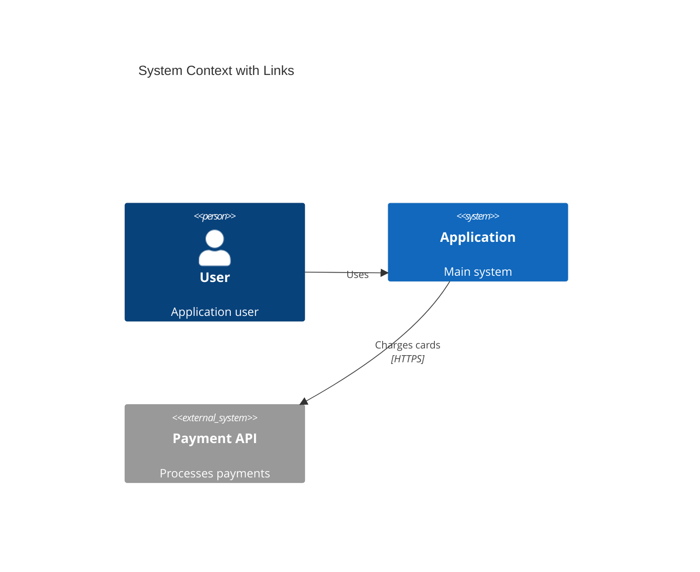
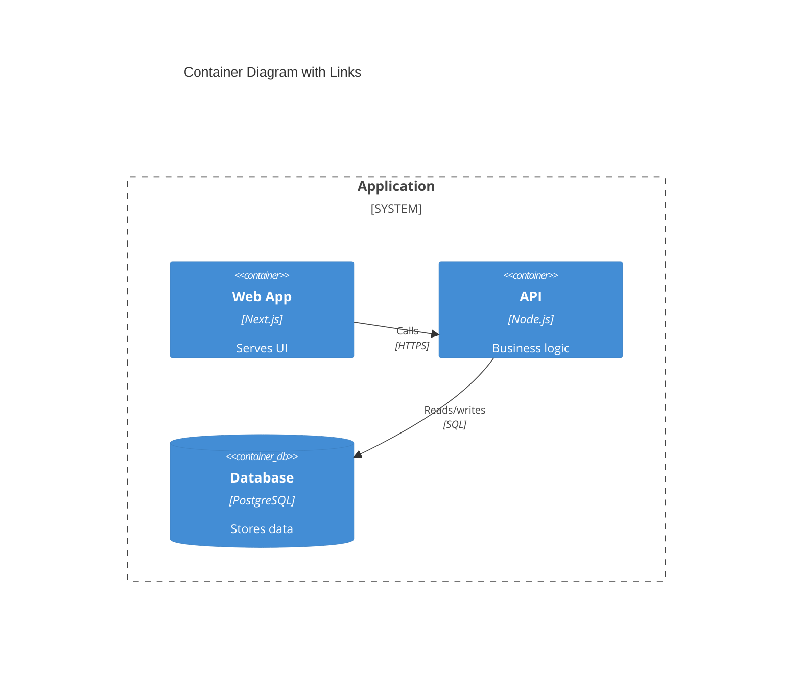
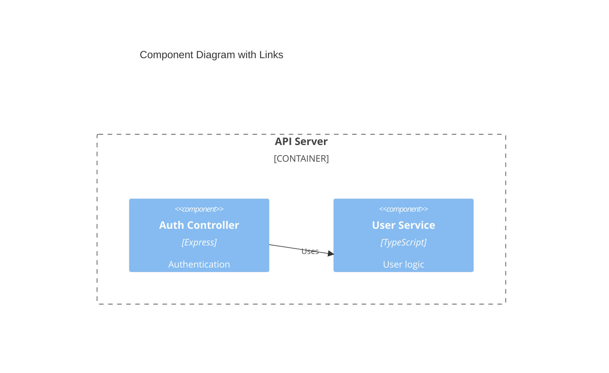

# Documentation Referencing

Create richly interconnected documentation allowing readers to navigate seamlessly between concepts, source code, and supporting documents.

## Core Principle

Every significant concept, component, function, class, or configuration MUST link to:
1. Its implementation in source code
2. Related sections in the documentation
3. Supporting documents (specs, designs, external references)

## Reference Density

- 3-5 hyperlinks per major section minimum
- Each code concept links to its source
- Each architectural term links to its definition
- Cross-link bidirectionally: if A mentions B, B should mention A

## Link Formats

### Source Code (GitHub)

```
Single line:   https://github.com/{org}/{repo}/blob/{branch}/{path}#L{line}
Line range:    https://github.com/{org}/{repo}/blob/{branch}/{path}#L{start}-L{end}
Whole file:    https://github.com/{org}/{repo}/blob/{branch}/{path}
```

Examples:
```markdown
The [`authenticateUser()`](https://github.com/org/repo/blob/main/src/auth/login.ts#L45-L78) function handles OAuth2 token validation.

Request flow: [`validateInput()`](https://github.com/org/repo/blob/main/src/api/validators.ts#L23-L45) → [`processRequest()`](https://github.com/org/repo/blob/main/src/api/handlers.ts#L67-L102) → [`formatResponse()`](https://github.com/org/repo/blob/main/src/api/formatters.ts#L15-L38).
```

### Documentation Cross-References

```
Same file:       [Link Text](#header-anchor-id)
Same directory:  [Link Text](other-file.md#header-anchor-id)
Different dir:   [Link Text](../path/to/file.md#header-anchor-id)
```

Anchor generation: lowercase, spaces→hyphens, special chars removed.
- `## System Architecture` → `#system-architecture`
- `### 1. Authentication Flow` → `#1-authentication-flow`
- `## API Endpoints & Routes` → `#api-endpoints--routes`

### PDF and Word Documents

Include page numbers in link TEXT (not URL):
```markdown
[Technical Specification (p. 24)](../specs/technical-spec.pdf)
[Database Design (pp. 12-18)](../design/database-design.docx)
[Security Guidelines (Section 4.2, pp. 31-35)](../compliance/security-guidelines.pdf)
```

## Mermaid Diagrams with Clickable Nodes

Different diagram types use different syntax for interactivity:

### Flowcharts

Use `click NodeId "URL" "tooltip"` after node/edge definitions:



### Sequence Diagrams

Use `link ParticipantId: Label @ URL` syntax:


### Class Diagrams

Use `click ClassName href "URL" "tooltip"` (requires `href` keyword):


### C4 Diagrams (Context, Container, Component)

Use the `$link` parameter at the end of element definitions:

```
Person(alias, "Label", "Description", $link="URL")
System(alias, "Label", "Description", $link="URL")
Container(alias, "Label", "Technology", "Description", $link="URL")
Component(alias, "Label", "Technology", "Description", $link="URL")
```

Context diagram example:


Container diagram example:


Component diagram example:


## Tables with Links

| Component | Description | Source | Documentation |
|-----------|-------------|--------|---------------|
| [`AuthService`](https://github.com/org/repo/blob/main/src/auth/service.ts#L15-L120) | Authentication | [auth/service.ts](https://github.com/org/repo/blob/main/src/auth/service.ts) | [Authentication](#authentication) |
| [`DataProcessor`](https://github.com/org/repo/blob/main/src/core/processor.ts#L1-L200) | Data transformation | [core/processor.ts](https://github.com/org/repo/blob/main/src/core/processor.ts) | [Data Processing](./data-processing.md) |

## Citation Blocks

End each major section with a Sources block:

```markdown
**Sources:**
- [`src/auth/service.ts:L15-L85`](https://github.com/org/repo/blob/main/src/auth/service.ts#L15-L85) - Authentication service
- [`config/auth.yml`](https://github.com/org/repo/blob/main/config/auth.yml) - Auth configuration
- [Security Guidelines (pp. 31-35)](../compliance/security-guidelines.pdf) - Compliance requirements
- [API Security](#api-security) - Related documentation section
```

## Best Practices

- Use descriptive link text; avoid "click here"
- Prefer specific line ranges over whole-file links
- Use branch references (main/develop) rather than commit SHAs
- Add tooltips to Mermaid click statements
- Group related links at section ends
- Use consistent URL patterns throughout
