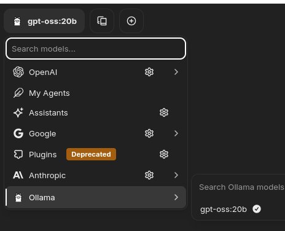
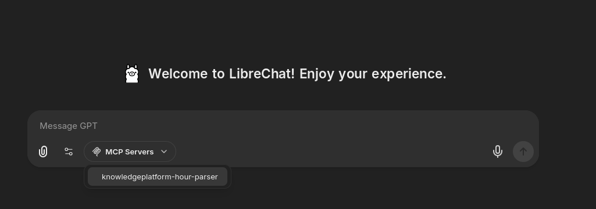

# Studio App

This repo contains a self-contained deploy-ready studio app. Although most components are imported, like the chat-ui ([Librechat](https://www.librechat.ai/)). 

There is still some custom source-code for the MCP & RAG server (Todo!), which fetches from our custom databases.


## System requirements ...

**These are the requirements for deployment:**

- NVIDIA cuda capable card (with atleast >= 12 GB VRAM)

- Docker with nvidia-container toolkit configured: [See this guide from Nvidia ...](https://docs.nvidia.com/datacenter/cloud-native/container-toolkit/latest/install-guide.html)

- Intel/AMD x86_64 capable machine

- Linux (preferably debian-based)

**These are the requirements for developing:**

- Intel/AMD x86_64 or ARM 64-bit capable machine

- Linux/Windows/Mac are supported

**Why does this matter?** 

**If you're only working with the python source-code and don't need LLM inference** -> You can run the app within pixi environment without touching cuda. 

**But if you need to have LLM inference** -> you'll have to run the deploy config using docker compose.

## Getting started for development
Three steps:

1. [Install Pixi on your computer, if you haven't already](https://pixi.sh/latest/installation/)

2. Open a terminal window, browse to the root of this repo. And run:
```bash
pixi shell
```

3. Open any editor, you would like to use from this windows (*except pycharm):

e.g. vscode (you might need to add to path in Mac OS -> CTRL+SHIFT+P -> Add to path): 
```bash
code .
```

## Getting started for deployment (debian)
1. Check if deployment machine has Nvidia GPU and drivers installed, it should show something like this when running `nvidia-smi`:
```bash
~/studio$ nvidia-smi
Wed Oct  1 11:24:38 2025       
+---------------------------------------------------------------------------------------+
| NVIDIA-SMI 535.216.01             Driver Version: 535.216.01   CUDA Version: 12.2     |
|-----------------------------------------+----------------------+----------------------+
| GPU  Name                 Persistence-M | Bus-Id        Disp.A | Volatile Uncorr. ECC |
| Fan  Temp   Perf          Pwr:Usage/Cap |         Memory-Usage | GPU-Util  Compute M. |
|                                         |                      |               MIG M. |
|=========================================+======================+======================|
|   0  NVIDIA GeForce RTX 4080        Off | 00000000:01:00.0 Off |                  N/A |
|  0%   39C    P8              15W / 320W |      1MiB / 16376MiB |      0%      Default |
|                                         |                      |                  N/A |
+-----------------------------------------+----------------------+----------------------+
                                                                                         
+---------------------------------------------------------------------------------------+
| Processes:                                                                            |
|  GPU   GI   CI        PID   Type   Process name                            GPU Memory |
|        ID   ID                                                             Usage      |
|=======================================================================================|
|  No running processes found                                                           |
+---------------------------------------------------------------------------------------+

```
If command unrecognized? -> [Nvidia driver wiki debian](https://wiki.debian.org/NvidiaGraphicsDrivers)

2. Prepare environment:
    1. Place your typedb exported: knowledgeplatform-data.tar.gz file in data/ folder (create folder if it doesn't exist).
    
    2. Copy .env.sample to .env
    
    3. Copy librechat.variant.han.yaml to librechat.yaml

3. Install docker & docker-container-toolkit (if you haven't already):

```bash
# Add Docker's official GPG key:
sudo apt-get update
sudo apt-get install ca-certificates curl
sudo install -m 0755 -d /etc/apt/keyrings
sudo curl -fsSL https://download.docker.com/linux/debian/gpg -o /etc/apt/keyrings/docker.asc
sudo chmod a+r /etc/apt/keyrings/docker.asc

# Add the repository to Apt sources:
echo \
  "deb [arch=$(dpkg --print-architecture) signed-by=/etc/apt/keyrings/docker.asc] https://download.docker.com/linux/debian \
  $(. /etc/os-release && echo "$VERSION_CODENAME") stable" | \
  sudo tee /etc/apt/sources.list.d/docker.list > /dev/null
# Do the same for Nvidia container toolkit
curl -fsSL https://nvidia.github.io/libnvidia-container/gpgkey | sudo gpg --dearmor -o /usr/share/keyrings/nvidia-container-toolkit-keyring.gpg \
  && curl -s -L https://nvidia.github.io/libnvidia-container/stable/deb/nvidia-container-toolkit.list | \
    sed 's#deb https://#deb [signed-by=/usr/share/keyrings/nvidia-container-toolkit-keyring.gpg] https://#g' | \
    sudo tee /etc/apt/sources.list.d/nvidia-container-toolkit.list
sudo apt-get update
# Install both docker and the toolkit
export NVIDIA_CONTAINER_TOOLKIT_VERSION=1.17.8-1
  sudo apt-get install -y \
      nvidia-container-toolkit=${NVIDIA_CONTAINER_TOOLKIT_VERSION} \
      nvidia-container-toolkit-base=${NVIDIA_CONTAINER_TOOLKIT_VERSION} \
      libnvidia-container-tools=${NVIDIA_CONTAINER_TOOLKIT_VERSION} \
      libnvidia-container1=${NVIDIA_CONTAINER_TOOLKIT_VERSION} \
      docker-ce docker-ce-cli containerd.io docker-buildx-plugin docker-compose-plugin
```

4. After installation run the docker-container-toolkit config command:

```bash
sudo nvidia-ctk runtime configure --runtime=docker
# Restart docker
sudo systemctl restart docker
```

5. Now start the containers, by running in root of cloned repo:

```bash
sudo docker compose up
```

6. If running for first time, you need to download the llm model manually, till it's patched into toolchain. You do this by opening another window or ssh session and run:

```bash
sudo docker exec --it studio-ollama-1 bash
```

This opens a shell inside the ollama container and pull the model using the ollama pull command:

```bash
ollama pull gpt-oss:20b
```

Wait till it's finished, after its done, close the shell and continue the guide.

```bash
exit
```

7. Open a webbrowser and head to: ```http://<IP_ADDR>:3080```. Register for account and login. 

8. To use the gpt-oss model:


Now you can also register the MCP server and you should be done.

9. Register the MCP server:



You should now be able to ask something about your hours (in Dutch or English):

```
Can you give me a weekly summary of my hours in 2024? My e-mail is: example@example.com 
```

## Some implementation details

This project uses the librechat ui interface, which also calls the LLM engine. Although custom frontend was suggested, for now this is easily accesible way to get the information we need atm. 

Librechat supports both the MCP protocol and qdrant vector database protocol and is configurable using the `librechat.yaml` configuraton file.

Docker is used to deploy it quickly, it now contains:

- MCP server (src code in src/studio) (debian container, which runs the python script) listening on 0.0.0.0@8000

- TypeDB 2.29 server: Runs typedb server with custom hook that initializes the DB on first setup by importing `data/knowledgeplatform-data.tar.gz`. Listens on 0.0.0.0@1729

- Ollama inference engine: Nvidia edition ollama listens on 0.0.0.0@11434

- RAG server: (Librechat provided, todo replace/make compatible). Listens on 0.0.0.0@8000 (should be changed)

- Mongo -> for chat history, listens on deamon mode

- VectorDB: (vectordb) -> listens on daemon mode

- Librechat webui -> listens on 0.0.0.0@3080

The MCP server source code is in src/studio.
