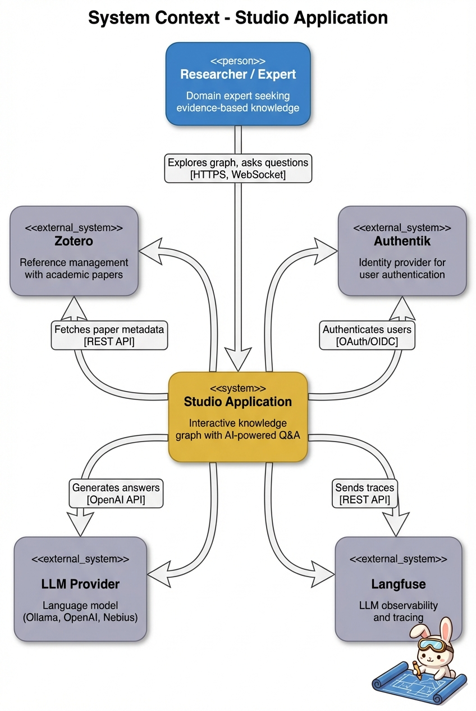
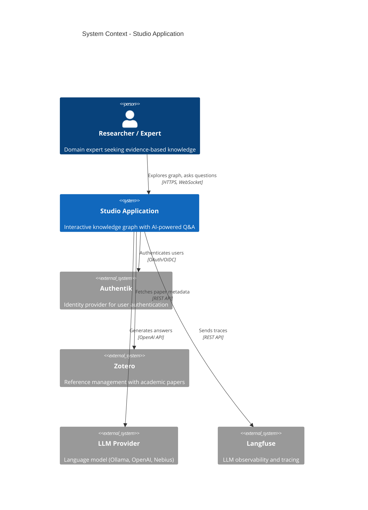

# 1. Context

This chapter provides the big picture view of the Studio application, including its purpose, users, and how it fits into the broader ecosystem.

## 1.1 System Purpose

**Studio** is an interactive knowledge platform that combines a domain specific knowledge graph with AI-driven information retrieval. The application combines the "human in the loop" design principle, by curating data and information via domain experts on the ingestion side, with emerging possibilities of generative artificial intelligence on the output side. In this way, the application aims to provide intuitive and easy access to trivial data and information, stored across different source databases. 

Furthermore, it aims to enable non-expert users to explore complex topics and connected data through an intuitive user interface. Receiving evidence-based, and verifiable answers, backed by curated, expert knowledge and information. The design of the application intends to make otherwise hard to obtain data and information, stored in different sources, accessible in the context of where and when non-experts users need (pieces of) it.

For this design principle a knowledge graph is manually constructed based on qualitative research such as interviews with domain experts, surveys, and UX-testing. This model is used to provide context to an LLM by Retrieval Augmented Generation (RAG). The domain specific concepts and relationships modelled in the knowledge graph, are also leveraged as a "roadmap" in the UI. This should enable users to explore and provides context to the data and information needed to answer their questions.

## 1.2 Problem Space

### 1.2.1 High access thresholds  

The thresholds to access data and information for non-expert users about your own organisation, projects, themes, expertise, problem domains, etc. are often high. They require a lot of navigation and clicks, going back and forth through folders and teams in Microsoft SharePoint. Or they are "hidden" by overly complex and archaic user interfaces of ERP, CRM or e-HRM systems. All with their own individual interface. Or you simply do not know where to look for certain pieces of information and it takes  weeks of (luke)warm networking to know where to look or who to talk to.

### 1.2.2 Answering questions requires exploration

One of the assumptions behind the application is that many questions require exploration and that many answers lead to new questions. Straightforward questions might not need much exploration. How many vacation days you have left, is a simple number. But many other questions require different pieces of information to be related to each other, so that the person asking the question can interpret the information to generate an answer.

Take for example policy makers on energy poverty working for a municipality. They might want to know what other municipalities are doing to counter it. To start from an overview in which general paths, directions and themes are explored, then narrow down to intervention strategies that fit the specific problem and circumstances, requires interactive exploration and interpretation of different kinds of information. Currently, this way of interacting with domain specific data and information is very time consuming and often  requires lot's of (domain) expertise.

The same problem also also manifests in the situation of the of the employee, who might want to know with what partners its organisation works with in the energy sector. An overview of the projects that the organisation is doing with an interesting partner, might lead the employee in the right direction to contact the right person much faster then he would be able normally. 

### 1.2.3 Distance of Information is often large

Data and information about a certain topic might be scattered among many places and people. Take for example policy makers on a topic such as energy poverty in Europe. Through their warm social network they can share experiences, knowledge, information and sometimes maybe even data, but there are many different approaches and methods all over Europe. Applied by national, regional and local government. Lot's of NGO's are involved. All researched by research institutions, publishing scientific articles on the subject. Sharing and accessing this kind of knowledge and information on specific domains is currently (humanly) impossible for these policy makers.

Again, the same principle holds for the employee in an organisation. Often, different departments or other separated entities within a company do not share knowledge and expertise in an interactive and continuous way, leading to working across purpose, opportunities being missed and time delays in all kind of simple operations. This all depends on social distance of information. Exaggerating somewhat: if you do not work in related fields, you do not know what others are doing, what they are working on and with whom they are collaborating. If these distances are digitally reduced and (partly) automated, simple problems like knowing who to contact for what, as mentioned above, would take factors less time.

## 1.3 Solution Space

### 1.3.1 Lowering thresholds

The purpose of the user interface of the application is have one single interface from which you can access multiple data sources, connected by the knowledge graph. The knowledge graph is tailored on the use cases and user stories of a specific domain, fetching and connecting the specificity of relevant data and information. The user interface of the application consists of two main modalities: a chat interface and a visualisation of the knowledge graph next to it, by which the user can navigate the connection of data and information.

Take for example an project lead of a large organisation, who wants to know what employee has worked how many hours on a certain project adn how many hours remain in the project. Often, this means that the project lead needs to ask an ERP expert to pull the needed data out of the ERP and deliver it to him. Or, in a less bad scenario, the project lead has been educated in the user interface of the ERP and he/she/them can do it autonomously by clicking through an often overly complicated and archaic UI. Having a central landing platform where this data is connected as a proces or scenario, the project lead only needs to ask the question in the chat and the application does the rest in providing an answer.

In this way, the application lowers thresholds of labour intensive user interfaces and gatekeepers.

### 1.3.2 Facilitate exploration and navigation of data and information

Isolated data and information do not have meaning. In the example given above, a number doesn't mean anything to the project lead if it is not situated within the context information that this numbers are hours worked, of the specific employee  on the specific project. The same number would have different meaning to the project lead if it was another project or another employee.

And this is a relative simple question, revolving around numbers. Imagine the same project lead, needing specific data scientist for a project in the energy sector. Looking for colleagues with the right profile is something that needs to be assessed and interpreted. He/she/them might need specific data science skills, like training neural networks, might also want this data scientist to have applied his skills in the energy sector itself. Or even more specific: on grid management.

To get an idea on who would fit this profile, different kind of sources could contribute: previous employers, recent projects, the department a person works, etc. The application offers a change to navigate these sources of information by visualising the "data and information landscape" with an interactive knowledge graph, where the user can narrow or broaden the paths and directions of needed information. Secondly, the application facilitates this with chat interface in which the user can ask follow-up questions given an answer and brainstorm with the LLM on relevance, ideas and reflection.

It is then up to the user when enough information is given for the user to be able act on it's question. This does not mean that the given information by the platform needs to be 100% complete or accurate, all the time. The user just needs enough information pertaining to the question(s) asked, so that the user can act faster then she/them/he would be able without the application.

### Reducing data and information distance

Combining the knowledge graph with retrieval augmented generation, the application should reduce the distance of information. The knowledge graph functions as a database, a map for use cases that connects the data in a meaningful way per use case and as filter and structure for the RAG input. This ensures that the user can control the RAG context input to be be broadened or narrowed down, by navigating the knowledge graph. i

Furthermore, the structure of the knowledge graph enables the connection of different kind of source databases and connects the data or information drawn from these sources in a meaningful way for the user. So instead of networking and searching the internet for disconnected pieces of information, scraped from different texts and databases in order to form a picture, this relational context is already mapped to a certain degree by the knowledge graph and further refined and interpreted in interaction with an LLM via the chat interface.

Referring to the policy maker on energy poverty example, this policy maker can navigate the graph towards specific target groups (say elderly citizens), combined with specific intervention strategies (say, financial interventions) to understand what the biggest thresholds are for this group to apply for existing funding for renovation. Navigating towards this specificity with the graph in the UI, inherently selects more specific context information that is fed to the LLM, making the answers more specific and better traceable.

## 1.4 Users and Stakeholders

### 1.2.1 Primary Users 

| User Type | Description | Goals |
|-----------|-------------|-------|
| non-experts | Users that need access to data and information that otherwise is highly inaccessible due to a lack of purposeful situatedness, scattered over different sources, and/or highly complex user interfaces. | Intuitive and easy access to data and information, scattered in different sources, pertaining to a specific domain and/or use cases and user stories.
| ... | ... | ... |

### 1.2.2 Stakeholders --> needs revision

| Stakeholder | Interest |
|-------------|----------|
| Larger organisations | Offer easy and intuitive access for employees to data and information stored in different expert systems |
| Research institutions, departments and projects | Fast, intuitive and easy access to literature, project documents and information sharing |
| IT Operations | Deploy, maintain and monitor the system |
| Curators | Pre-selected domain experts charged with maintaining and updating the data and information quality in the graph database |

## 1.3 System Context Diagram

Mermaid source

## 1.4 External Systems

### 1.4.1 Authentik (Optional)

**Type**: Identity Provider

**Purpose**: Provides OAuth/OpenID Connect authentication for user access control.

**Integration**: The backend uses Authentik for login/logout flows. When not configured, the system operates with default development credentials.

**Why Authentik**: Open-source, self-hosted identity provider that supports OAuth/OpenID Connect.

### 1.4.2 Zotero

**Type**: Reference Management System

**Purpose**: Stores and organizes academic papers and their metadata.

**Integration**: The MCP server queries Zotero by tags to find papers relevant to user questions. Paper keys are used to filter vector search results.

**Why Zotero**: Widely used in academia, good API, supports group libraries for collaborative collections.

### 1.4.3 TypeDB

**Type**: Graph database and knowledge graph

**Purpose**: Situates relevant data and document reference into domain context, maps expert domain knowledge to end users

**Integration**: The MCP server queries TypDB

**Why TypeDB**: Intuitive, direct and rich knowledge graph modelling/programming

### 1.4.4 Qdrant

**Type**: Vector search engine and database

**Purpose**: Used to relate documents stored in the graph database with it's vectorised version and feed as RAG input 

**Integration**: The MCP server queries the graph database. Related vectors are retrieved and use as RAG input 

**Why Qdrant**: Open source, convienient API

### 1.4.5 Large Language Model

**Type**: Cloud hardware provider for running large language models. 

**Purpose**: Used to implement retrieval augmented generation and interact with users in natural language.

**Supported Providers**:

- **Nebius** - Cloud hardware provider, hosting open source large language models

**Integration**: The LLM Worker uses the OpenAI-compatible API to communicate with any provider.

### 1.4.6 LLM Provider

**Type**: Cloud hardware provider for running large language models. 

**Purpose**: To have the hardware available to run market leading LLM's, providing significally better performance over models that can run locally

**Supported Models**:

- All opens source models
- Any commercial model with licensed API-key
 

**Integration**: ???

### 1.4.7 Langfuse 

**Type**: LLM Observability Platform

**Purpose**: Traces LLM and logs calls for debugging, analytics, and cost tracking. Used to perform (UX and data science) research on infromation accuracy and user satisfaction. 

**Integration**: The LLM Worker sends traces via Langfuse callbacks. When not configured, tracing is disabled.

## 1.5 Scope

### 1.5.1 In Scope

| Capability | Description |
|------------|-------------|
| Graph database and knowledge graph | Situates data and information in the context domain and providing RAG-input |
| Knowledge Graph Visualization | Display and navigate domain concepts situated in the knowledge graph  |
| Vector search | Vector search on data, information and structure stored in the knowledge graph, based on user questions |
| Retrieval augmented generation| Feed large language model with context information to improve informsation quality in generated answers |
| AI Chat Interface | Natural language question answering |
| Upload interface for curators | Document upload interface for curators (domain experts) enabling them to position new documents in the knowledge graph |
| User Authentication | OAuth/OpenID-based access control |
| Real-time Streaming | Stream LLM responses to users |

### 1.5.2 Out of Scope

| Capability | Reason |
|------------|--------|
| Graph Editing | Read-only for initial release |
| Multi-tenant Support | Single organization deployment |
| Mobile App | Web-first approach |
| Export/Reporting | Focus on interactive exploration |

## 1.6 Key Quality Goals

| Priority | Quality | Description |
|----------|---------|-------------|
| 1 | Usability | Intuitive interface for non-expert users |
| 2 | Responsiveness | Fast perceived performance via streaming |
| 3 | Accuracy | Evidence-based answers with citations |
| 4 | Flexibility | Support multiple LLM providers |
| 5 | Deployability | Containerized deployment |

## 1.7 Technology Summary

| Layer | Technologies |
|-------|-------------|
| Frontend | React 19, Vite, TailwindCSS, shadcn/ui, React Flow, Jotai |
| Backend | FastAPI, Python 3.12, python-socketio, authlib |
| AI/ML | LangChain, MCP, sentence-transformers, Langfuse |
| Data | Qdrant (vectors), JSON (graph), Zotero (bibliography), TypeDB |
| Infrastructure | Docker, Pixi, Docker Compose |

## 1.8 Assumptions

1. Users have modern web browsers with JavaScript enabled
2. The knowledge graph is pre-created and relatively static
3. Literature is indexed in Zotero
4. Network connectivity is available to external services
5. LLM provider is accessible (local Ollama or cloud API)

## 1.9 Risks

| Risk | Impact | Mitigation |
|------|--------|------------|
| LLM provider unavailable | Users cannot get answers | Support multiple providers, graceful error handling |
| Qdrant not populated | No text citations | Document data ingestion requirements |
| Session data loss on restart | User loses chat history | Document limitation, consider persistent storage |
| Default OAuth credentials in code | Security vulnerability if deployed | Require production configuration, remove defaults |
