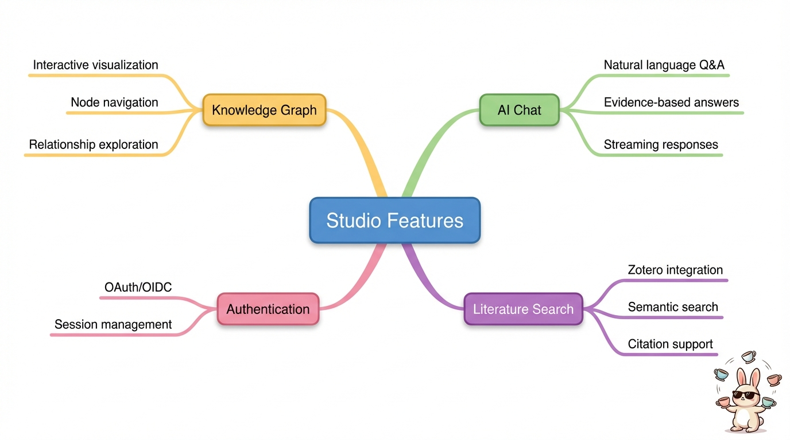
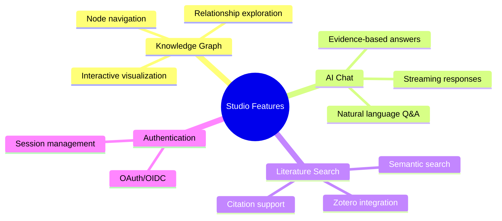
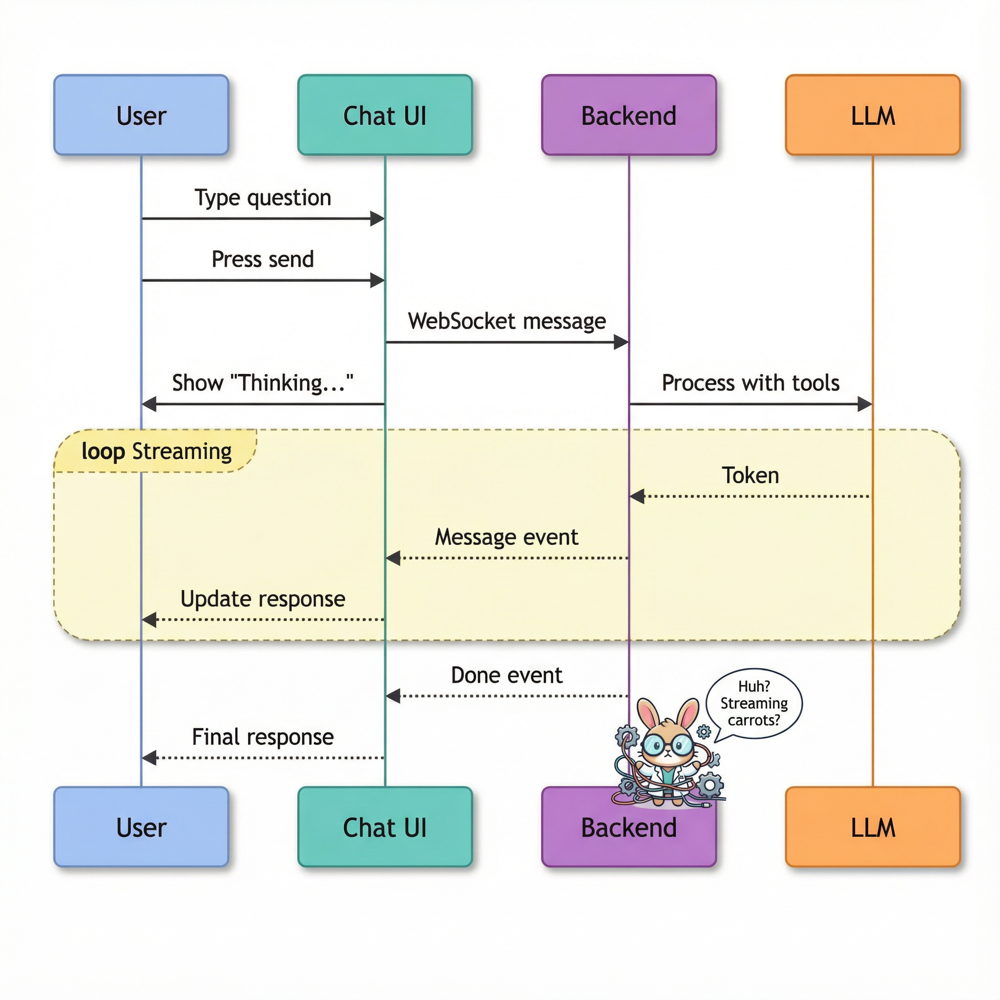
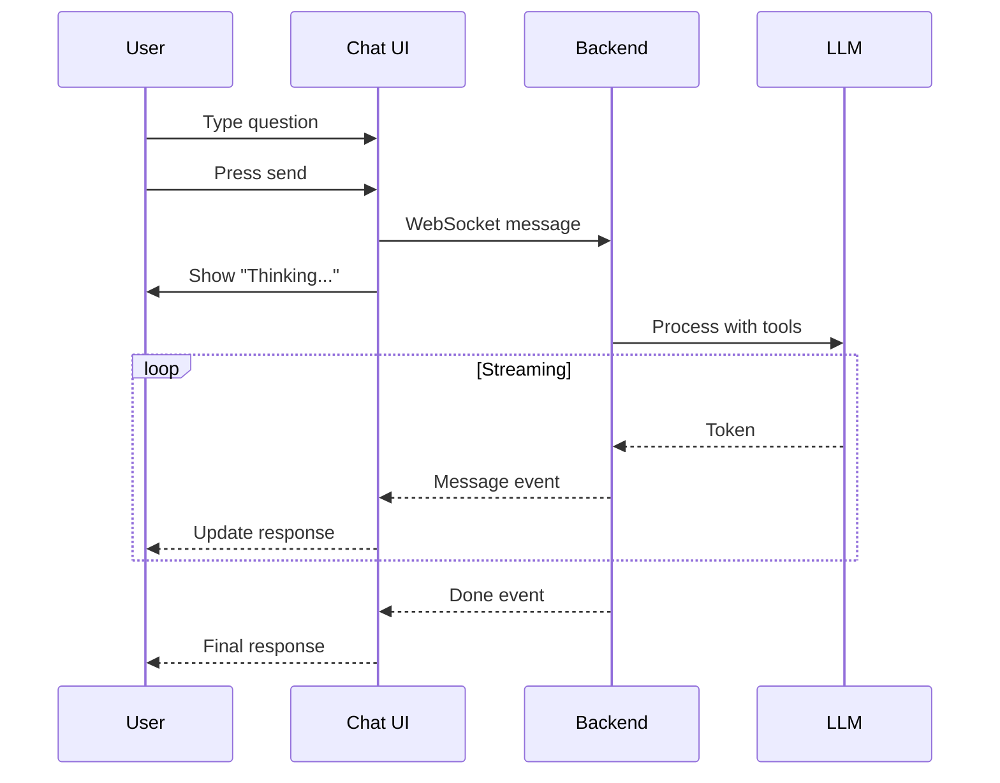
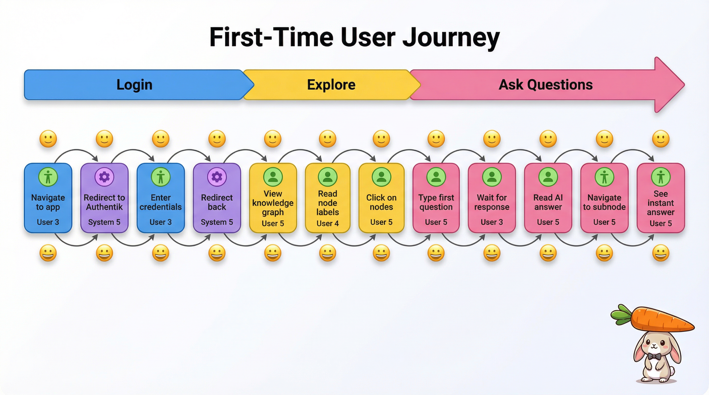
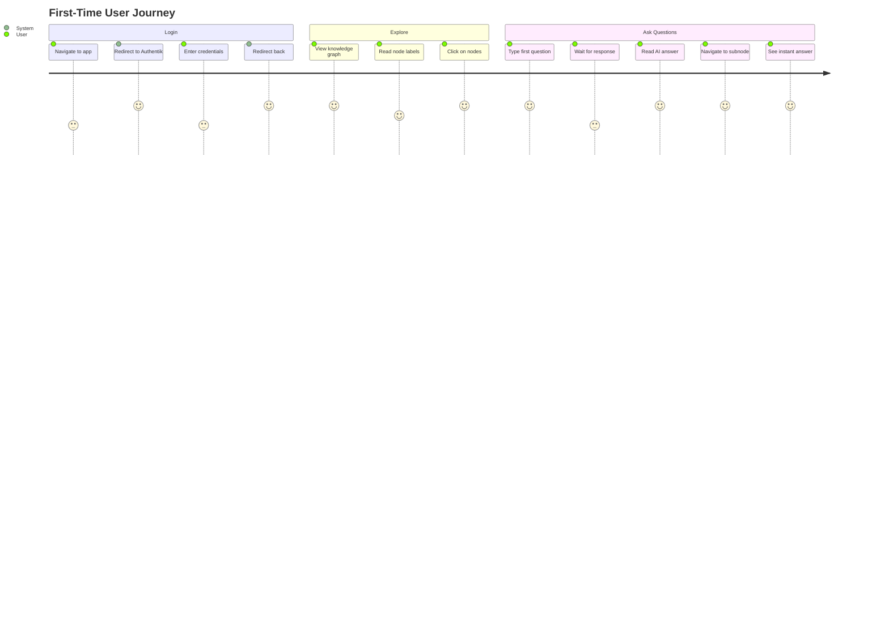
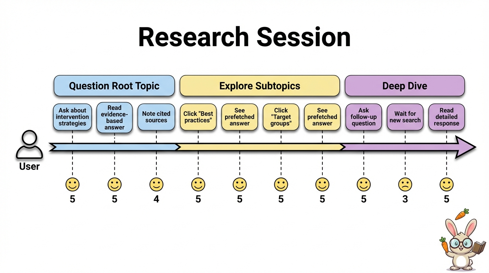
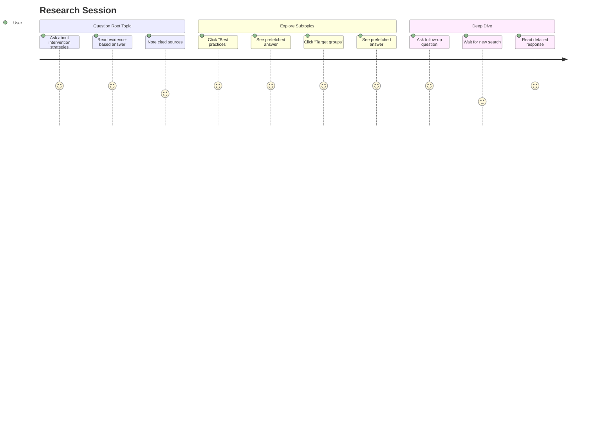

# 2. Functional Overview

This chapter provides an overview of the key features and capabilities of the generic features of the application.

## 2.1 Core Features

The application provides an interactive knowledge platform with AI-powered (RAG) question answering.

**NB: TODO1: Missing connectivity to different  source databases, needs to be added**

**NB: TODO2: literature search needs to be changed into "Upload interface for curators**

**NB: TODO3: RAG needs to be added somewhere. Could be under "AI Chat" but could also be a individual "node"

Mermaid source

## 2.2 Feature Details 
### 2.2.1 Graph database and Knowledge Graph: back-end

On the back-end side the TypeDB schema provides a manually constructed knowledge graph database. This models the domain and it's specific userpersonas, processes, theme's, organisational forms, documentation, etc.: it models the domain specific situatedness of the data and information. As such, it extracts this form different sources and pipelines and structures it. I may duplicate data form source or query the source at run time.

A user question is matched with a specific tool call of the MCP-server. The graph database is queried by this MCP-tool. The retrieved data and information is then send as input for use with RAG to generate a response based on this narrowed information (i.e. information contained in the selected sub graph).

**Capabilities**:

- Connects and structures data from different source databases
- References vectorized texts stored in Qdrant through hash values 
- Feeds RAG with queried data, information and related texts

**Implementation**:

- TypeDB 

### 2.2.2 Graph database and Knowledge Graph: front end
The front end of the application renders a visualisation of the knowledge graph, relevant to the question of the user in the chat interface. Users can explore this graph visually and dynamically by clicking on nodes, navigating their path trough the information  the graph database, hereby automatically "selecting a sub graph of information", specific to their question and information needs. 

**Capabilities**:
- View TypeDB enities as nodes
- See relationships (and optionally roles) between entities as edges
- Click nodes to navigate and get context
- Selected sub graph (pathways) determine contextual RAG input 
- Responsive chat messages upon node clicks used to determine (sub graph) choices (and vice versa)
- Resizable split-panel layout

**Implementation**:
- React Flow for graph rendering ([`src/frontend/src/graph.jsx`](https://github.com/AIM-kennisplatformen/studio/blob/main/src/frontend/src/graph.jsx))
- Graph data loaded from JSON ([`example-data.json`](https://github.com/AIM-kennisplatformen/studio/blob/main/src/frontend/src/knowledge-graph/example-data.json))

### 2.2.2 Retrieval augmented generation chat interface

Parallel to the graph interface the application has chat interface, in which the user can interact with an LLM in natural language. The interaction between the graph and chat interfaces determines the subset of information that will be used as contextual RAG input from which the answer to a question is generated. 

**Capabilities**:
- Users can ask natural language questions
- Receive streaming responses in real-time
- Responses cite relevant texts
- Cited texts can be viewed
- [under development] Chat dynamically interacts with graph UI (an vice versa) and refines sub-graph selection 

- Logs chat sessions and sessions can be re-selected

### 2.2.4 Integrated AI-powered tutorials

### 2.2.5 User Authentication

Optional OAuth authentication via Authentik.

**Capabilities**:
- Login via external identity provider
- Session-based authentication
- Automatic redirect for protected resources
- Logout functionality

## 2.3 User Flow

Mermaid source

### 2.2.3 Curated upload interface

## 2.4 User Journeys

### 2.3.1 First-Time User --> reverse ask question and explore or better: To separate but interacting paths

Mermaid source

### 2.3.2 Research Session

Mermaid source

## 2.4 Feature Matrix

| Feature | Status | Implementation |
|---------|--------|----------------|
| Knowledge graph visualization | Complete | React Flow |
| Node click navigation | Complete | Graph endpoint |
| AI chat interface | Complete | Socket.IO + LLM Worker |
| Streaming responses | Complete | SSE + WebSocket |
| Vector search | Complete | Zotero + Qdrant |
| MCP-tools | Complete | Chat interface calls MCP tools, MCP queries TyeDB |
| OAuth authentication | Complete | Authentik |
| Chat history persistence | Complete | User can select precious sessions |
| Multi-user rooms | Not implemented | Single user per session |
| Graph database editing | Complete | Users can upload and situate new documents |

## 2.5 Domain Context

The application is domain agnostic. The knowledge graph database, modelled in TypeDB, determines what is included in the domain of an instance of the application. The knowledge graph is constructed based on qualitative (user) research, modelling the contextually and situatedness of the data and information needed by the user. This design principle determines the scope of the domain.

| Concept | Description |
|---------|-------------|
| Knowledge graph | Models the domain context, based on qualitative user research |
| Connected vector store | The knowledge graph interfaces with a vector store, relating relevant text to concepts, objects and their relations |
| Upload interface documents | Expert users can upload and situate new documentation, refining, updating enriching the domain |

## 2.6 Limitations

1. **Read-only graph**: Users cannot modify the knowledge graph through the UI
2. **Single collection**: Only one Qdrant collection is supported
