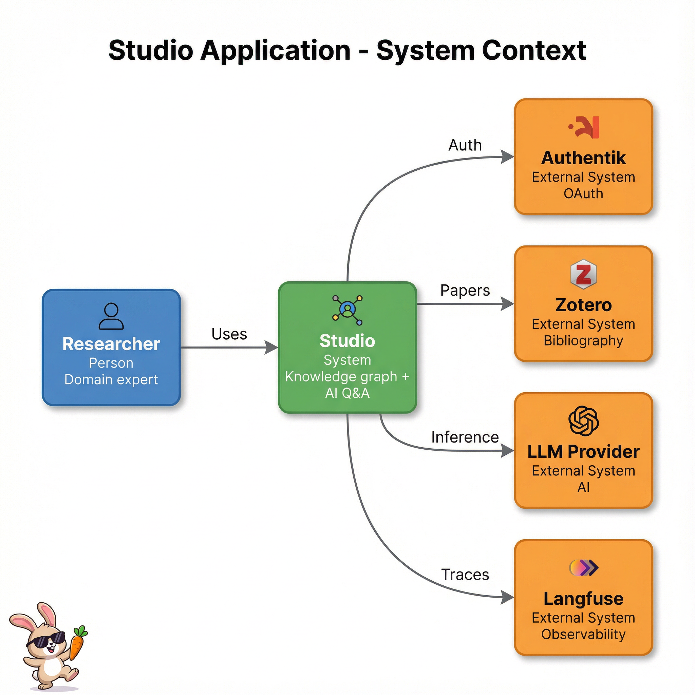
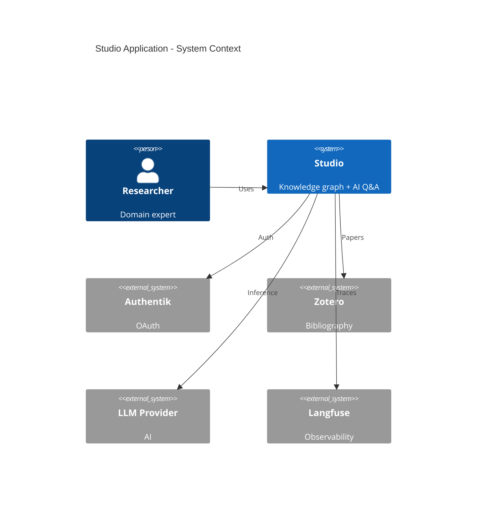

# Studio Application - Software Guidebook

> This documentation was generated for commit [`0ed101dc`](https://github.com/AIM-kennisplatformen/studio/commit/0ed101dc541a7163e415657818e27e0449788d91) on branch `creating-documentation`.

## About This Guidebook

This Software Guidebook follows [Simon Brown's methodology](https://softwarearchitecturefordevelopers.com/) from "Software Architecture for Developers Vol. 2". It provides comprehensive documentation of the Studio application's architecture, design decisions, and operational aspects.

**Purpose**: Help new team members understand the system and enable informed decision-making about changes.

**Audience**: Developers, architects, and operations staff working with the Studio application.

## Table of Contents

### Context and Scope

| Chapter | Description |
|---------|-------------|
| [1. Context](01-context.md) | System purpose, users, external systems, and scope |
| [2. Functional Overview](02-functional-overview.md) | Key features, capabilities, and user journeys |
| [3. Quality Attributes](03-quality-attributes.md) | Non-functional requirements and quality goals |
| [4. Constraints](04-constraints.md) | External constraints the team cannot change |
| [5. Principles](05-principles.md) | Architecture and design principles |

### Technical Architecture

| Chapter | Description |
|---------|-------------|
| [6. Software Architecture](06-software-architecture.md) | C4 diagrams, component structure, key flows |
| [7. External Interfaces](07-external-interfaces.md) | APIs, WebSocket protocols, integrations |
| [8. Code](08-code.md) | Code organization, patterns, conventions |
| [9. Data](09-data.md) | Data models, storage, data flow |

### Deployment and Operations

| Chapter | Description |
|---------|-------------|
| [10. Infrastructure](10-infrastructure.md) | Container architecture, networking, services |
| [11. Deployment](11-deployment.md) | Build process, deployment procedures |
| [12. Operation and Support](12-operation-support.md) | Monitoring, troubleshooting, runbooks |
| [13. Decision Log](13-decision-log.md) | Architecture Decision Records (ADRs) |

## Quick Start

### For New Developers

1. Read [Chapter 1: Context](01-context.md) to understand what the system does
2. Review [Chapter 2: Functional Overview](02-functional-overview.md) for features
3. Study [Chapter 6: Software Architecture](06-software-architecture.md) for the big picture
4. Follow [Chapter 11: Deployment](11-deployment.md) to run locally

### For Operations Staff

1. Review [Chapter 10: Infrastructure](10-infrastructure.md) for service architecture
2. Study [Chapter 12: Operation and Support](12-operation-support.md) for runbooks
3. Check [Chapter 11: Deployment](11-deployment.md) for deployment procedures

### For Architects

1. Start with [Chapter 1: Context](01-context.md) and [Chapter 6: Architecture](06-software-architecture.md)
2. Review [Chapter 13: Decision Log](13-decision-log.md) for architectural decisions
3. Understand constraints in [Chapter 4](04-constraints.md) and principles in [Chapter 5](05-principles.md)

## System at a Glance

Mermaid source

## Technology Stack

| Layer | Technologies |
|-------|-------------|
| **Frontend** | React 19, Vite, TailwindCSS, shadcn/ui, React Flow, Jotai |
| **Backend** | FastAPI, Python 3.12, python-socketio, authlib |
| **AI/ML** | LangChain, MCP, sentence-transformers, Langfuse |
| **Data** | Qdrant, JSON, Zotero |
| **Infrastructure** | Docker, Pixi, Docker Compose |

## Key Architectural Decisions

| Decision | Rationale |
|----------|-----------|
| Microservices | Independent scaling, fault isolation |
| MCP Protocol | Standardized tool integration |
| Streaming responses | Better perceived performance |
| Prefetching | Instant subnode navigation |

See [Chapter 13: Decision Log](13-decision-log.md) for full details.

## Keeping This Guidebook Current

This guidebook should be updated when:
- Significant architectural changes are made
- New external integrations are added
- Deployment processes change
- New ADRs are recorded

To update:
1. Run the Software Guidebook skill: `/sgb` or "update guidebook"
2. The skill will detect changes since commit `0ed101dc`
3. Review and approve proposed updates

## Document History

| Date | Commit | Author | Changes |
|------|--------|--------|---------|
| 2025-01-15 | `0ed101dc` | Claude | Initial guidebook creation |

---

*Generated with [Claude Code](https://claude.ai/code) using the SGB-maintainer skill*
