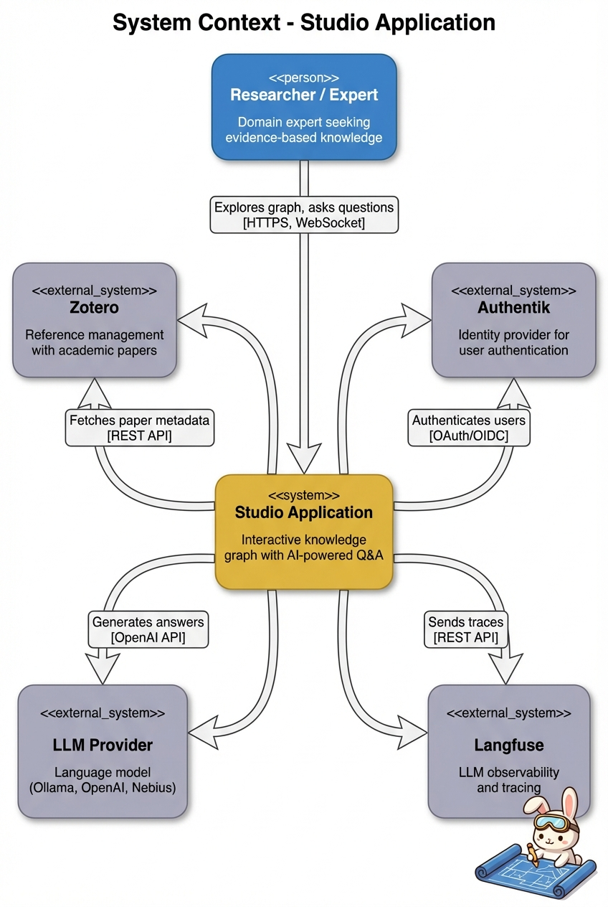
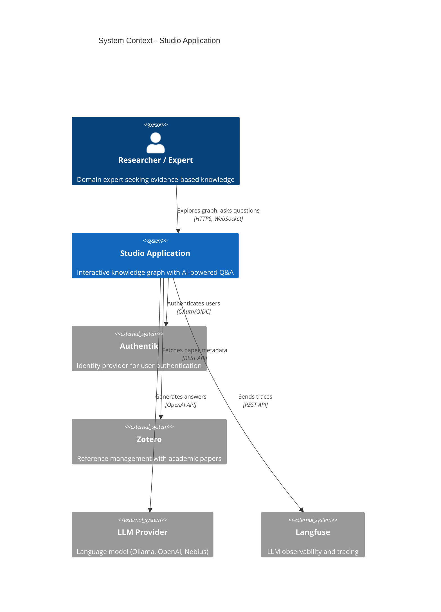

# 1. Context

This chapter provides the big picture view of the Studio application, including its purpose, users, and how it fits into the broader ecosystem.

## 1.1 System Purpose

**Studio** is an interactive knowledge exploration platform that combines a visual knowledge graph with AI-powered question answering. It enables researchers and domain experts to explore complex topics through an intuitive interface while receiving evidence-based answers backed by academic literature.

### 1.1.1 Problem Statement

Researchers and domain experts often struggle to:
- Navigate complex relationships between concepts in their field
- Find relevant academic literature efficiently
- Get synthesized answers that cite authoritative sources
- Explore topics from multiple perspectives (best practices, target groups, strategy)

### 1.1.2 Solution

Studio addresses these challenges by providing:
- A visual knowledge graph for intuitive concept navigation
- AI-powered chat that synthesizes answers from academic literature
- Integration with Zotero for bibliography management
- Semantic search via vector embeddings for relevant content retrieval

## 1.2 Users and Stakeholders

### 1.2.1 Primary Users

| User Type | Description | Goals |
|-----------|-------------|-------|
| Researchers | Academic or industry researchers exploring a domain | Find evidence-based answers, discover relevant literature |
| Domain Experts | Practitioners seeking best practices and strategies | Understand intervention strategies, identify target groups |
| Policy Makers | Decision makers needing strategic overviews | Access synthesized knowledge for planning |

### 1.2.2 Stakeholders

| Stakeholder | Interest |
|-------------|----------|
| Development Team | Build and maintain the platform |
| Content Curators | Manage knowledge graph content and Zotero collections |
| IT Operations | Deploy and monitor the system |
| Organization Leadership | ROI on knowledge management investment |

## 1.3 System Context Diagram

Mermaid source

## 1.4 External Systems

### 1.4.1 Authentik (Optional)

**Type**: Identity Provider

**Purpose**: Provides OAuth/OpenID Connect authentication for user access control.

**Integration**: The backend uses Authentik for login/logout flows. When not configured, the system operates with default development credentials.

**Why Authentik**: Open-source, self-hosted identity provider that supports OpenID Connect.

### 1.4.2 Zotero

**Type**: Reference Management System

**Purpose**: Stores and organizes academic papers and their metadata.

**Integration**: The MCP server queries Zotero by tags to find papers relevant to user questions. Paper keys are used to filter vector search results.

**Why Zotero**: Widely used in academia, good API, supports group libraries for collaborative collections.

### 1.4.3 LLM Provider

**Type**: AI Language Model

**Purpose**: Generates natural language responses to user questions.

**Supported Providers**:
- **Ollama** (default) - Local inference, no API key needed
- **OpenAI** - Cloud-based, requires API key
- **Nebius** - Alternative cloud provider

**Integration**: The LLM Worker uses the OpenAI-compatible API to communicate with any provider.

### 1.4.4 Langfuse (Optional)

**Type**: LLM Observability Platform

**Purpose**: Traces LLM calls for debugging, analytics, and cost tracking.

**Integration**: The LLM Worker sends traces via Langfuse callbacks. When not configured, tracing is disabled.

## 1.5 Scope

### 1.5.1 In Scope

| Capability | Description |
|------------|-------------|
| Knowledge Graph Visualization | Display and navigate domain concepts |
| AI Chat Interface | Natural language question answering |
| Literature-Backed Answers | Integrate Zotero and vector search |
| User Authentication | OAuth-based access control |
| Real-time Streaming | Stream LLM responses to users |

### 1.5.2 Out of Scope

| Capability | Reason |
|------------|--------|
| Graph Editing | Read-only for initial release |
| Multi-tenant Support | Single organization deployment |
| Mobile App | Web-first approach |
| Content Ingestion | Papers are pre-indexed externally |
| Export/Reporting | Focus on interactive exploration |

## 1.6 Key Quality Goals

| Priority | Quality | Description |
|----------|---------|-------------|
| 1 | Usability | Intuitive interface for non-technical users |
| 2 | Responsiveness | Fast perceived performance via streaming |
| 3 | Accuracy | Evidence-based answers with citations |
| 4 | Flexibility | Support multiple LLM providers |
| 5 | Deployability | Easy local and containerized deployment |

## 1.7 Technology Summary

| Layer | Technologies |
|-------|-------------|
| Frontend | React 19, Vite, TailwindCSS, shadcn/ui, React Flow, Jotai |
| Backend | FastAPI, Python 3.12, python-socketio, authlib |
| AI/ML | LangChain, MCP, sentence-transformers, Langfuse |
| Data | Qdrant (vectors), JSON (graph), Zotero (bibliography) |
| Infrastructure | Docker, Pixi, Docker Compose |

## 1.8 Assumptions

1. Users have modern web browsers with JavaScript enabled
2. The knowledge graph is pre-created and relatively static
3. Academic papers are already indexed in Zotero and Qdrant
4. Network connectivity is available to external services
5. LLM provider is accessible (local Ollama or cloud API)

## 1.9 Risks

| Risk | Impact | Mitigation |
|------|--------|------------|
| LLM provider unavailable | Users cannot get answers | Support multiple providers, graceful error handling |
| Qdrant not populated | No literature citations | Document data ingestion requirements |
| Session data loss on restart | User loses chat history | Document limitation, consider persistent storage |
| Default OAuth credentials in code | Security vulnerability if deployed | Require production configuration, remove defaults |
