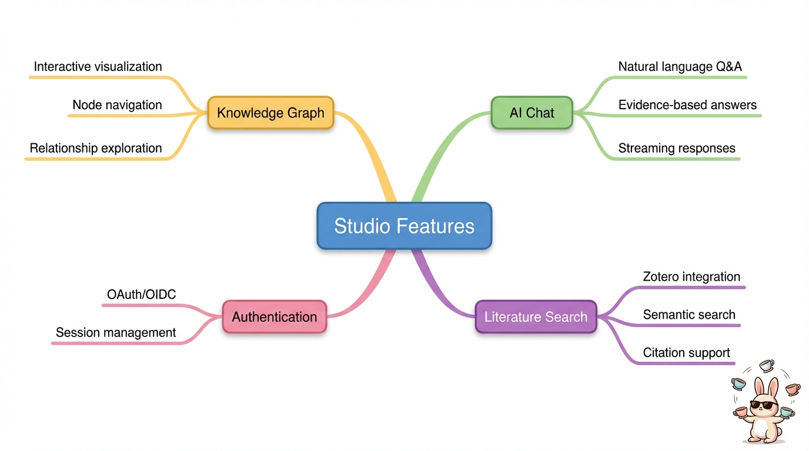
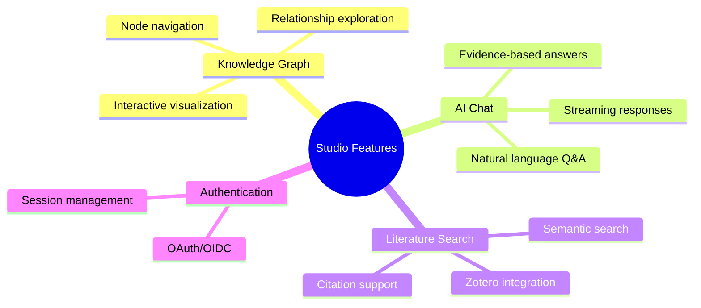
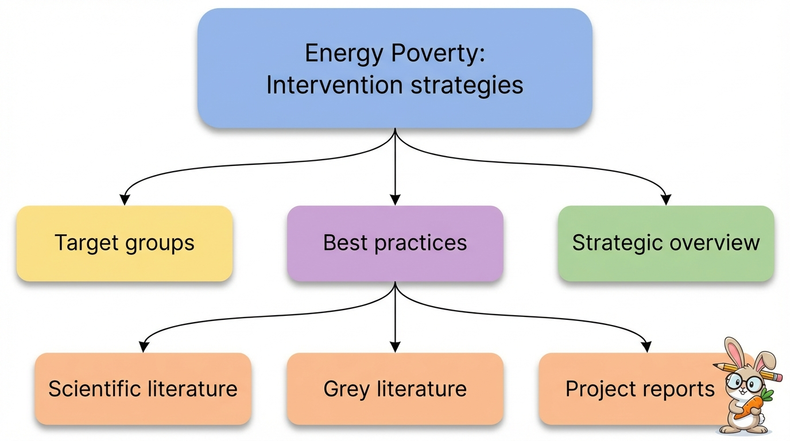
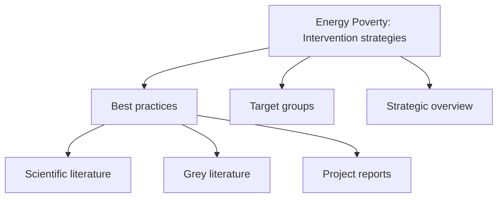
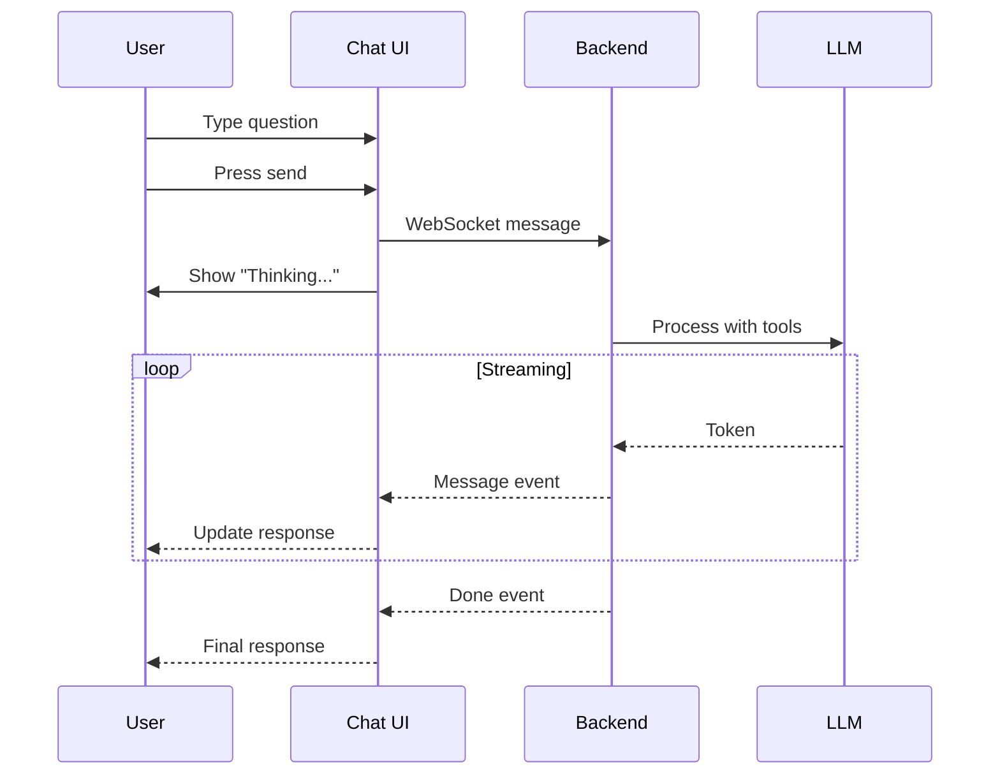
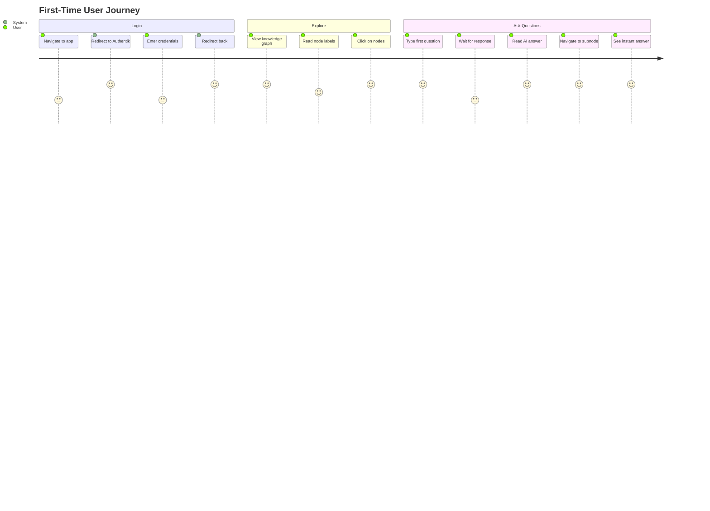
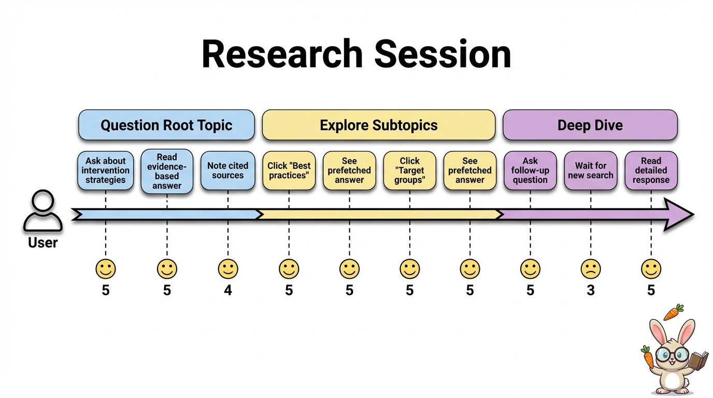
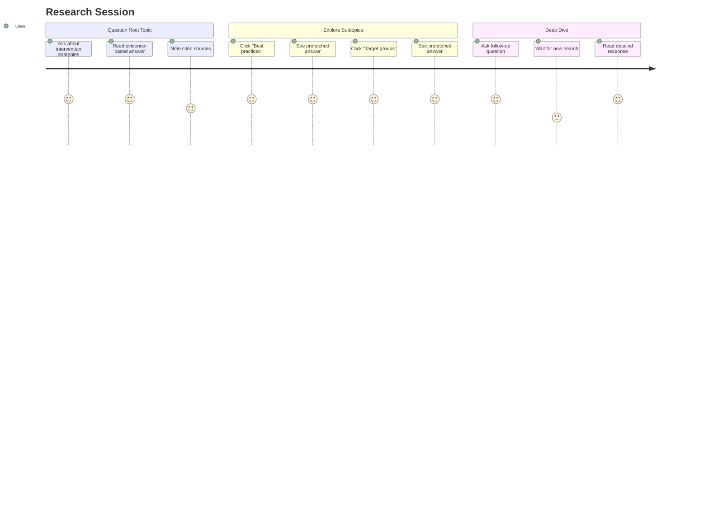

# 2. Functional Overview

This chapter provides an overview of the key features and capabilities of the Studio application.

## 2.1 Core Features

The Studio application provides an interactive knowledge exploration platform with AI-powered question answering.

Mermaid source

## 2.2 Feature Details

### 2.2.1 Interactive Knowledge Graph

The application displays a knowledge graph that users can explore visually.

**Capabilities**:
- View domain concepts as nodes
- See relationships between concepts as edges
- Click nodes to navigate and get context
- Resizable split-panel layout

**Implementation**:
- React Flow for graph rendering ([`src/frontend/src/graph.jsx`](https://github.com/AIM-kennisplatformen/studio/blob/main/src/frontend/src/graph.jsx))
- Graph data loaded from JSON ([`example-data.json`](https://github.com/AIM-kennisplatformen/studio/blob/main/src/frontend/src/knowledge-graph/example-data.json))

**Current Graph Structure** (Energy Poverty domain):

Mermaid source

### 2.2.2 AI-Powered Chat

Users can ask natural language questions and receive evidence-informed answers.

**Capabilities**:
- Type questions in natural language
- Receive streaming responses in real-time
- See "thinking" indicator while processing
- Responses cite relevant literature

**User Flow**:

Mermaid source

### 2.2.3 Literature-Backed Responses

The AI assistant searches academic literature to support its answers.

**Capabilities**:
- Automatic literature search via MCP tool
- Semantic matching using vector embeddings
- Bibliography metadata from Zotero
- Relevance scores for citations

**How It Works**:

1. User asks a question
2. LLM invokes `paper_search` tool with question + keywords
3. MCP server queries Zotero for papers matching keywords
4. Qdrant performs semantic search on paper content
5. Results returned to LLM for synthesis
6. LLM generates answer citing relevant sources

### 2.2.4 Prefetched Subnode Answers

When a user asks a question at the root node, the system prefetches answers for subnodes in the background.

**Subnodes**:
- Best practices
- Target groups
- Strategic overview

**Benefits**:
- Instant responses when navigating to subnodes
- Improved perceived performance
- Better user experience

### 2.2.5 User Authentication

Optional OAuth authentication via Authentik.

**Capabilities**:
- Login via external identity provider
- Session-based authentication
- Automatic redirect for protected resources
- Logout functionality

## 2.3 User Journeys

### 2.3.1 First-Time User

Mermaid source

### 2.3.2 Research Session

Mermaid source

## 2.4 Feature Matrix

| Feature | Status | Implementation |
|---------|--------|----------------|
| Knowledge graph visualization | Complete | React Flow |
| Node click navigation | Complete | Graph endpoint |
| AI chat interface | Complete | Socket.IO + LLM Worker |
| Streaming responses | Complete | SSE + WebSocket |
| Literature search | Complete | Zotero + Qdrant |
| Subnode prefetching | Complete | Async tasks |
| OAuth authentication | Complete | Authentik |
| Chat history persistence | Not implemented | In-memory only |
| Multi-user rooms | Not implemented | Single user per session |
| Graph editing | Not implemented | Read-only |

## 2.5 Domain Context

The current deployment focuses on **Energy Poverty** research:

| Concept | Description |
|---------|-------------|
| Energy Poverty | Inability to afford adequate energy services |
| Intervention Strategies | Approaches to address energy poverty |
| Best Practices | Proven effective methods |
| Target Groups | Populations most affected |
| Strategic Overview | Policy and planning perspectives |

The system is domain-agnostic; replacing the knowledge graph JSON and Qdrant collection would adapt it to other domains.

## 2.6 Limitations

1. **Read-only graph**: Users cannot modify the knowledge graph through the UI
2. **No persistent history**: Chat sessions are lost on server restart
3. **Single collection**: Only one Qdrant collection is supported
4. **Fixed subnodes**: Prefetch targets are hardcoded to three specific nodes
5. **No multi-turn context**: Each question is processed independently (no conversation memory passed to LLM)
