# 6. Software Architecture

This chapter describes the software architecture of the Studio application using C4 model diagrams and component breakdowns.

## 6.1 System Context (C4 Level 1)

The System Context diagram shows the Studio system in its environment, including users and external systems it interacts with.

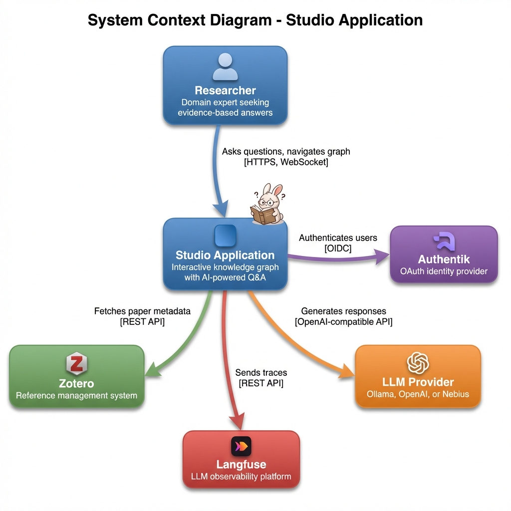

Mermaid source

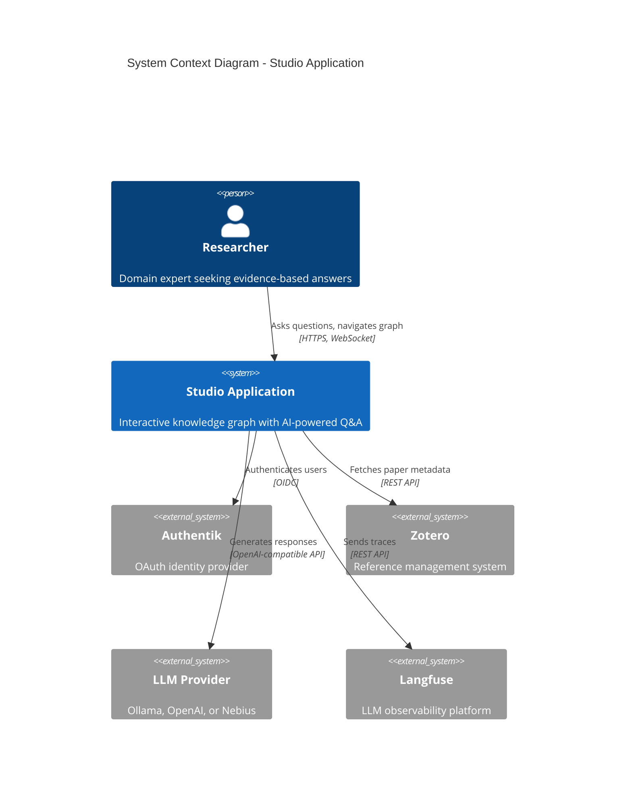
```mermaid
C4Context
    title System Context Diagram - Studio Application

    Person(researcher, "Researcher", "Domain expert seeking evidence-based answers")

    System(studio, "Studio Application", "Interactive knowledge graph with AI-powered Q&A")

    System_Ext(authentik, "Authentik", "OAuth identity provider")
    System_Ext(zotero, "Zotero", "Reference management system")
    System_Ext(llm_provider, "LLM Provider", "Ollama, OpenAI, or Nebius")
    System_Ext(langfuse, "Langfuse", "LLM observability platform")

    Rel(researcher, studio, "Asks questions, navigates graph", "HTTPS, WebSocket")
    Rel(studio, authentik, "Authenticates users", "OIDC")
    Rel(studio, zotero, "Fetches paper metadata", "REST API")
    Rel(studio, llm_provider, "Generates responses", "OpenAI-compatible API")
    Rel(studio, langfuse, "Sends traces", "REST API")
```

### 6.1.1 External Systems

| System | Type | Purpose | Required |
|--------|------|---------|----------|
| Authentik | Identity Provider | User authentication via OAuth/OIDC | Optional |
| Zotero | Reference Manager | Academic paper metadata | Optional |
| LLM Provider | AI Service | Natural language generation | Required |
| Langfuse | Observability | LLM tracing and analytics | Optional |

## 6.2 Container Diagram (C4 Level 2)

The Container diagram shows the high-level technology choices and how containers communicate.

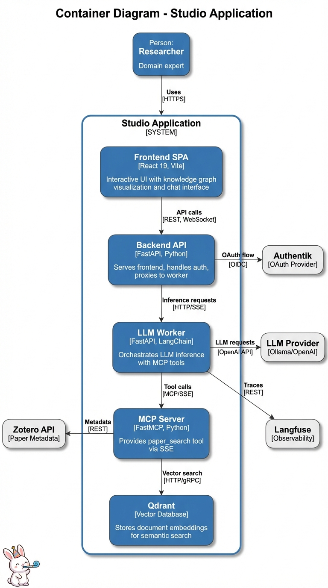

Mermaid source

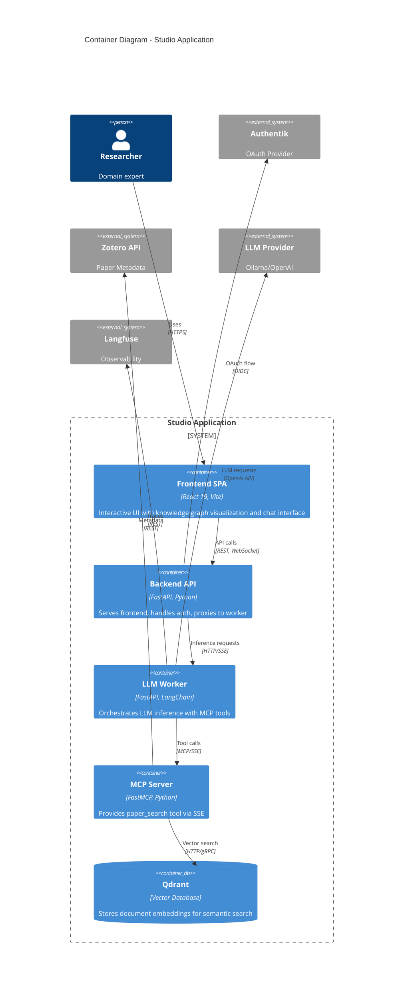
```mermaid
C4Container
    title Container Diagram - Studio Application

    Person(researcher, "Researcher", "Domain expert")

    System_Boundary(studio, "Studio Application") {
        Container(spa, "Frontend SPA", "React 19, Vite", "Interactive UI with knowledge graph visualization and chat interface")
        Container(backend, "Backend API", "FastAPI, Python", "Serves frontend, handles auth, proxies to worker")
        Container(worker, "LLM Worker", "FastAPI, LangChain", "Orchestrates LLM inference with MCP tools")
        Container(mcp, "MCP Server", "FastMCP, Python", "Provides paper_search tool via SSE")
        ContainerDb(qdrant, "Qdrant", "Vector Database", "Stores document embeddings for semantic search")
    }

    System_Ext(authentik, "Authentik", "OAuth Provider")
    System_Ext(zotero, "Zotero API", "Paper Metadata")
    System_Ext(llm, "LLM Provider", "Ollama/OpenAI")
    System_Ext(langfuse, "Langfuse", "Observability")

    Rel(researcher, spa, "Uses", "HTTPS")
    Rel(spa, backend, "API calls", "REST, WebSocket")
    Rel(backend, authentik, "OAuth flow", "OIDC")
    Rel(backend, worker, "Inference requests", "HTTP/SSE")
    Rel(worker, mcp, "Tool calls", "MCP/SSE")
    Rel(worker, llm, "LLM requests", "OpenAI API")
    Rel(worker, langfuse, "Traces", "REST")
    Rel(mcp, qdrant, "Vector search", "HTTP/gRPC")
    Rel(mcp, zotero, "Metadata", "REST")
```

### 6.2.1 Container Details

| Container | Technology | Port | Responsibility |
|-----------|------------|------|----------------|
| Frontend SPA | React 19, Vite, TailwindCSS | (served by backend) | User interface |
| Backend API | FastAPI, Python 3.12 | 10090 | API gateway, auth, WebSocket |
| LLM Worker | FastAPI, LangChain, mcp-use | 9200 (dev) / 7000 (prod) | LLM orchestration |
| MCP Server | FastMCP, Python | 8000 | Tool execution |
| Qdrant | Qdrant v1.13 | 6333 | Vector storage |

## 6.3 Component Diagram (C4 Level 3)

### 6.3.1 Backend Components

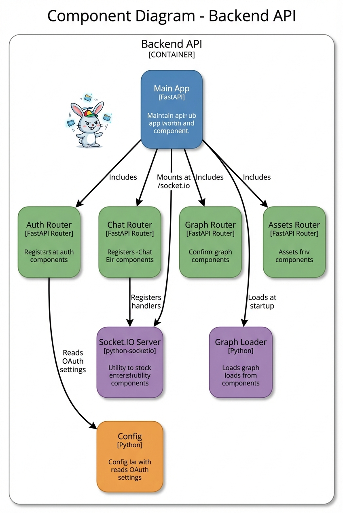

Mermaid source

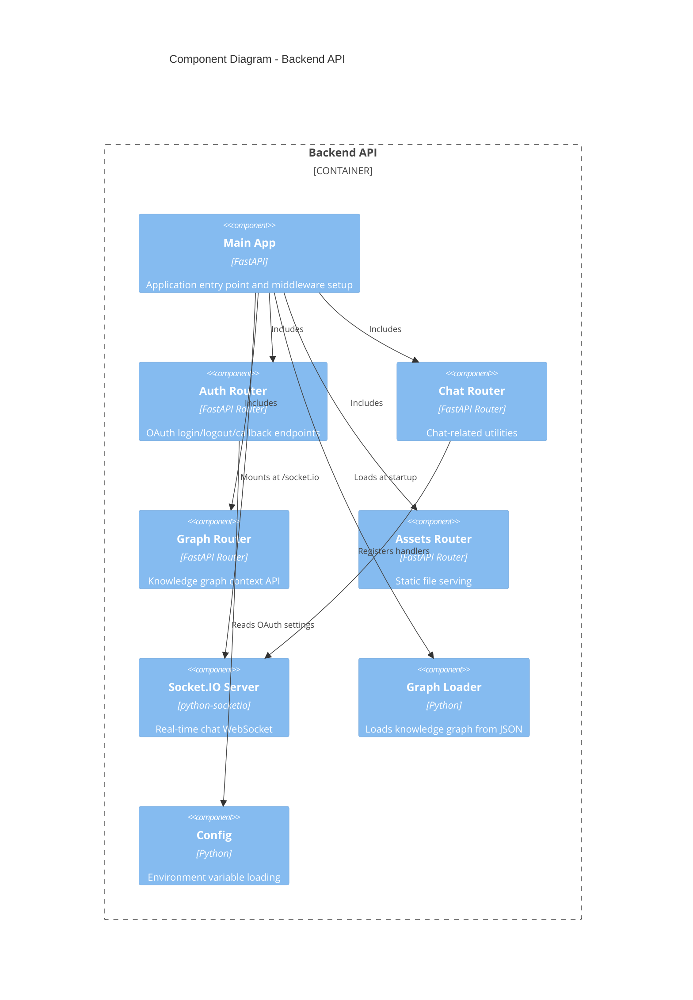
```mermaid
C4Component
    title Component Diagram - Backend API

    Container_Boundary(backend, "Backend API") {
        Component(main, "Main App", "FastAPI", "Application entry point and middleware setup")
        Component(auth, "Auth Router", "FastAPI Router", "OAuth login/logout/callback endpoints")
        Component(chat, "Chat Router", "FastAPI Router", "Chat-related utilities")
        Component(graph, "Graph Router", "FastAPI Router", "Knowledge graph context API")
        Component(assets, "Assets Router", "FastAPI Router", "Static file serving")
        Component(socketio, "Socket.IO Server", "python-socketio", "Real-time chat WebSocket")
        Component(graph_loader, "Graph Loader", "Python", "Loads knowledge graph from JSON")
        Component(config, "Config", "Python", "Environment variable loading")
    }

    Rel(main, auth, "Includes")
    Rel(main, chat, "Includes")
    Rel(main, graph, "Includes")
    Rel(main, assets, "Includes")
    Rel(main, socketio, "Mounts at /socket.io")
    Rel(main, graph_loader, "Loads at startup")
    Rel(auth, config, "Reads OAuth settings")
    Rel(chat, socketio, "Registers handlers")
```

#### Backend Component Files

| Component | File | Purpose |
|-----------|------|---------|
| Main App | [`src/backend/main.py`](https://github.com/AIM-kennisplatformen/studio/blob/main/src/backend/main.py) | FastAPI setup, middleware |
| Auth Router | [`src/backend/endpoints/auth.py`](https://github.com/AIM-kennisplatformen/studio/blob/main/src/backend/endpoints/auth.py) | OAuth flow |
| Chat Router | [`src/backend/endpoints/chat.py`](https://github.com/AIM-kennisplatformen/studio/blob/main/src/backend/endpoints/chat.py) | Socket.IO handlers |
| Graph Router | [`src/backend/endpoints/graph.py`](https://github.com/AIM-kennisplatformen/studio/blob/main/src/backend/endpoints/graph.py) | Node context API |
| Assets Router | [`src/backend/endpoints/assets.py`](https://github.com/AIM-kennisplatformen/studio/blob/main/src/backend/endpoints/assets.py) | Static files |
| Config | [`src/backend/config.py`](https://github.com/AIM-kennisplatformen/studio/blob/main/src/backend/config.py) | Environment vars |
| Graph Loader | [`src/backend/utility/graph_data_loader.py`](https://github.com/AIM-kennisplatformen/studio/blob/main/src/backend/utility/graph_data_loader.py) | JSON loading |

### 6.3.2 LLM Worker Components

Mermaid source

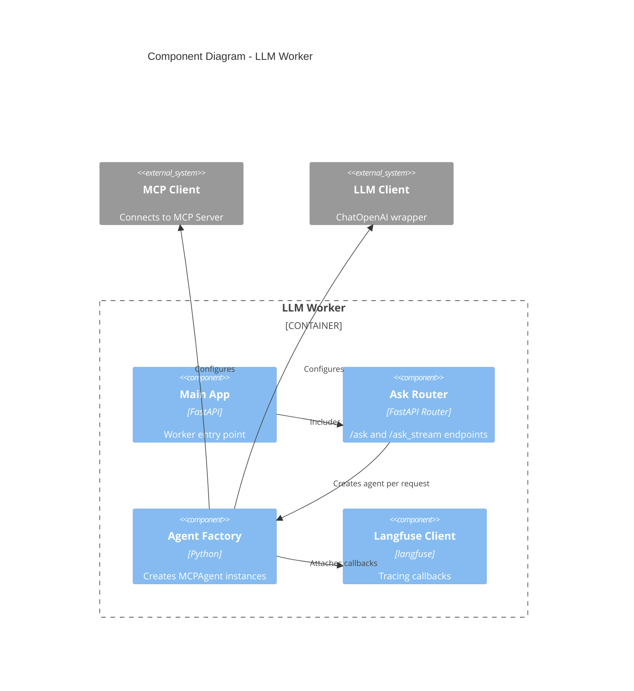
```mermaid
C4Component
    title Component Diagram - LLM Worker

    Container_Boundary(worker, "LLM Worker") {
        Component(worker_main, "Main App", "FastAPI", "Worker entry point")
        Component(ask_router, "Ask Router", "FastAPI Router", "/ask and /ask_stream endpoints")
        Component(agent_factory, "Agent Factory", "Python", "Creates MCPAgent instances")
        Component(langfuse_client, "Langfuse Client", "langfuse", "Tracing callbacks")
    }

    System_Ext(mcp_client, "MCP Client", "Connects to MCP Server")
    System_Ext(llm_client, "LLM Client", "ChatOpenAI wrapper")

    Rel(worker_main, ask_router, "Includes")
    Rel(ask_router, agent_factory, "Creates agent per request")
    Rel(agent_factory, mcp_client, "Configures")
    Rel(agent_factory, llm_client, "Configures")
    Rel(agent_factory, langfuse_client, "Attaches callbacks")
```

#### LLM Worker Component Files

| Component | File | Purpose |
|-----------|------|---------|
| Main App | [`src/llm_worker/main.py`](https://github.com/AIM-kennisplatformen/studio/blob/main/src/llm_worker/main.py) | FastAPI setup |
| Ask Router | [`src/llm_worker/endpoints/ask.py`](https://github.com/AIM-kennisplatformen/studio/blob/main/src/llm_worker/endpoints/ask.py) | Inference endpoints |

### 6.3.3 MCP Server Components

Mermaid source

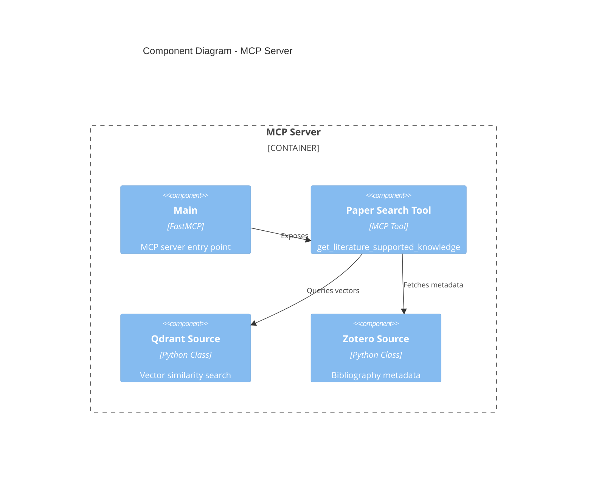
```mermaid
C4Component
    title Component Diagram - MCP Server

    Container_Boundary(mcp, "MCP Server") {
        Component(mcp_main, "Main", "FastMCP", "MCP server entry point")
        Component(paper_search, "Paper Search Tool", "MCP Tool", "get_literature_supported_knowledge")
        Component(qdrant_source, "Qdrant Source", "Python Class", "Vector similarity search")
        Component(zotero_source, "Zotero Source", "Python Class", "Bibliography metadata")
    }

    Rel(mcp_main, paper_search, "Exposes")
    Rel(paper_search, qdrant_source, "Queries vectors")
    Rel(paper_search, zotero_source, "Fetches metadata")
```

#### MCP Server Component Files

| Component | File | Purpose |
|-----------|------|---------|
| Main | [`src/mcp_servers/main.py`](https://github.com/AIM-kennisplatformen/studio/blob/main/src/mcp_servers/main.py) | Server entry |
| Paper Search Tool | [`src/mcp_servers/tools/scepa_paper_search.py`](https://github.com/AIM-kennisplatformen/studio/blob/main/src/mcp_servers/tools/scepa_paper_search.py) | MCP tool |
| Qdrant Source | [`src/mcp_servers/lib/qdrant/qdrant_source.py`](https://github.com/AIM-kennisplatformen/studio/blob/main/src/mcp_servers/lib/qdrant/qdrant_source.py) | Vector DB client |
| Zotero Source | [`src/mcp_servers/lib/zotero/zotero_source.py`](https://github.com/AIM-kennisplatformen/studio/blob/main/src/mcp_servers/lib/zotero/zotero_source.py) | Zotero client |

### 6.3.4 Frontend Components

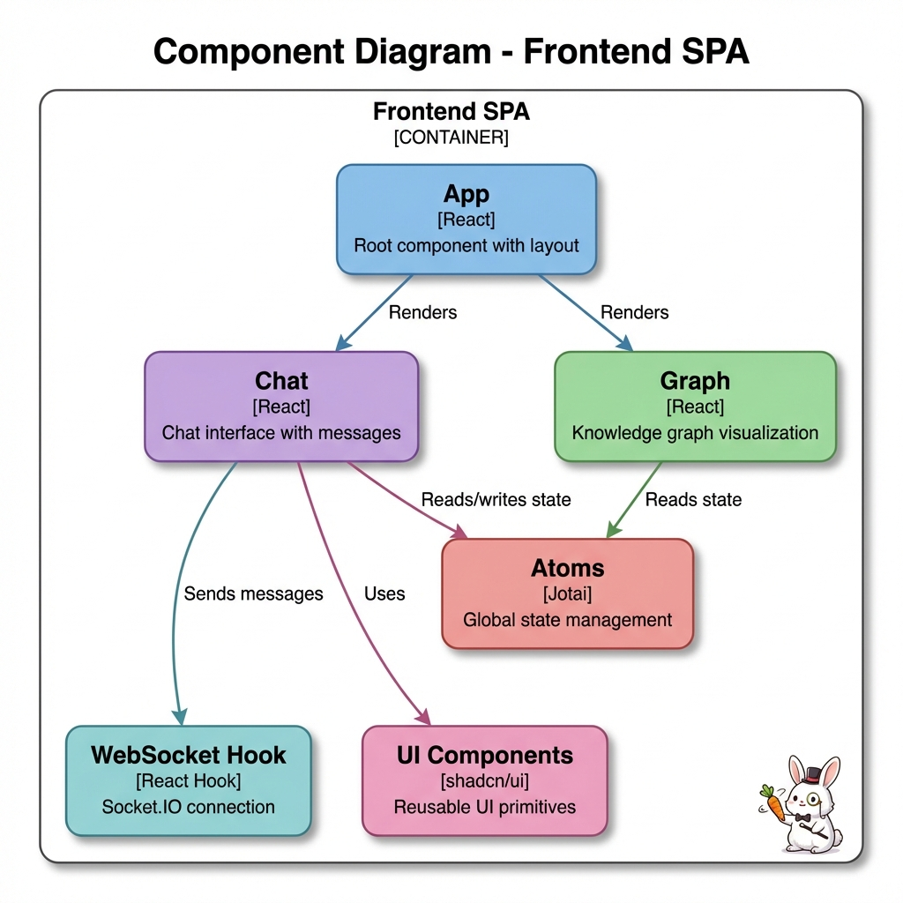

Mermaid source

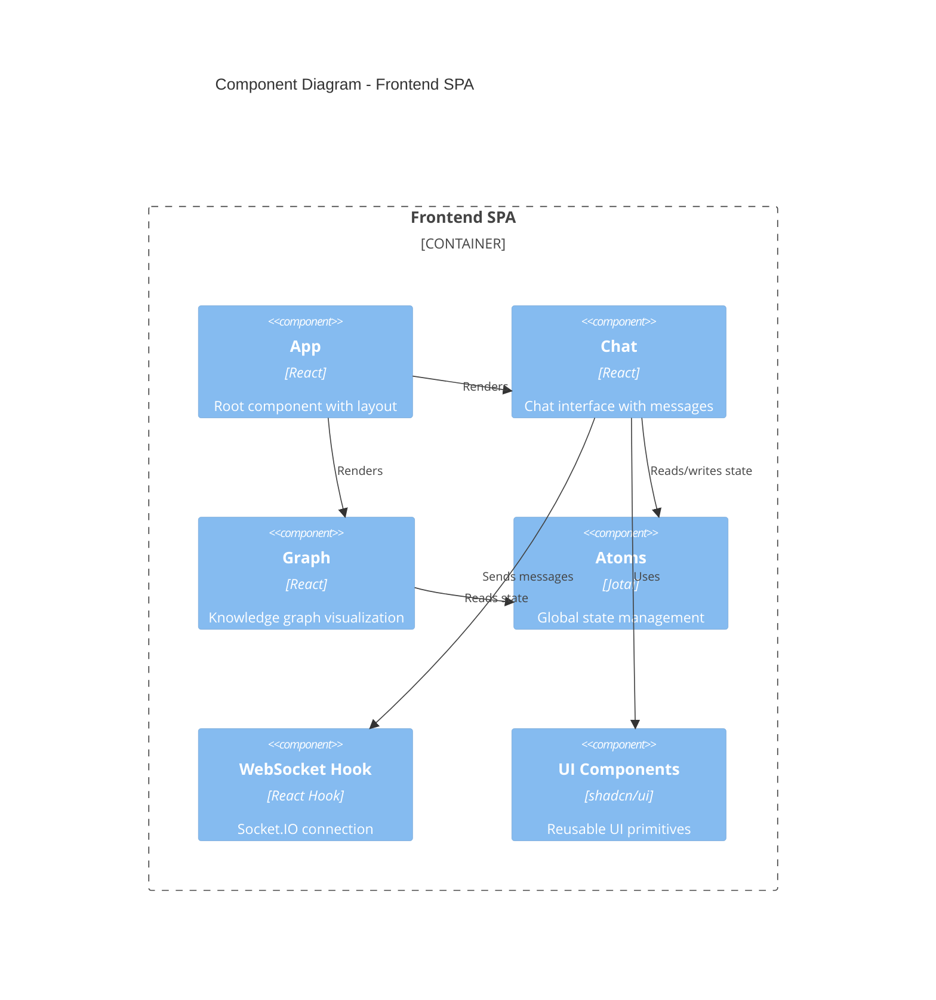
```mermaid
C4Component
    title Component Diagram - Frontend SPA

    Container_Boundary(frontend, "Frontend SPA") {
        Component(app, "App", "React", "Root component with layout")
        Component(chat, "Chat", "React", "Chat interface with messages")
        Component(graph, "Graph", "React", "Knowledge graph visualization")
        Component(atoms, "Atoms", "Jotai", "Global state management")
        Component(websocket, "WebSocket Hook", "React Hook", "Socket.IO connection")
        Component(ui_components, "UI Components", "shadcn/ui", "Reusable UI primitives")
    }

    Rel(app, chat, "Renders")
    Rel(app, graph, "Renders")
    Rel(chat, atoms, "Reads/writes state")
    Rel(chat, websocket, "Sends messages")
    Rel(chat, ui_components, "Uses")
    Rel(graph, atoms, "Reads state")
```

#### Frontend Component Files

| Component | File | Purpose |
|-----------|------|---------|
| App | [`src/frontend/src/App.jsx`](https://github.com/AIM-kennisplatformen/studio/blob/main/src/frontend/src/App.jsx) | Root layout |
| Chat | [`src/frontend/src/chat.jsx`](https://github.com/AIM-kennisplatformen/studio/blob/main/src/frontend/src/chat.jsx) | Chat UI |
| Graph | [`src/frontend/src/graph.jsx`](https://github.com/AIM-kennisplatformen/studio/blob/main/src/frontend/src/graph.jsx) | Graph visualization |
| Atoms | [`src/frontend/src/data/atoms.js`](https://github.com/AIM-kennisplatformen/studio/blob/main/src/frontend/src/data/atoms.js) | State atoms |

## 6.4 Key Architectural Flows

### 6.4.1 Chat Message Flow

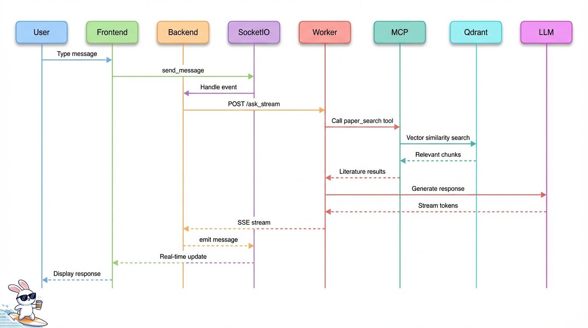

Mermaid source

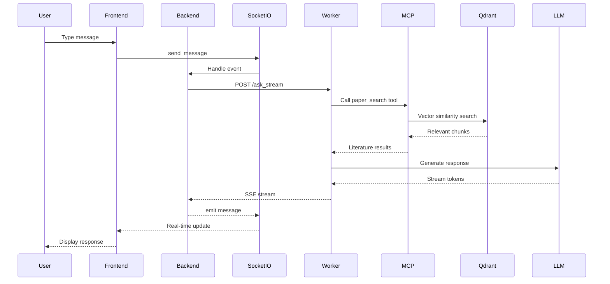
```mermaid
sequenceDiagram
    participant User
    participant Frontend
    participant Backend
    participant SocketIO
    participant Worker
    participant MCP
    participant Qdrant
    participant LLM

    User->>Frontend: Type message
    Frontend->>SocketIO: send_message
    SocketIO->>Backend: Handle event
    Backend->>Worker: POST /ask_stream
    Worker->>MCP: Call paper_search tool
    MCP->>Qdrant: Vector similarity search
    Qdrant-->>MCP: Relevant chunks
    MCP-->>Worker: Literature results
    Worker->>LLM: Generate response
    LLM-->>Worker: Stream tokens
    Worker-->>Backend: SSE stream
    Backend-->>SocketIO: emit message
    SocketIO-->>Frontend: Real-time update
    Frontend-->>User: Display response
```

### 6.4.2 Authentication Flow

Mermaid source

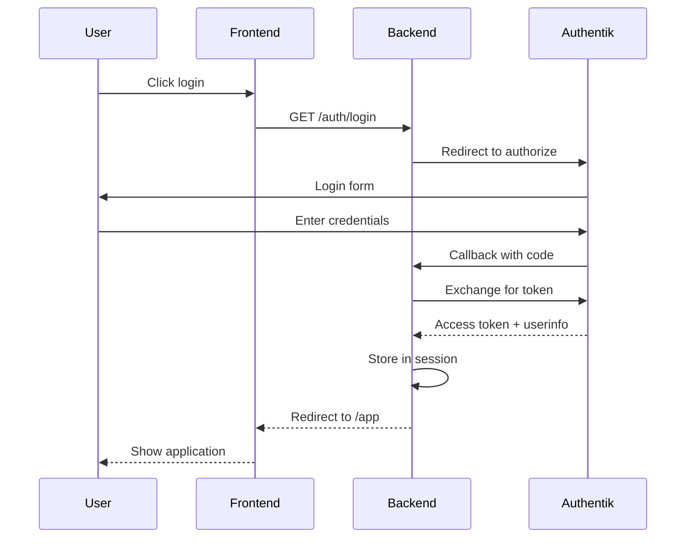
```mermaid
sequenceDiagram
    participant User
    participant Frontend
    participant Backend
    participant Authentik

    User->>Frontend: Click login
    Frontend->>Backend: GET /auth/login
    Backend->>Authentik: Redirect to authorize
    Authentik->>User: Login form
    User->>Authentik: Enter credentials
    Authentik->>Backend: Callback with code
    Backend->>Authentik: Exchange for token
    Authentik-->>Backend: Access token + userinfo
    Backend->>Backend: Store in session
    Backend-->>Frontend: Redirect to /app
    Frontend-->>User: Show application
```

### 6.4.3 Prefetch Flow

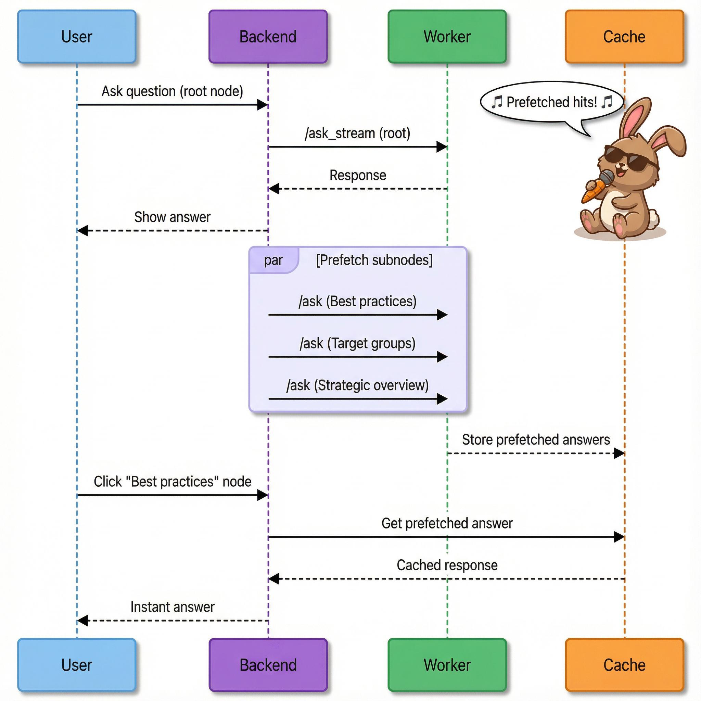

Mermaid source

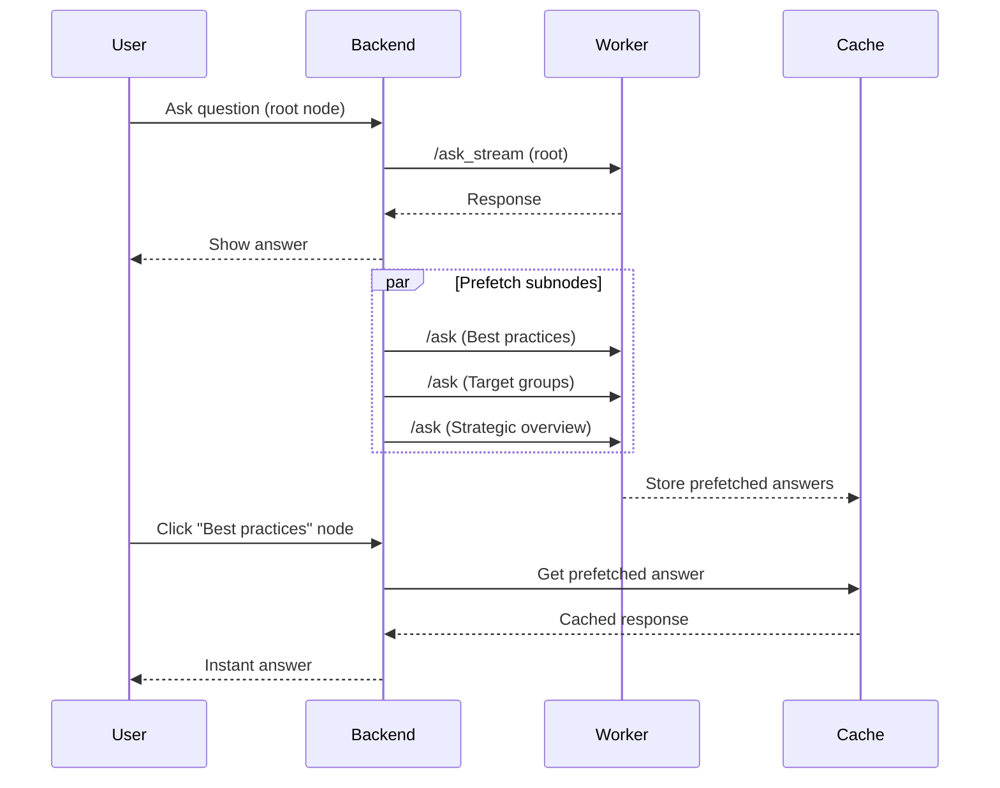
```mermaid
sequenceDiagram
    participant User
    participant Backend
    participant Worker
    participant Cache

    User->>Backend: Ask question (root node)
    Backend->>Worker: /ask_stream (root)
    Worker-->>Backend: Response
    Backend-->>User: Show answer

    par Prefetch subnodes
        Backend->>Worker: /ask (Best practices)
        Backend->>Worker: /ask (Target groups)
        Backend->>Worker: /ask (Strategic overview)
    end

    Worker-->>Cache: Store prefetched answers

    User->>Backend: Click "Best practices" node
    Backend->>Cache: Get prefetched answer
    Cache-->>Backend: Cached response
    Backend-->>User: Instant answer
```

## 6.5 Technology Stack Summary

Mermaid source

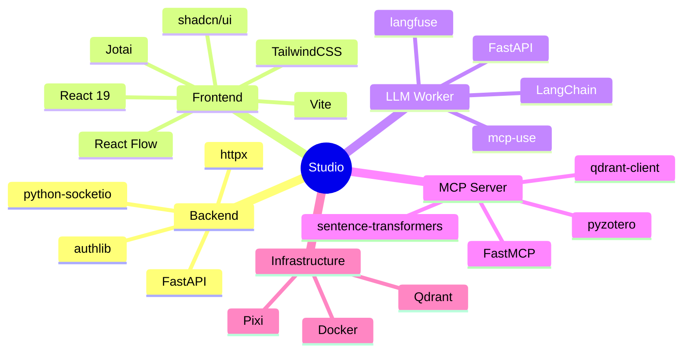
```mermaid
mindmap
  root((Studio))
    Backend
      FastAPI
      python-socketio
      authlib
      httpx
    Frontend
      React 19
      Vite
      Jotai
      TailwindCSS
      shadcn/ui
      React Flow
    LLM Worker
      FastAPI
      LangChain
      mcp-use
      langfuse
    MCP Server
      FastMCP
      sentence-transformers
      pyzotero
      qdrant-client
    Infrastructure
      Docker
      Pixi
      Qdrant
```

