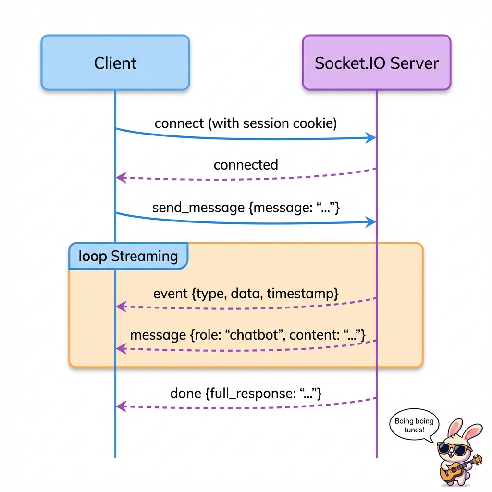
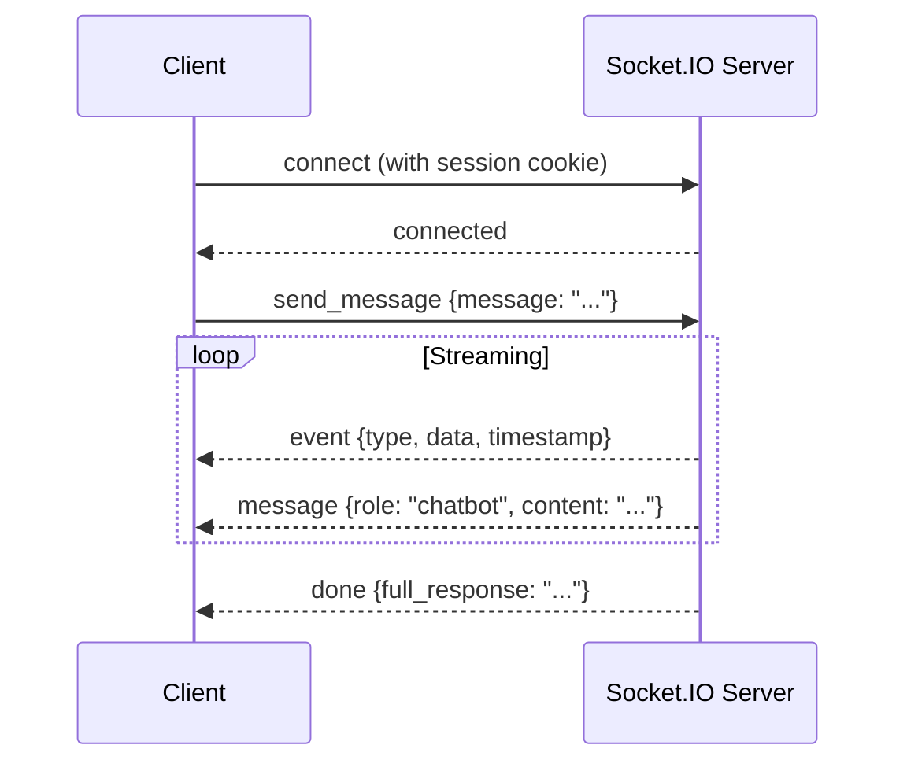

# 7. External Interfaces

This chapter documents all external interfaces including REST APIs, WebSocket protocols, and third-party integrations.

## 7.1 Backend REST API

The backend API is documented via OpenAPI and available at `/docs` when running.

### 7.1.1 Authentication Endpoints

| Endpoint | Method | Purpose | Authentication |
|----------|--------|---------|----------------|
| `/auth/login` | GET | Initiate OAuth flow | None |
| `/auth/callback` | GET | OAuth callback | None |
| `/auth/logout` | GET | Clear session | Session |
| `/me` | GET | Get current user | Session |

#### GET /auth/login

Redirects user to Authentik for authentication.

**Response**: `302 Redirect` to Authentik authorize endpoint

#### GET /auth/callback

OAuth callback endpoint. Receives authorization code and exchanges for tokens.

**Query Parameters**:
- `code` - Authorization code from Authentik
- `state` - CSRF state token

**Response**: `302 Redirect` to `/app`

**Side Effect**: Stores user info in session cookie

#### GET /auth/logout

Clears the user session.

**Response**: `302 Redirect` to `/`

#### GET /me

Returns the authenticated user's information.

**Response** (200):
```json
{
  "authenticated": true,
  "user": {
    "sub": "user-uuid",
    "email": "user@example.com",
    "name": "User Name"
  }
}
```

**Response** (307): Redirect to `/auth/login` if not authenticated

### 7.1.2 Graph Endpoints

| Endpoint | Method | Purpose | Authentication |
|----------|--------|---------|----------------|
| `/nodes/{node_id}/context` | POST | Get node context and trigger prefetch | Session |

#### POST /nodes/{node_id}/context

Returns knowledge graph context for a node and triggers LLM prefetching.

**Path Parameters**:
- `node_id` (int) - The node ID to retrieve context for

**Response** (200):
```json
{
  "message": "Context for node 1",
  "nodes": [
    {
      "id": "1",
      "type": "text",
      "label": "Energy Poverty: Intervention strategies",
      "attributes": {}
    }
  ],
  "edges": [
    {
      "id": "14",
      "sourceId": "1",
      "targetId": "2",
      "labelToSource": null,
      "labelToTarget": null,
      "type": "relation",
      "attributes": {}
    }
  ],
  "sources": [],
  "error": null
}
```

**Side Effects**:
- Updates user's selected subnode in context
- Pushes cached prefetch results via Socket.IO if available

### 7.1.3 Asset Endpoints

| Endpoint | Method | Purpose | Authentication |
|----------|--------|---------|----------------|
| `/assets/*` | GET | Serve static assets | None |
| `/app` | GET | Serve SPA entry point | None |

## 7.2 WebSocket API (Socket.IO)

### 7.2.1 Connection

**Endpoint**: `/socket.io`

**Protocol**: Socket.IO (WebSocket with fallback)

**Authentication**: Session cookie required

**Connection Rejection**:
- If no user in session, connection is refused with `ConnectionRefusedError("unauthorized")`

### 7.2.2 Events

#### Client -> Server: `send_message`

Send a chat message to the LLM.

**Payload**:
```json
{
  "message": "What are best practices for energy poverty intervention?"
}
```

#### Server -> Client: `message`

Streaming chat message chunk.

**Payload**:
```json
{
  "role": "chatbot",
  "content": "Based on the literature..."
}
```

#### Server -> Client: `event`

Raw LLM event (for debugging/advanced UI).

**Payload**:
```json
{
  "type": "on_chat_model_stream",
  "data": "token content",
  "timestamp": 1704067200.123
}
```

#### Server -> Client: `done`

Signal that response streaming is complete.

**Payload**:
```json
{
  "full_response": "Complete response text..."
}
```

### 7.2.3 Message Flow Diagram



<details>
<summary>Mermaid source</summary>



</details>

## 7.3 LLM Worker API

### 7.3.1 Endpoints

| Endpoint | Method | Purpose |
|----------|--------|---------|
| `/ask` | POST | Synchronous inference |
| `/ask_stream` | POST | Streaming inference (SSE) |

#### POST /ask

Synchronous LLM inference with MCP tools.

**Request Body**:
```json
{
  "chat_id": "prefetch",
  "message": "SYSTEM META-INSTRUCTION:\n..."
}
```

**Response** (200):
```json
{
  "llm": "The response text...",
  "tools": "1 tools available"
}
```

#### POST /ask_stream

Streaming LLM inference using Server-Sent Events.

**Request Body**:
```json
{
  "chat_id": "default",
  "message": "SYSTEM META-INSTRUCTION:\n...",
  "user_id": "user-uuid"
}
```

**Response**: `text/event-stream`

**SSE Format**:
```
data: {"type": "on_chat_model_stream", "timestamp": 1704067200.0, "data": "token"}

data: {"type": "on_tool_start", "timestamp": 1704067200.1, "data": ""}

data: [DONE]
```

### 7.3.2 Event Types

| Event Type | Description |
|------------|-------------|
| `on_chat_model_start` | LLM generation starting |
| `on_chat_model_stream` | Token being generated |
| `on_chat_model_end` | LLM generation complete |
| `on_tool_start` | MCP tool invocation starting |
| `on_tool_end` | MCP tool invocation complete |

## 7.4 MCP Server Interface

### 7.4.1 Transport

- **Protocol**: Model Context Protocol (MCP)
- **Transport**: Server-Sent Events (SSE)
- **Endpoint**: `http://localhost:8000/sse`

### 7.4.2 Available Tools

#### paper_search (get_literature_supported_knowledge)

Searches for relevant academic literature using Zotero and Qdrant.

**Parameters**:
| Name | Type | Description |
|------|------|-------------|
| `full_question` | string | The complete user question |
| `keywords_related_to_question` | string | Keywords/tags to filter Zotero results |

**Returns**: String containing formatted literature summary:
```
Relevant literature found:

— Score 0.85
  Title: Energy poverty interventions: A systematic review
  Source: This paper examines various approaches to...

— Score 0.78
  Title: Best practices in energy efficiency programs
  Source: The study identifies key success factors...
```

## 7.5 External API Integrations

### 7.5.1 Authentik (OAuth/OIDC)

**Protocol**: OpenID Connect

**Discovery URL**: Configured via `OAUTH_DISCOVERY_URL`

**Scopes**: `openid email profile`

**Endpoints Used**:
- Authorization endpoint (redirect user)
- Token endpoint (exchange code)
- Userinfo endpoint (get user details)

### 7.5.2 Zotero API

**Base URL**: `https://api.zotero.org`

**Authentication**: API key via header

**Endpoints Used**:

| Endpoint | Method | Purpose |
|----------|--------|---------|
| `/groups/{library_id}/items` | GET | Search items by tag |
| `/groups/{library_id}/collections` | GET | Get collections |

**Request Headers**:
```
Zotero-API-Key: {ZOTERO_API_KEY}
```

### 7.5.3 Qdrant Vector Database

**Protocol**: HTTP REST / gRPC

**Endpoints Used**:

| Endpoint | Method | Purpose |
|----------|--------|---------|
| `/collections/{name}/points/query` | POST | Similarity search |

**Query Example**:
```json
{
  "query": [0.1, 0.2, ...],
  "limit": 30,
  "filter": {
    "must": [{
      "key": "zotero_hash",
      "match": {"any": ["hash1", "hash2"]}
    }]
  },
  "with_payload": true
}
```

### 7.5.4 LLM Provider (OpenAI-compatible)

**Protocol**: OpenAI Chat Completions API

**Endpoints Used**:

| Endpoint | Method | Purpose |
|----------|--------|---------|
| `/v1/chat/completions` | POST | Generate completion |

**Request Format**:
```json
{
  "model": "qwen2.5:7b",
  "messages": [
    {"role": "user", "content": "..."}
  ],
  "stream": true
}
```

### 7.5.5 Langfuse

**Protocol**: HTTP REST

**Purpose**: LLM observability and tracing

**Authentication**: API key pair (public + secret)

**Endpoints Used**:

| Endpoint | Method | Purpose |
|----------|--------|---------|
| `/api/public/ingestion` | POST | Send traces |

## 7.6 API Response Models

### 7.6.1 Node

```python
class Node(BaseModel):
    id: str
    type: str = "unknown"
    label: str
    attributes: dict
```

### 7.6.2 Edge

```python
class Edge(BaseModel):
    id: str
    sourceId: str
    targetId: str
    labelToSource: Optional[str] = None
    labelToTarget: Optional[str] = None
    type: str = "unknown"
    attributes: Optional[dict]
```

### 7.6.3 ContextResponse

```python
class ContextResponse(BaseModel):
    message: Optional[str] = None
    nodes: List[Node] = []
    edges: List[Edge] = []
    sources: List[Source] = []
    error: Optional[str] = None
```

## 7.7 Error Handling

### 7.7.1 HTTP Status Codes

| Code | Meaning | When Used |
|------|---------|-----------|
| 200 | OK | Successful request |
| 307 | Temporary Redirect | Authentication required |
| 400 | Bad Request | Invalid parameters |
| 401 | Unauthorized | Invalid/missing session |
| 404 | Not Found | Resource not found |
| 500 | Internal Server Error | Unexpected error |

### 7.7.2 Socket.IO Errors

| Code | Meaning |
|------|---------|
| 4401 | WebSocket unauthorized (no session) |

### 7.7.3 Error Response Format

```json
{
  "message": "Error description",
  "nodes": [],
  "edges": [],
  "sources": [],
  "error": "error_code"
}
```

Common error codes:
- `not_loaded` - Knowledge graph not loaded
- `not_found` - Node not found
