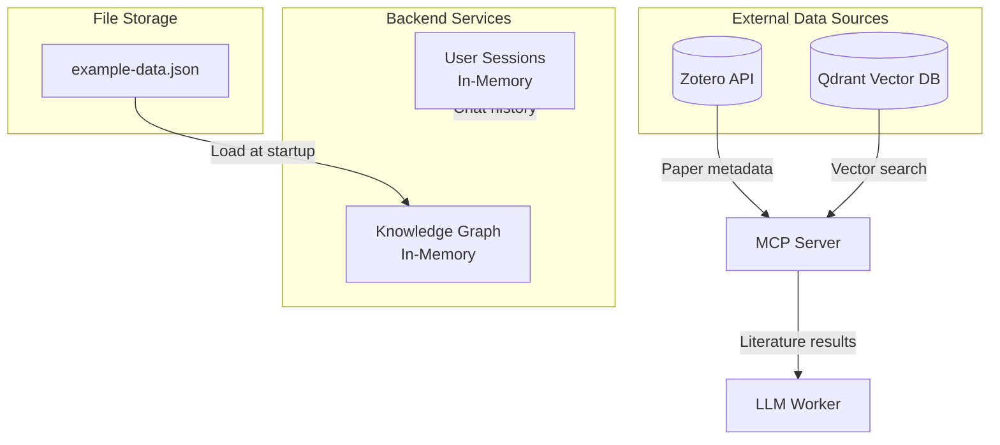

# 9. Data

This chapter describes the data models, storage mechanisms, and data flow within the Studio application.

## 9.1 Overview

The Studio application works with several types of data:

| Data Type | Storage | Purpose |
|-----------|---------|---------|
| Knowledge Graph | JSON file (in-memory at runtime) | Represents domain concepts and relationships |
| Vector Embeddings | Qdrant | Semantic search over document chunks |
| Bibliography Metadata | Zotero (external) | Academic paper metadata and references |
| User Sessions | In-memory (Python dict) + cookies | Authentication state and chat history |
| LLM Traces | Langfuse (external) | Observability and prompt analytics |

## 9.2 Knowledge Graph Data Model

The knowledge graph is loaded from a JSON file at startup and stored in memory throughout the application lifecycle.

### 9.2.1 Data Source

- **File**: [`src/frontend/src/knowledge-graph/example-data.json`](https://github.com/AIM-kennisplatformen/studio/blob/main/src/frontend/src/knowledge-graph/example-data.json)
- **Loaded by**: [`src/backend/utility/graph_data_loader.py`](https://github.com/AIM-kennisplatformen/studio/blob/main/src/backend/utility/graph_data_loader.py)

### 9.2.2 JSON Schema

The knowledge graph JSON file contains two arrays:

```json
{
  "nuggets": [
    {
      "id": 1,
      "type": "text",
      "title": "Energy Poverty: Intervention strategies"
    }
  ],
  "relationships": [
    {
      "id": 14,
      "source_id": 1,
      "target_id": 2,
      "label_forward": "optional",
      "label_backward": "optional"
    }
  ]
}
```

### 9.2.3 Domain Models

The knowledge graph data is converted to Pydantic models defined in [`src/backend/utility/graph_api_models.py`](https://github.com/AIM-kennisplatformen/studio/blob/main/src/backend/utility/graph_api_models.py):

```python
class Node(BaseModel):
    id: str
    type: str = "unknown"
    label: str
    attributes: dict

class Edge(BaseModel):
    id: str
    sourceId: str
    targetId: str
    labelToSource: Optional[str] = None
    labelToTarget: Optional[str] = None
    type: str = "unknown"
    attributes: Optional[dict]
```

### 9.2.4 Data Container

The `KnowledgeGraphData` class ([`graph_data_loader.py:9-86`](https://github.com/AIM-kennisplatformen/studio/blob/main/src/backend/utility/graph_data_loader.py#L9-L86)) provides:

| Field | Type | Description |
|-------|------|-------------|
| `entities` | `Dict[int, Node]` | Map of entity ID to Node |
| `relations` | `Dict[int, Edge]` | Map of relation ID to Edge |
| `questions` | `List[Dict]` | Predefined Q&A questions (currently unused) |

## 9.3 Vector Database (Qdrant)

### 9.3.1 Purpose

Qdrant stores document embeddings for semantic similarity search. When a user asks a question, the system queries Qdrant to find relevant text chunks from academic papers.

### 9.3.2 Configuration

| Setting | Environment Variable | Default |
|---------|---------------------|---------|
| Host | `QDRANT_URL` | `http://127.0.0.1` |
| Port | `QDRANT_PORT` | `6333` |
| Collection | Hardcoded | `knowledgeplatform` |

### 9.3.3 Data Schema

Each vector point in Qdrant contains:

| Field | Type | Description |
|-------|------|-------------|
| `vector` | `float[]` | 1024-dimensional embedding (Jina v3) |
| `zotero_hash` | `string` | Reference to Zotero item key |
| `text` | `string` | Original text chunk |
| `score` | `float` | Similarity score (added at query time) |

### 9.3.4 Embedding Model

- **Model**: `jinaai/jina-embeddings-v3` (configurable via `EMBEDDING_MODEL`)
- **Implementation**: [`src/mcp_servers/lib/qdrant/qdrant_source.py`](https://github.com/AIM-kennisplatformen/studio/blob/main/src/mcp_servers/lib/qdrant/qdrant_source.py)
- **Dimensions**: 1024
- **Normalization**: Enabled

## 9.4 Zotero Integration

### 9.4.1 Purpose

Zotero provides bibliography metadata for academic papers. The MCP server queries Zotero by tag to find papers relevant to a topic, then uses those paper keys to filter Qdrant results.

### 9.4.2 Configuration

| Setting | Environment Variable | Required |
|---------|---------------------|----------|
| API Key | `ZOTERO_API_KEY` | Optional |
| Library ID | `ZOTERO_LIBRARY_ID` | Optional |
| Collection ID | `ZOTERO_COLLECTION_ID` | Optional |

### 9.4.3 Data Retrieved

From Zotero API responses:

| Field | Description |
|-------|-------------|
| `key` | Unique item identifier (used as `zotero_hash` in Qdrant) |
| `data.title` | Paper title |
| `data.itemType` | Type of item (e.g., "journalArticle") |
| `data.date` | Publication date |

## 9.5 Session Data

### 9.5.1 User Sessions

User chat sessions are stored in memory using a `defaultdict`:

```python
# src/backend/endpoints/chat.py:50-52
user_sessions: DefaultDict[str, Session] = defaultdict(
    lambda: {"history": [], "last_seen": time.time(), "last_topic": None}
)
```

| Field | Type | Description |
|-------|------|-------------|
| `history` | `List[dict]` | Chat messages with `role` and `message` |
| `last_seen` | `float` | Unix timestamp of last activity |
| `last_topic` | `str` | Last discussed topic (nullable) |

### 9.5.2 Graph Context

Per-user graph navigation state:

```python
# src/backend/endpoints/graph.py:46-57
{
    "selected_subnode": "root",      # Currently viewed subnode
    "latest_question": None,         # Last question asked
    "latest_keywords": [],           # Extracted keywords
    "prefetched": {},                # subnode_name -> llm_answer
    "pending": {},                   # subnode_name -> asyncio.Task
}
```

### 9.5.3 Authentication Session

OAuth user info is stored in a signed session cookie managed by Starlette's `SessionMiddleware`:

```python
# src/backend/endpoints/auth.py:56-57
token = await oauth.authentik.authorize_access_token(request)
request.session["user"] = dict(token["userinfo"])
```

## 9.6 Data Flow Diagram


<details>
<summary>Mermaid source</summary>



</details>

## 9.7 Data Lifecycle

| Data | Created | Updated | Deleted |
|------|---------|---------|---------|
| Knowledge Graph | Application startup | Never (read-only) | Application shutdown |
| Vector embeddings | External ingestion process | External process | External process |
| Zotero metadata | External (Zotero) | External | External |
| User sessions | First chat message | Each interaction | Never (memory leak) |
| Auth sessions | OAuth callback | Never | Logout or cookie expiry |

## 9.8 Known Limitations

1. **No persistent chat storage**: User sessions are lost on server restart
2. **No session cleanup**: Old sessions accumulate in memory without TTL-based eviction
3. **Static knowledge graph**: The graph is read-only and cannot be modified at runtime
4. **Single-collection Qdrant**: Only one collection (`knowledgeplatform`) is supported
