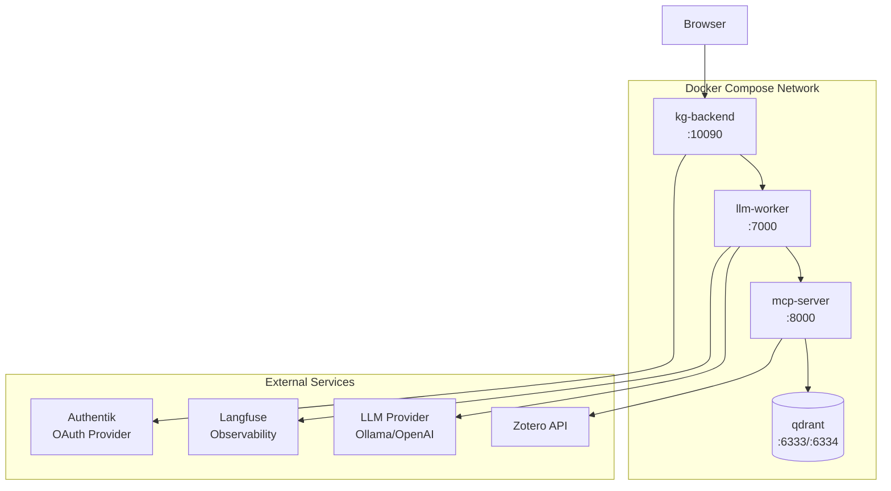

# 10. Infrastructure Architecture

This chapter describes the infrastructure components, networking, and deployment environments for the Studio application.

## 10.1 Overview

The Studio application runs as a set of containerized services orchestrated by Docker Compose, with optional external dependencies for authentication and observability.

## 10.2 Service Architecture


<details>
<summary>Mermaid source</summary>



</details>

## 10.3 Container Definitions

### 10.3.1 Backend Service (kg-backend)

| Property | Value |
|----------|-------|
| Dockerfile | [`dockerfiles/Dockerfile.backend`](https://github.com/AIM-kennisplatformen/studio/blob/main/dockerfiles/Dockerfile.backend) |
| Base Image | `ghcr.io/prefix-dev/pixi:latest` |
| Port | 10090 |
| Volume | `.:/app` (development) |

**Environment Variables:**
- `PYTHONPATH=src`
- `BACKEND_BASE_URL`
- `LLM_WORKER_URL`
- `OAUTH_CLIENT_ID`
- `OAUTH_CLIENT_SECRET`
- `OAUTH_DISCOVERY_URL`

### 10.3.2 MCP Server (mcp-server)

| Property | Value |
|----------|-------|
| Dockerfile | `dockerfiles/Dockerfile.mcp` |
| Port | 8000 |
| Transport | SSE (Server-Sent Events) |

**Environment Variables:**
- `PYTHONPATH=src`
- `ZOTERO_API_KEY`
- `ZOTERO_LIBRARY_ID`
- `ZOTERO_COLLECTION_ID`
- `QDRANT_URL`
- `QDRANT_PORT`

### 10.3.3 LLM Worker (llm-worker)

| Property | Value |
|----------|-------|
| Dockerfile | `dockerfiles/Dockerfile.llm_worker` |
| Port | 7000 |
| Config File | `llm_worker_config.toml` |

**Environment Variables:**
- `PYTHONPATH=src`
- `LANGFUSE_PUBLIC_KEY`
- `LANGFUSE_SECRET_KEY`
- `LANGFUSE_HOST`
- `LLM_WORKER_URL`

### 10.3.4 Qdrant Vector Database

| Property | Value |
|----------|-------|
| Image | `qdrant/qdrant:v1.13.5-unprivileged` |
| HTTP Port | 6333 |
| gRPC Port | 6334 |
| Volume | `qdrant_paper_data:/qdrant/storage` |
| User | `1000:1000` |

## 10.4 Network Configuration

### 10.4.1 Port Mapping

| Service | Internal Port | External Port | Protocol |
|---------|--------------|---------------|----------|
| kg-backend | 10090 | 10090 | HTTP |
| mcp-server | 8000 | 8000 | SSE |
| llm-worker | 7000 | 7000 | HTTP |
| qdrant | 6333 | 6333 | HTTP |
| qdrant | 6334 | 6334 | gRPC |

### 10.4.2 Internal Communication

Services communicate within the Docker network:

```
kg-backend -> llm-worker:7000/ask_stream
llm-worker -> mcp-server:8000/sse
mcp-server -> qdrant:6333
```

## 10.5 Docker Compose Configuration

The full orchestration is defined in [`docker-compose.yml`](https://github.com/AIM-kennisplatformen/studio/blob/main/docker-compose.yml):

```yaml
version: "3.9"

services:
  kg-backend:
    build:
      context: .
      dockerfile: dockerfiles/Dockerfile.backend
    ports:
      - "10090:10090"
    env_file: [.env]

  mcp-server:
    build:
      context: .
      dockerfile: dockerfiles/Dockerfile.mcp
    ports:
      - "8000:8000"
    env_file: [.env]

  llm-worker:
    build:
      context: .
      dockerfile: dockerfiles/Dockerfile.llm_worker
    ports:
      - "7000:7000"
    env_file: [.env]
    volumes:
      - ./llm_worker_config.toml:/app/llm_worker_config.toml

  qdrant:
    image: qdrant/qdrant:v1.13.5-unprivileged
    ports:
      - "6333:6333"
      - "6334:6334"
    volumes:
      - qdrant_paper_data:/qdrant/storage:Z

volumes:
  qdrant_paper_data:
```

## 10.6 External Service Dependencies

### 10.6.1 Authentication (Authentik)

| Setting | Description |
|---------|-------------|
| Protocol | OpenID Connect |
| Discovery URL | `https://<authentik>/application/o/<app>/.well-known/openid-configuration` |
| Scopes | `openid email profile` |
| Status | Optional (defaults configured for local dev) |

### 10.6.2 LLM Provider

The system supports multiple LLM backends:

| Provider | Host | Notes |
|----------|------|-------|
| Ollama (local) | `http://localhost:11434/v1` | Requires Ollama installation |
| OpenAI | `https://api.openai.com/v1` | Requires API key |
| Nebius | `https://api.studio.nebius.ai/v1` | Requires API key |

Configuration via `llm_worker_config.toml`:

```toml
[llm]
client_type = "ollama"
model_type = "qwen2.5:7b"
host = "http://localhost:11434/v1"
api_key = "ollama"
mcp_server = "http://localhost:8000/sse"
```

### 10.6.3 Observability (Langfuse)

| Setting | Environment Variable |
|---------|---------------------|
| Public Key | `LANGFUSE_PUBLIC_KEY` |
| Secret Key | `LANGFUSE_SECRET_KEY` |
| Host | `LANGFUSE_HOST` |

Langfuse integration is optional and provides:
- LLM call tracing
- Prompt analytics
- Cost tracking

### 10.6.4 Zotero API

| Setting | Environment Variable |
|---------|---------------------|
| API Key | `ZOTERO_API_KEY` |
| Library ID | `ZOTERO_LIBRARY_ID` |
| Collection ID | `ZOTERO_COLLECTION_ID` |

Zotero integration is optional and used for academic paper metadata.

## 10.7 Development Environment

For local development without Docker:

```
┌─────────────────────────────────────────────────────────────┐
│                     Developer Machine                        │
│                                                             │
│   ┌──────────┐    ┌──────────┐    ┌──────────┐             │
│   │ Backend  │    │ MCP      │    │ LLM      │             │
│   │ :10090   │───▶│ Server   │◀───│ Worker   │             │
│   │          │    │ :8000    │    │ :9200    │             │
│   └──────────┘    └────┬─────┘    └────┬─────┘             │
│                        │               │                    │
│                        ▼               ▼                    │
│                   ┌─────────┐    ┌─────────┐               │
│                   │ Qdrant  │    │ Ollama  │               │
│                   │ :6333   │    │ :11434  │               │
│                   └─────────┘    └─────────┘               │
└─────────────────────────────────────────────────────────────┘
```

## 10.8 Resource Requirements

### 10.8.1 Minimum Requirements

| Resource | Requirement |
|----------|-------------|
| CPU | 4 cores |
| RAM | 8 GB |
| Disk | 10 GB |
| GPU | None (cloud LLM) |

### 10.8.2 Recommended for Local LLM

| Resource | Requirement |
|----------|-------------|
| CPU | 8+ cores |
| RAM | 32 GB |
| Disk | 50 GB |
| GPU | NVIDIA with 12+ GB VRAM |

## 10.9 Security Considerations

### 10.9.1 Session Security

```python
# src/backend/main.py:36-41
app.add_middleware(
    SessionMiddleware,
    secret_key=SESSION_SECRET,
    same_site="lax",
    https_only=False,  # Set True for production HTTPS
)
```

### 10.9.2 CORS Configuration

```python
# src/backend/main.py:43-49
app.add_middleware(
    CORSMiddleware,
    allow_origins=[BASE_URL],  # Restrict to known origin
    allow_credentials=True,
    allow_methods=["*"],
    allow_headers=["*"],
)
```

### 10.9.3 Secrets Management

Secrets are managed via environment variables loaded from `.env` (not committed to version control). Required secrets:

- `SESSION_SECRET` - Auto-generated if not set
- `OAUTH_CLIENT_SECRET` - From Authentik
- `OPENAI_API_KEY` - For cloud LLM providers
- `LANGFUSE_SECRET_KEY` - For observability
