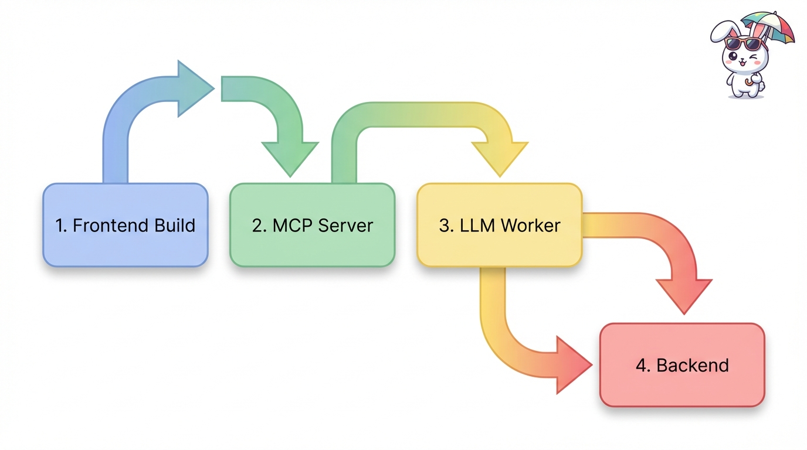
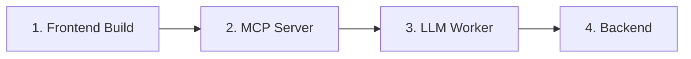

# 11. Deployment

This chapter describes the build process, release workflow, and deployment procedures for the Studio application.

## 11.1 Overview

The Studio application supports two deployment modes:

| Mode | Use Case | Tools |
|------|----------|-------|
| Development | Local development and testing | Pixi tasks |
| Production | Containerized deployment | Docker Compose |

## 11.2 Prerequisites

### 11.2.1 Development Prerequisites

- **Pixi** - Package manager ([installation guide](https://pixi.sh/latest/installation/))
- **Node.js** - Included via Pixi (v22.13.x)
- **Python** - Included via Pixi (v3.12.x)
- **Ollama** (optional) - For local LLM inference

### 11.2.2 Production Prerequisites

- **Docker** and **Docker Compose**
- Access to container registry (for custom images)

## 11.3 Configuration Files

Before deployment, create these configuration files from samples:

### 11.3.1 Environment Variables (.env)

```bash
cp .env.sample .env
```

Minimum required settings:

```dotenv
# Core URLs
BACKEND_BASE_URL=http://localhost:10090
LLM_WORKER_URL=http://127.0.0.1
LLM_WORKER_PORT=9200

# Qdrant
QDRANT_URL=http://127.0.0.1
QDRANT_PORT=6333

# LLM Configuration
OPENAI_HOST=http://localhost:11434/v1
OPENAI_API_KEY=ollama
LLM_MODEL=qwen2.5:7b

# MCP Tool Config
MCP_TOOL_CONFIG_PATH=scepa_tools.json
```

### 11.3.2 LLM Worker Config (llm_worker_config.toml)

```bash
cp llm_worker_config.sample.toml llm_worker_config.toml
```

Example for local Ollama:

```toml
[llm]
client_type = "ollama"
model_type = "qwen2.5:7b"
max_tokens = 1000
host = "http://localhost:11434/v1"
api_key = "ollama"
mcp_server = "http://localhost:8000/sse"
```

## 11.4 Development Deployment

### 11.4.1 Startup Sequence

Services must be started in this order:



<details>
<summary>Mermaid source</summary>



</details>

### 11.4.2 Pixi Tasks

All development tasks are run within a Pixi shell:

```bash
pixi shell
```

| Order | Command | Purpose |
|-------|---------|---------|
| 1 | `pixi run frontend_build` | Compile React frontend |
| 2 | `pixi run mcp_server` | Start MCP tool server |
| 3 | `pixi run llm_worker` | Start LLM inference worker |
| 4 | `pixi run backend_no_docker` | Start backend API |

### 11.4.3 Frontend Build Process

The frontend build task (defined per-platform in [`pyproject.toml`](https://github.com/AIM-kennisplatformen/studio/blob/main/pyproject.toml#L128-L136)):

1. Reads `BACKEND_BASE_URL` from `.env`
2. Creates `.env.production` for Vite
3. Runs `npm install && npm run build`
4. Moves compiled assets to `kg/` directory

```bash
# Linux/macOS task
rm -rf kg && \
cd src/frontend && \
echo "VITE_BACKEND_BASE_URL=$BACKEND_BASE_URL" > .env.production && \
npm install && npm run build && \
rm .env.production && \
mv dist ../../kg
```

### 11.4.4 Service Ports (Development)

| Service | Port | Command |
|---------|------|---------|
| Backend | 10090 | `pixi run backend_no_docker` |
| MCP Server | 8000 | `pixi run mcp_server` |
| LLM Worker | 9200 | `pixi run llm_worker` |
| Qdrant | 6333 | External (Docker or local) |
| Ollama | 11434 | External |

## 11.5 Production Deployment

### 11.5.1 Docker Compose

Start all services with Docker Compose:

```bash
docker compose up -d
```

Or using Pixi:

```bash
pixi run backend  # Alias for docker compose up
```

### 11.5.2 Build Images

Build all images locally:

```bash
docker compose build
```

### 11.5.3 Service Ports (Production)

| Service | Internal Port | External Port |
|---------|--------------|---------------|
| kg-backend | 10090 | 10090 |
| mcp-server | 8000 | 8000 |
| llm-worker | 7000 | 7000 |
| qdrant | 6333/6334 | 6333/6334 |

## 11.6 Continuous Integration

### 11.6.1 GitHub Actions Workflows

| Workflow | File | Trigger | Purpose |
|----------|------|---------|---------|
| Lint | [`.github/workflows/lint.yaml`](https://github.com/AIM-kennisplatformen/studio/blob/main/.github/workflows/lint.yaml) | Push to main, PRs | Run Ruff linter |
| Typecheck | `.github/workflows/typecheck.yaml` | Push to main, PRs | Run Mypy |
| Toolchain | `.github/workflows/toolchain_check.yaml` | Push to main, PRs | Verify Pixi environment |

### 11.6.2 Lint Workflow

```yaml
# .github/workflows/lint.yaml
name: Lint

on:
  push:
    branches: [ main ]
  pull_request:

jobs:
  build:
    runs-on: ubuntu-latest
    steps:
      - uses: actions/checkout@v4
      - uses: prefix-dev/setup-pixi@v0.8.3
      - run: pixi run lint
```

## 11.7 Build Artifacts

### 11.7.1 Frontend Assets

After `frontend_build`, compiled assets are in:

```
kg/
├── index.html
├── assets/
│   ├── index-[hash].js
│   └── index-[hash].css
└── ...
```

### 11.7.2 Docker Images

| Image | Dockerfile | Size (approx) |
|-------|------------|---------------|
| kg-backend | `dockerfiles/Dockerfile.backend` | ~1.5 GB |
| mcp-server | `dockerfiles/Dockerfile.mcp` | ~1.5 GB |
| llm-worker | `dockerfiles/Dockerfile.llm_worker` | ~1.5 GB |

## 11.8 Deployment Checklist

### 11.8.1 Pre-deployment

- [ ] `.env` file created and configured
- [ ] `llm_worker_config.toml` created and configured
- [ ] Qdrant collection populated (if using paper search)
- [ ] Zotero credentials configured (if using paper search)
- [ ] OAuth application registered (if using authentication)
- [ ] LLM provider accessible

### 11.8.2 First-time Setup

```bash
# 1. Clone repository
git clone https://github.com/AIM-kennisplatformen/studio.git
cd studio

# 2. Create configuration
cp .env.sample .env
cp llm_worker_config.sample.toml llm_worker_config.toml
# Edit both files with your settings

# 3. Start with Docker
docker compose up -d

# Or for development
pixi shell
pixi run frontend_build
pixi run mcp_server &
pixi run llm_worker &
pixi run backend_no_docker
```

### 11.8.3 Verification

After deployment, verify services are running:

| Check | URL | Expected |
|-------|-----|----------|
| Backend health | `http://localhost:10090/docs` | OpenAPI docs |
| Frontend | `http://localhost:10090/app` | React UI |
| Qdrant | `http://localhost:6333/dashboard` | Qdrant dashboard |

## 11.9 Rollback Procedure

For Docker deployments:

```bash
# Stop current deployment
docker compose down

# Checkout previous version
git checkout <previous-tag>

# Rebuild and restart
docker compose build
docker compose up -d
```

## 11.10 Known Issues

1. **Frontend build requires .env**: The build reads `BACKEND_BASE_URL` at build time
2. **Service startup order**: MCP Server must start before LLM Worker
3. **Port conflicts**: Ensure ports 8000, 9200, 10090 are available
4. **Large Docker images**: Pixi-based images are ~1.5 GB due to conda dependencies
