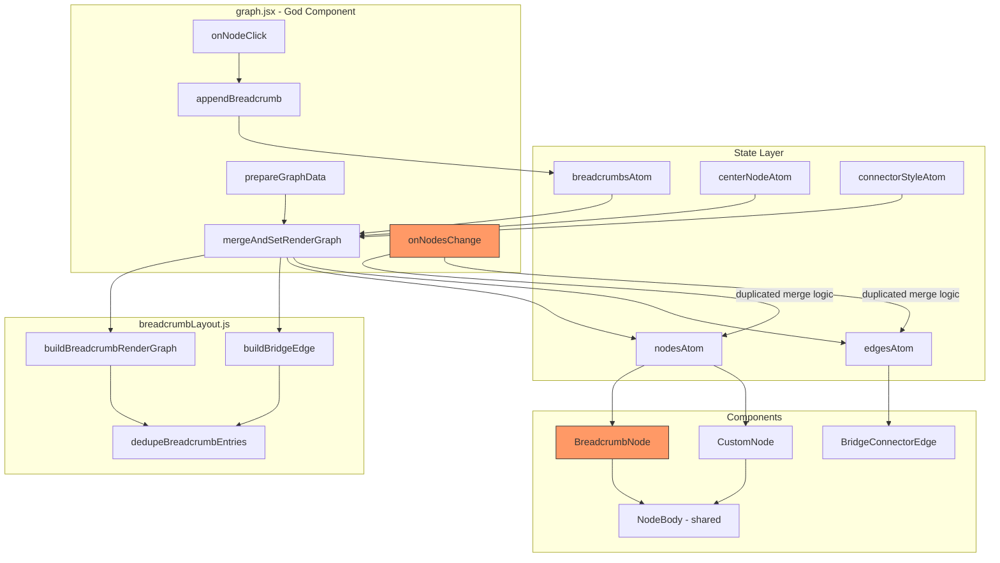

# Breadcrumb Navigation Implementation — Code Review

**Reviewer:** Senior Frontend Engineer  
**Scope:** All files related to the breadcrumb navigation system  
**Verdict:** ⚠️ **Needs significant rework before merge**

---

## Executive Summary

This implementation renders breadcrumb navigation history as React Flow nodes pinned to the viewport, connected by chain edges and a bridge edge to the currently focused graph node. The architectural approach — embedding breadcrumbs as pseudo-nodes inside the same `<ReactFlow>` canvas — is defensible for the stated requirements. However, the execution has **critical bugs, dead debug code shipped as production, hardcoded magic values everywhere, zero accessibility, and a `graph.jsx` orchestrator that has grown into an unmaintainable 546-line god-component**. Several issues will cause runtime failures under real-world conditions.

---

## 🔴 Critical Issues (Must Fix)

---

### 2. `setBreadcrumbs` returns `undefined` on a code path in `onNodeClick`

**File:** [`graph.jsx`](src/graph.jsx:433)

```js
setBreadcrumbs((prev) => {
  if (!selectedNode || node.id !== selectedNode.id) {
    const clickedIndex = prev.findIndex((entry) => entry.historyId === node.id);
    if (clickedIndex < 0) {
      return prev;
    }
    return prev.slice(0, clickedIndex + 1);
  }
  // ⚠️ No return statement here — returns undefined
});
```

When `selectedNode` exists AND `node.id === selectedNode.id`, the updater function returns `undefined`. Jotai will set `breadcrumbsAtom` to `undefined`, which will cause `dedupeBreadcrumbEntries` to crash on the next render because it calls `.reduce()` on `undefined`.

**Fix:** Always return a value from the updater:

```js
setBreadcrumbs((prev) => {
  if (!selectedNode || node.id !== selectedNode.id) {
    const clickedIndex = prev.findIndex((entry) => entry.historyId === node.id);
    if (clickedIndex < 0) {
      return prev;
    }
    return prev.slice(0, clickedIndex + 1);
  }
  return prev; // ← missing
});
```

---

### 3. `buildBreadcrumbRenderGraph` signature mismatch between definition and call sites

**File:** [`breadcrumbLayout.js`](src/lib/breadcrumbLayout.js:62) defines:

```js
export function buildBreadcrumbRenderGraph(breadcrumbEntries, viewport)
```

But [`graph.jsx`](src/graph.jsx:372) calls it with **4 arguments**:

```js
buildBreadcrumbRenderGraph(
  breadcrumbs,
  viewport,
  containerWidth,
  anchorNode?.position
);
```

And [`graph.jsx`](src/graph.jsx:123) calls it with **3 arguments**:

```js
buildBreadcrumbRenderGraph(breadcrumbs, viewport, anchorNode?.position);
```

The function only uses 2 parameters. The extra arguments are silently ignored. This indicates either:

- The function was refactored and call sites were not updated, or
- There is intended functionality (collision avoidance with anchor position?) that was never implemented.

Either way, this is confusing and will mislead future developers. **Clean up all call sites to match the actual signature.**

---

### 4. `appendBreadcrumb` has a stale closure bug with `appended`

**File:** [`graph.jsx`](src/graph.jsx:150-188)

```js
const appendBreadcrumb = useCallback(
  (node) => {
    let appended = false;

    setBreadcrumbs((prev) => {
      // ... logic that may set appended = true ...
      appended = true;
      // ...
    });

    if (appended || latestForwardNodeIdRef.current == null) {
      latestForwardNodeIdRef.current = node.id;
    }
  },
  [setBreadcrumbs]
);
```

The `setBreadcrumbs` updater function runs **asynchronously** in Jotai (it batches updates). The `appended` variable is read synchronously after `setBreadcrumbs` is called, but the updater may not have executed yet. This means `appended` could still be `false` when the `if` check runs, causing `latestForwardNodeIdRef` to not be updated when it should be.

**Fix:** Move the ref update inside the updater, or use a ref instead of a local variable:

```js
setBreadcrumbs((prev) => {
  // ... existing logic ...
  latestForwardNodeIdRef.current = node.id;
  return [...prev, entry];
});
```

---

### 5. `onNodeClick` dependency array is missing `selectedNode`

**File:** [`graph.jsx`](src/graph.jsx:460-467)

The callback reads `selectedNode` on line 434:

```js
if (!selectedNode || node.id !== selectedNode.id) {
```

But `selectedNode` is **not in the dependency array**:

```js
[
  appendBreadcrumb,
  centerNodeInView,
  setBreadcrumbs,
  setCenterNodeId,
  setSelectedNode,
];
```

This means the callback captures a stale `selectedNode` value. The breadcrumb-click truncation logic will use an outdated reference, potentially producing incorrect behavior.

**Fix:** Add `selectedNode` to the dependency array, or access it via a ref.

---

## 🟠 Significant Issues (Should Fix)

### 6. `graph.jsx` is a 546-line god-component

[`graph.jsx`](src/graph.jsx:76) contains:

- Graph data preparation and layout
- Breadcrumb state management
- Breadcrumb layout computation
- Node click handling for both regular and breadcrumb nodes
- Edge recomputation
- Viewport management
- Resize observation
- Connector style UI rendering
- Node centering animation

This violates single-responsibility principle severely. The file is difficult to reason about, test, or modify safely. The `onNodesChange` handler alone (lines 346-408) is a 60-line nested callback that mutates refs, calls setters, rebuilds edge arrays, and filters node types — all inside a `setNodes` updater.

**Recommendation:** Extract at minimum:

- `useBreadcrumbManager()` — custom hook encapsulating breadcrumb state, append/truncate logic, and render graph computation
- `useGraphLayout()` — custom hook for dagre layout and edge computation
- `ConnectorStylePicker` — separate component for the toggle group UI

---

### 7. Hardcoded color `#038061` appears 15+ times across 4 files

The color `#038061` is hardcoded in:

- [`breadcrumbLayout.js`](src/lib/breadcrumbLayout.js:94) (node data)
- [`breadcrumbLayout.js`](src/lib/breadcrumbLayout.js:115) (edge style)
- [`breadcrumbLayout.js`](src/lib/breadcrumbLayout.js:143) (bridge edge style)
- [`graph.jsx`](src/graph.jsx:233) (node data)
- [`graph.jsx`](src/graph.jsx:497) (connector UI)
- [`graph.jsx`](src/graph.jsx:517) (toggle items)
- [`CustomEdge.jsx`](src/components/CustomEdge.jsx:41) (solid edge)

This is a maintenance nightmare. A brand color change requires a find-and-replace across the entire codebase.

**Fix:** Define a theme constants file or use CSS custom properties:

```js
// lib/theme.js
export const COLORS = {
  primary: "#038061",
  primaryLight: "rgba(3, 128, 97, 0.2)",
  // ...
};
```

---

### 8. `dedupeBreadcrumbEntries` has O(n²) complexity and confusing semantics

**File:** [`breadcrumbLayout.js`](src/lib/breadcrumbLayout.js:48-60)

```js
function dedupeBreadcrumbEntries(breadcrumbEntries) {
  return breadcrumbEntries.reduce((path, entry) => {
    const existingIndex = path.findIndex(
      (pathEntry) => pathEntry.originNodeId === entry.originNodeId
    );
    if (existingIndex >= 0) {
      return path.slice(0, existingIndex + 1);
    }
    return [...path, entry];
  }, []);
}
```

This is O(n²) due to `findIndex` inside `reduce`. For small breadcrumb trails this is fine, but the bigger problem is **semantic confusion**: this function doesn't just deduplicate — it **truncates the trail at the first revisited node**. If the trail is `[A, B, C, B]`, the result is `[A, B]`, not `[A, B, C]`. This is cycle-detection, not deduplication. The function name is misleading.

Additionally, this same logic is **duplicated** in [`appendBreadcrumb`](src/graph.jsx:164-169) in `graph.jsx`. The dedup runs both when appending AND when rendering. Pick one location.

**Fix:** Rename to `collapseCycles` or `truncateAtRevisit`, and remove the duplicate logic from one of the two locations.

---

### 9. `JSON.stringify` used for deep equality in hot paths

**Files:** [`graph.jsx`](src/graph.jsx:52), [`graph.jsx`](src/graph.jsx:71)

```js
JSON.stringify(node.data) === JSON.stringify(nextNode.data);
JSON.stringify(edge.style || {}) === JSON.stringify(nextEdge.style || {});
```

`areNodeArraysEqual` and `areEdgeArraysEqual` are called on every render cycle — inside `setNodes` and `setEdges` updaters. `JSON.stringify` is expensive for deep comparison and has known pitfalls (key ordering, `undefined` values, circular references). For the `data` object which contains ~12 properties, this creates garbage strings on every comparison.

**Fix:** Use a shallow comparison of known keys, or use a library like `fast-deep-equal`. Alternatively, since you control the data shape, compare only the fields that actually change:

```js
node.data.label === nextNode.data.label &&
  node.data.scale === nextNode.data.scale &&
  node.data.background === nextNode.data.background;
```

---

### 10. No input validation in `buildBreadcrumbRenderGraph`

**File:** [`breadcrumbLayout.js`](src/lib/breadcrumbLayout.js:62)

The function does not guard against:

- `breadcrumbEntries` being `undefined` or `null` (will crash on `.reduce()` in `dedupeBreadcrumbEntries`)
- `viewport` being `undefined` (will crash on `viewport.x`)
- `viewport.zoom` being `0` (division by zero in position calculation)
- Empty `breadcrumbEntries` (returns `{ nodes: [], edges: [] }` which is fine, but undocumented)

**Fix:** Add guards:

```js
export function buildBreadcrumbRenderGraph(breadcrumbEntries, viewport) {
  if (!Array.isArray(breadcrumbEntries) || !breadcrumbEntries.length) {
    return { nodes: [], edges: [] };
  }
  if (!viewport || viewport.zoom === 0) {
    return { nodes: [], edges: [] };
  }
  // ...
}
```

---

### 11. Magic numbers everywhere in layout calculations

**File:** [`breadcrumbLayout.js`](src/lib/breadcrumbLayout.js:64-78)

```js
const nodeHeight = 75;
const rowGap = 24;
const newestScreenY = 20 + newestIndex * verticalStep;
const screenX = 20;
const scaleEdge = 1.11;
const newScale = 1.75;
const defaultScale = 1;
```

These are all unnamed magic numbers. What is `1.11`? Why `75` for height when `CustomNode` uses `80`? Why `20` for margin? None of this is documented or configurable.

**Fix:** Extract to a named constants object at the top of the file:

```js
const BREADCRUMB_LAYOUT = {
  NODE_HEIGHT: 75,
  ROW_GAP: 24,
  SCREEN_MARGIN: 20,
  ZOOM_SCALE_THRESHOLD: 1.11,
  ZOOMED_OUT_SCALE: 1.75,
  DEFAULT_SCALE: 1,
};
```

---

## 🟡 Moderate Issues (Consider Fixing)

### 12. Zero accessibility

**File:** [`BreadcrumbNode.jsx`](src/components/BreadcrumbNode.jsx:32-112)

The breadcrumb nodes have:

- No `role` attribute (they are clickable navigation elements rendered as plain `<div>`s)
- No `aria-label` or `aria-description`
- No keyboard navigation support (no `tabIndex`, no `onKeyDown`)
- No screen reader announcement when the breadcrumb trail changes
- No semantic relationship between breadcrumb items (no `aria-current`, no `nav` landmark)

The [`breadcrumb.jsx`](src/components/ui/breadcrumb.jsx) UI component from shadcn has proper ARIA attributes (`aria-label="breadcrumb"`, `aria-current="page"`, `role="presentation"` on separators), but **it is never used**. The breadcrumb system completely bypasses the accessible UI component in favor of raw React Flow nodes.

**Recommendation:** At minimum, add `role="button"` and `aria-label` to the breadcrumb node wrapper. Consider rendering an accessible breadcrumb trail as an HTML overlay on top of the canvas for screen reader users.

---

### 13. `NodeBody` does not receive `showDragHandle` prop from `BreadcrumbNode`

**File:** [`BreadcrumbNode.jsx`](src/components/BreadcrumbNode.jsx:101-111)

```jsx
<NodeBody
  data={data}
  selected={false}
  contentRef={contentRef}
  scale={scale}
  baseWidth={baseWidth}
  textColor={textColor}
  background={background}
  fontWeight={fontWeight}
  showDragHandle={false}
/>
```

The `showDragHandle` prop is passed but [`NodeBody`](src/components/NodeBody.jsx:1) does not destructure or use it:

```js
export function NodeBody({
  data, selected, contentRef, scale, baseWidth, textColor, background, fontWeight,
}) {
```

The prop is silently dropped. Either `NodeBody` should use it, or it should not be passed.

---

### 14. `containerWidth` is computed but never used

**File:** [`graph.jsx`](src/graph.jsx:117)

```js
const containerWidth = containerRef.current?.clientWidth ?? 800;
```

This variable is computed in `mergeAndSetRenderGraph` but never passed to any function. It is also computed in `onNodesChange` (line 367) and similarly unused. This is dead code left over from a previous iteration where `buildBreadcrumbRenderGraph` accepted a `containerWidth` parameter.

**Fix:** Remove the dead variable declarations.

---

### 15. Breadcrumb nodes use vertical stacking but edges use `sourceHandle: "bottom"` / `targetHandle: "target-top"`

**File:** [`breadcrumbLayout.js`](src/lib/breadcrumbLayout.js:108-117)

The layout positions breadcrumbs vertically (each one below the previous), and the chain edges connect `bottom` → `target-top`. But the bridge edge on line 142 uses `sourceHandle: "right"` → `targetHandle: "target-left"`. This means the bridge edge exits the last breadcrumb to the right, while the chain edges exit downward. This creates an inconsistent visual flow — the trail goes down, then suddenly goes right.

**Recommendation:** Either make the bridge edge also go downward for consistency, or document this as an intentional design choice. Better yet, dynamically compute the bridge edge handle based on the relative position of the anchor node.

---

### 16. `onNodesChange` duplicates breadcrumb merge logic

**File:** [`graph.jsx`](src/graph.jsx:346-408)

The `onNodesChange` handler contains a near-complete copy of the merge logic from `mergeAndSetRenderGraph`. It rebuilds breadcrumb edges, bridge edges, and merges node arrays — all inline inside a `setNodes` updater. This is:

1. **Duplicated logic** — any change to merge behavior must be updated in two places
2. **Nested state updates** — calling `setEdges` inside a `setNodes` updater is a code smell that can cause extra renders
3. **Hard to test** — the logic is buried inside a callback inside a callback

**Fix:** Extract the merge logic into a shared function, or call `mergeAndSetRenderGraph` after the node change is applied.

---

### 17. `"Copied of PoC-Robert-React-Flow"` comments

**Files:** [`BreadcrumbNode.jsx`](src/components/BreadcrumbNode.jsx:1), [`CustomNode.jsx`](src/components/CustomNode.jsx:1)

```js
/* Copied of PoC-Robert-React-Flow */
```

This comment provides no value in production code. It does not explain what was copied, why, or whether the copy has diverged. If provenance tracking is needed, use git blame.

**Fix:** Remove these comments.

---

### 18. `centerNodeAtom` stores a number but node IDs are strings

**File:** [`atoms.js`](src/data/atoms.js:42)

```js
export const centerNodeAtom = atom(1);
```

Throughout [`graph.jsx`](src/graph.jsx), node IDs are strings (`String(node.id)`), but `centerNodeAtom` stores a number. This forces `String(centerNodeId)` conversions everywhere (lines 120, 137, 369) and `Number(node.id)` conversions when setting (lines 447, 454). This type mismatch is a bug waiting to happen.

**Fix:** Store the center node ID as a string consistently:

```js
export const centerNodeAtom = atom("1");
```

---

### 19. `isCenter` check is hardcoded to `node.id === 1`

**File:** [`graph.jsx`](src/graph.jsx:225)

```js
const isCenter = node.id === 1;
```

This compares a raw API node ID (number) to the literal `1`. This means only the node with ID 1 gets center styling on initial render. This is fragile — what if the API returns a different root node? This should use `centerNodeAtom` or be derived from the actual center node.

---

### 20. No breadcrumb trail length limit

There is no maximum length for the breadcrumb trail. A user who clicks through 100 nodes will have 100 breadcrumb nodes rendered in the React Flow canvas, each with 4 source handles and 4 target handles (8 DOM elements per node), plus 99 chain edges and 1 bridge edge. That is 800+ handle DOM elements plus 100 edge SVG paths, all recomputed on every viewport change.

**Fix:** Add a configurable maximum trail length (e.g., 20) and truncate from the oldest end:

```js
const MAX_BREADCRUMBS = 20;
setBreadcrumbs((prev) => {
  const next = [...prev, entry];
  return next.length > MAX_BREADCRUMBS ? next.slice(-MAX_BREADCRUMBS) : next;
});
```

---

## 🔵 Minor Issues / Nitpicks

### 21. Inconsistent naming: `originNodeId` vs `originalNodeId`

The atom comment in [`atoms.js`](src/data/atoms.js:51) says `originalNodeId`, but the actual code uses `originNodeId` everywhere. Pick one.

### 22. `getEdgeHandles` is a no-op

[`graphUtils.js`](src/lib/graphUtils.js:3-7) accepts no parameters and always returns the same hardcoded value. The function signature suggests it should compute handles based on positions, but the body ignores all inputs. Either implement it or inline the constant.

### 23. `scaleEdge` naming is confusing

In [`breadcrumbLayout.js`](src/lib/breadcrumbLayout.js:78), `scaleEdge` sounds like it relates to edge scaling, but it is actually a zoom threshold for node scaling. Name it `zoomScaleThreshold` or similar.

### 24. No TypeScript / JSDoc types

None of the breadcrumb functions have type annotations or JSDoc. The `buildBreadcrumbRenderGraph` return type, the shape of breadcrumb entries, and the viewport parameter are all undocumented. This makes the code harder to use correctly.

### 25. `proOptions={{ hideAttribution: true }}` may violate React Flow license

**File:** [`graph.jsx`](src/graph.jsx:542)

Hiding the React Flow attribution requires a Pro subscription. If this project does not have one, this is a license violation. Verify.

---

## Architecture Diagram



---

## Summary of Required Actions

| Priority       | Issue                              | File                          | Action                             |
| -------------- | ---------------------------------- | ----------------------------- | ---------------------------------- |
| 🔴 Critical    | Debug colors hardcoded             | `BreadcrumbNode.jsx:29-30`    | Remove hardcoded blue/white        |
| 🔴 Critical    | `setBreadcrumbs` returns undefined | `graph.jsx:433-445`           | Add missing `return prev`          |
| 🔴 Critical    | Function signature mismatch        | `graph.jsx:123,372`           | Fix call sites to match definition |
| 🔴 Critical    | Stale closure on `appended`        | `graph.jsx:150-188`           | Move ref update inside updater     |
| 🔴 Critical    | Missing dependency `selectedNode`  | `graph.jsx:460-467`           | Add to dependency array            |
| 🟠 Significant | God component                      | `graph.jsx`                   | Extract custom hooks               |
| 🟠 Significant | Hardcoded colors everywhere        | Multiple files                | Extract theme constants            |
| 🟠 Significant | Misleading function name           | `breadcrumbLayout.js:48`      | Rename `dedupeBreadcrumbEntries`   |
| 🟠 Significant | `JSON.stringify` in hot path       | `graph.jsx:52,71`             | Use shallow comparison             |
| 🟠 Significant | No input validation                | `breadcrumbLayout.js:62`      | Add guards                         |
| 🟠 Significant | Magic numbers                      | `breadcrumbLayout.js:64-78`   | Extract named constants            |
| 🟡 Moderate    | Zero accessibility                 | `BreadcrumbNode.jsx`          | Add ARIA attributes                |
| 🟡 Moderate    | Unused `showDragHandle` prop       | `NodeBody.jsx`                | Implement or remove                |
| 🟡 Moderate    | Dead `containerWidth` variable     | `graph.jsx:117,367`           | Remove                             |
| 🟡 Moderate    | Inconsistent edge direction        | `breadcrumbLayout.js:108,142` | Align or document                  |
| 🟡 Moderate    | Duplicated merge logic             | `graph.jsx:346-408`           | Extract shared function            |
| 🟡 Moderate    | PoC comments                       | `BreadcrumbNode.jsx:1`        | Remove                             |
| 🟡 Moderate    | Type mismatch number/string        | `atoms.js:42`                 | Standardize to string              |
| 🟡 Moderate    | No trail length limit              | `graph.jsx:150-188`           | Add max breadcrumbs                |
| 🔵 Minor       | Naming inconsistency               | `atoms.js:51`                 | Fix comment                        |
| 🔵 Minor       | `getEdgeHandles` is a no-op        | `graphUtils.js:3-7`           | Implement or inline                |
| 🔵 Minor       | Confusing `scaleEdge` name         | `breadcrumbLayout.js:78`      | Rename                             |
| 🔵 Minor       | No types/JSDoc                     | Multiple files                | Add documentation                  |
| 🔵 Minor       | Attribution hiding                 | `graph.jsx:542`               | Verify license                     |
