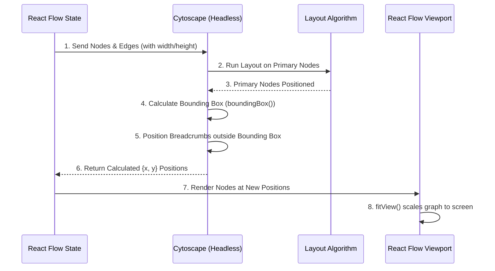

# Two-Step Layout Strategy: React Flow & Cytoscape.js

## Overview

This document details the architectural pattern for integrating React Flow (rendering) and Cytoscape.js (layout calculations). The primary goal is to calculate precise sizes and positions for all nodes, ensuring that secondary "breadcrumb" elements never overlap with primary graph nodes, and that the entire structure dynamically scales to fit the visible screen area.

## Architecture: The Two-Step Layout Strategy

To guarantee no overlap between breadcrumbs and primary nodes, we employ a Two-Step Layout Strategy:

1.  **Primary Layout:** Run a layout algorithm (e.g., `dagre` or `fcose`) exclusively on the primary graph nodes using a headless Cytoscape instance.
2.  **Bounding Box Calculation:** Calculate the exact bounding box of the resulting primary graph.
3.  **Deterministic Positioning:** Position the breadcrumb nodes deterministically outside of this bounding box (e.g., in a linear row above it).
4.  **Viewport Management:** Map the calculated positions back to React Flow and utilize `fitView` to scale the graph to the screen.

### Data Flow Diagram



# Technical Implementation

1. Cytoscape Layout Utility (src/lib/ctrytoscapeLayout.js)
   This utility initializes a headless Cytoscape instance, separates nodes by type, runs the layout on primary nodes, and calculates the bounding box to position breadcrumbs safely.

Crucial Note: You must pass the width and height of your React Flow nodes into Cytoscape so the layout algorithm can accurately calculate bounding boxes and prevent overlaps.

```javascript
import cytoscape from "cytoscape";
import dagre from "cytoscape-dagre";

// Register the layout algorithm
cytoscape.use(dagre);

export const calculateTwoStepLayout = (nodes, edges) => {
  // 1. Initialize headless Cytoscape instance
  const cy = cytoscape({ headless: true });

  // 2. Separate nodes by type
  const primaryNodes = nodes.filter((n) => n.type !== "breadcrumb");
  const breadcrumbNodes = nodes.filter((n) => n.type === "breadcrumb");

  // 3. Add primary nodes and edges to Cytoscape
  // CRITICAL: Pass width and height for accurate collision avoidance
  cy.add([
    ...primaryNodes.map((n) => ({
      group: "nodes",
      data: {
        id: n.id,
        width: n.width || 150,
        height: n.height || 50,
      },
    })),
    ...edges.map((e) => ({
      group: "edges",
      data: { id: e.id, source: e.source, target: e.target },
    })),
  ]);

  // 4. Configure and run the layout algorithm on primary nodes
  cy.layout({
    name: "dagre",
    nodeDimensionsIncludeLabels: true,
    spacingFactor: 1.5, // Increase spacing to prevent visual crowding
    fit: false, // React Flow handles the viewport fitting
    rankDir: "TB", // Top-to-Bottom hierarchy
  }).run();

  // 5. Calculate the Bounding Box of the primary graph
  const primaryBoundingBox = cy.elements().boundingBox();

  // 6. Position Breadcrumbs deterministically outside the bounding box
  const BREADCRUMB_SPACING = 20;
  const BREADCRUMB_MARGIN_BOTTOM = 80;

  // Start positioning breadcrumbs aligned with the left edge of the main graph,
  // shifted upwards by the margin.
  let currentX = primaryBoundingBox.x1;
  const breadcrumbY = primaryBoundingBox.y1 - BREADCRUMB_MARGIN_BOTTOM;

  // 7. Map calculated positions back to React Flow format
  const positionedNodes = nodes.map((node) => {
    if (node.type === "breadcrumb") {
      const width = node.width || 120;
      const pos = { x: currentX, y: breadcrumbY };
      currentX += width + BREADCRUMB_SPACING; // Advance X for the next breadcrumb
      return { ...node, position: pos };
    } else {
      const cyNode = cy.getElementById(node.id);
      return {
        ...node,
        position: { x: cyNode.position("x"), y: cyNode.position("y") },
      };
    }
  });

  return positionedNodes;
};
```

2. React Flow Integration (src/graph.jsx)
   Integrate the layout calculation into the React Flow rendering component. Use React Flow's useReactFlow hook to access the fitView method, ensuring the viewport scales dynamically after the layout is applied.

```javascript
import React, { useEffect, useCallback } from "react";
import ReactFlow, {
  useNodesState,
  useEdgesState,
  useReactFlow,
  ReactFlowProvider,
  Background,
} from "reactflow";
import "reactflow/dist/style.css";
import { calculateTwoStepLayout } from "./lib/ctrytoscapeLayout";
import CustomNode from "./components/CustomNode";
import BreadcrumbNode from "./components/BreadcrumbNode";

const nodeTypes = {
  custom: CustomNode,
  breadcrumb: BreadcrumbNode,
};

const GraphLayoutManager = ({ initialNodes, initialEdges }) => {
  const [nodes, setNodes, onNodesChange] = useNodesState(initialNodes);
  const [edges, setEdges, onEdgesChange] = useEdgesState(initialEdges);
  const { fitView } = useReactFlow();

  const applyLayout = useCallback(() => {
    if (!initialNodes || initialNodes.length === 0) return;

    // 1. Calculate new positions using the Two-Step Strategy
    const layoutedNodes = calculateTwoStepLayout(initialNodes, initialEdges);

    // 2. Update React Flow state
    setNodes(layoutedNodes);
    setEdges(initialEdges);

    // 3. Guarantee dynamic scaling
    // Wait for React to render the nodes at their new coordinates
    window.requestAnimationFrame(() => {
      fitView({
        padding: 0.2, // 20% padding around the screen edges
        includeHiddenNodes: false,
        duration: 800, // Smooth animated transition
      });
    });
  }, [initialNodes, initialEdges, setNodes, setEdges, fitView]);

  // Trigger layout when initial data changes
  useEffect(() => {
    applyLayout();
  }, [applyLayout]);

  return (
    <ReactFlow
      nodes={nodes}
      edges={edges}
      onNodesChange={onNodesChange}
      onEdgesChange={onEdgesChange}
      nodeTypes={nodeTypes}
    >
      <Background />
    </ReactFlow>
  );
};

// Wrap the component in ReactFlowProvider to enable useReactFlow
export default function Graph({ initialNodes, initialEdges }) {
  return (
    <div style={{ width: "100vw", height: "100vh" }}>
      <ReactFlowProvider>
        <GraphLayoutManager
          initialNodes={initialNodes}
          initialEdges={initialEdges}
        />
      </ReactFlowProvider>
    </div>
  );
}
```

## Debugging and Validation

To confirm the layout behaves as expected across different graph sizes, follow these validation steps:

### Verify Node Dimensions:

Test: Log node.width and node.height before passing them to Cytoscape.
Expected: They should have valid numeric values (e.g., 150 and 50). If they are undefined, Cytoscape defaults to 0x0, which causes the layout algorithm to overlap nodes. Ensure your initial data or node definitions provide these dimensions.

### Validate the Bounding Box:

Test: Add console.log('Bounding Box:', primaryBoundingBox) in src/lib/ctrytoscapeLayout.js.
Expected: x1, y1, x2, y2 should be valid numbers. If the graph is empty or nodes lack dimensions, this might return Infinity or NaN.

### Test Extreme Graph Sizes:

Test A (Micro Graph): Pass 1 primary node and 1 breadcrumb. Verify fitView zooms in appropriately without exceeding maximum zoom levels.
Test B (Macro Graph): Pass 100+ primary nodes and 5+ breadcrumbs. Verify the breadcrumbs remain strictly above the massive primary cluster and fitView zooms out enough to show everything.

### Check fitView Timing:

Test: If the graph renders off-center initially and snaps into place later, or doesn't fit at all, the requestAnimationFrame might be firing before the DOM fully paints.
Fix: Wrap the fitView call in a setTimeout(() => fitView(...), 50) as a fallback to ensure the React render cycle has completely finished.
