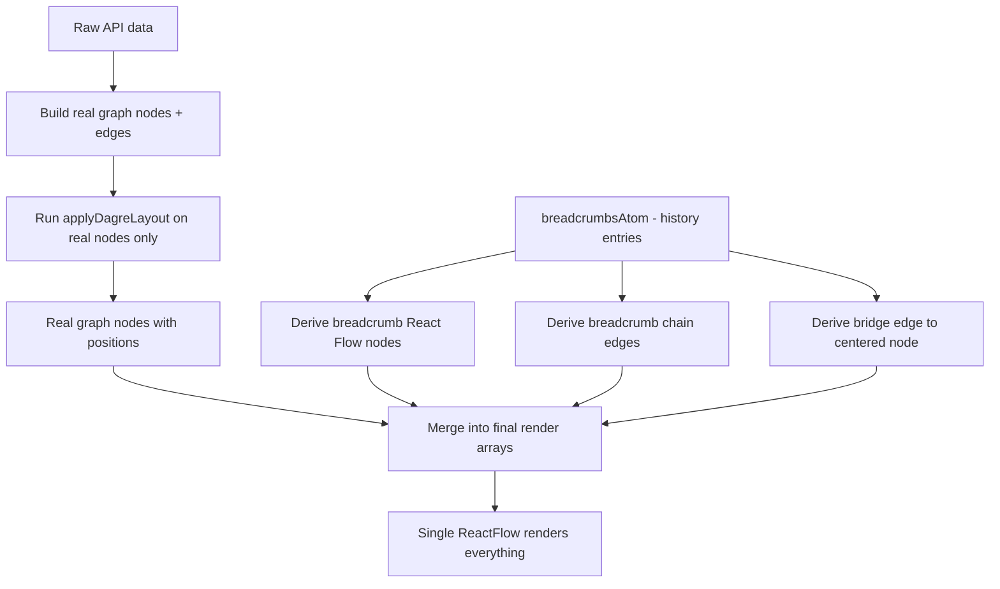

# Breadcrumb System Implementation Plan

## Context & Goals

The graph visualization in `src/frontend/src/graph.jsx` renders a knowledge graph using React Flow (`@xyflow/react` v12). Users navigate by clicking nodes, and a breadcrumb trail should visualize their navigation history. Breadcrumbs must:

- Live inside the **same** `<ReactFlow>` instance as the main graph (so they can share visual styling and have real edges drawn between them).
- Be connected by **history edges** (not graph-topology edges) between consecutive breadcrumb nodes.
- Have a **bridge edge** from the last breadcrumb to the currently centered real graph node.
- Be **excluded from the dagre layout** that positions regular graph nodes.
- Be **excluded from `fitView()`** calculations so the camera targets only the real graph.
- Track which real graph node each breadcrumb copies, so clicking a breadcrumb re-centers the corresponding real node.

The state management uses Jotai atoms defined in `src/frontend/src/data/atoms.js`.

---

## Architecture Overview



The key insight: two logical subgraphs share one React Flow canvas but are computed independently. The main graph goes through `applyDagreLayout()`; breadcrumbs get simple sequential positioning. They are merged only at the render boundary.

---

## Step 1 — Reshape `breadcrumbsAtom` to store history entries, not node objects

### Files to modify

- `src/frontend/src/data/atoms.js`

### What to do

The existing `breadcrumbsAtom` on line 46 is `atom([])`. Keep it, but define its contract: each entry in the array is a **history entry object**, not a React Flow node. Each entry should carry:

| Field | Type | Purpose |
|---|---|---|
| `historyId` | `string` | Unique id for this history step, e.g. `"bc-0"`, `"bc-1"`, … Use a simple auto-incrementing counter. |
| `originNodeId` | `string` | The `id` of the real graph node this breadcrumb copies. |
| `label` | `string` | The node title at the time of click. |

### Why this shape

- **`historyId` must be unique per visit, not per node.** A user can visit node `"3"` twice. If breadcrumbs shared the real node's id, React Flow would see duplicate ids and break rendering. A dedicated `historyId` avoids this collision.
- **Storing `originNodeId` separately** lets the click handler resolve back to the real node for centering.
- **Storing `label`** decouples the breadcrumb snapshot from the live graph node object. If graph data refreshes and a node's label changes, the breadcrumb still shows what the user saw when they clicked.
- **Not storing the full React Flow node object** prevents coupling to position, styling, or selection state that belongs to the main graph lifecycle.

Also add a small writable atom or a simple counter atom for generating sequential `historyId` values. Alternatively, import `nanoid` (already a dependency) for unique ids. Using a counter like `bc-0`, `bc-1` is simpler and easier to debug.

### Acceptance criteria

1. `breadcrumbsAtom` exists and its initial value is `[]`.
2. The atom's type contract is documented with a comment near the definition.
3. No other file breaks — the atom was already exported but unused outside `graph.jsx`, where the next step will rewire usage.

---

## Step 2 — Rewrite breadcrumb update logic in `graph.jsx`

### Files to modify

- `src/frontend/src/graph.jsx`

### What to do

1. **Remove** the local `useState` on line 41: `const [breadcrumbs, setBreadcrumbs] = useState([]);`
2. **Remove** the entire `updateBreadcrumbs` function (lines 43–57).
3. **Remove** the `console.log` debugging block (lines 59–65).
4. **Import** `breadcrumbsAtom` from `./data/atoms` and consume it with `useAtom`:
   ```
   const [breadcrumbs, setBreadcrumbs] = useAtom(breadcrumbsAtom);
   ```
5. **Create a new `appendBreadcrumb(node)` function** that:
   - Reads the clicked node's `id` and `data.label`.
   - Generates a new `historyId` (e.g. `"bc-" + nextCounter`; keep a ref for the counter).
   - Optionally suppresses consecutive duplicates: if the last entry in `breadcrumbs` has the same `originNodeId`, skip appending.
   - Calls `setBreadcrumbs(prev => [...prev, { historyId, originNodeId: node.id, label: node.data.label }])`.
6. **In `onNodeClick`** (line 224), replace the call to `updateBreadcrumbs(node)` with a call to the new `appendBreadcrumb(node)`, but **only when the clicked node is a real graph node** (not a breadcrumb node). Breadcrumb click handling is added in step 6.

### Why this change

The old `updateBreadcrumbs` stored full React Flow node objects and trimmed by numeric id comparison (`Number(n.id) <= selectedId`). That logic assumed node ids encode path order, which is not correct for a general navigation history. The new model is append-only (with optional dedup of consecutive clicks on the same node), which correctly models "the user navigated here, then here, then here."

Moving from local `useState` to the Jotai atom means breadcrumb state survives component remounts and is accessible from other components if needed later.

### Risks / gotchas

- The `BreadcrumbNode` import on line 24 is currently unused after this step. Leave it — step 4 will wire it up.
- The counter ref for `historyId` resets on remount. That is fine because breadcrumb state in the atom is also reset on full page reload. If persistence is ever needed, move the counter into the atom or derive it from `breadcrumbs.length`.

### Acceptance criteria

1. Clicking real graph nodes appends entries to `breadcrumbsAtom`. Verify by inspecting the atom value with React DevTools or a temporary `console.log`.
2. Clicking the same node twice in a row does not create a duplicate entry (if dedup is implemented).
3. The local `useState` for breadcrumbs no longer exists.
4. No console errors about duplicate keys or missing nodes.

---

## Step 3 — Create breadcrumb layout utility

### Files to create

- `src/frontend/src/lib/breadcrumbLayout.js`

### What to do

Create a pure function with signature:

```
buildBreadcrumbRenderGraph(breadcrumbEntries, viewport, containerWidth)
```

It receives:
- `breadcrumbEntries`: the array from `breadcrumbsAtom`.
- `viewport`: the object from `useReactFlow().getViewport()`, which has `{ x, y, zoom }`.
- `containerWidth`: the pixel width of the React Flow container div (from `containerRef.current.clientWidth`).

It returns:
- `{ nodes: [...], edges: [...] }` — breadcrumb React Flow nodes and breadcrumb chain edges.

#### Positioning logic (pseudo-viewport-fixed)

React Flow nodes live in **flow coordinates**, not screen coordinates. There is no built-in way to pin a node to the browser viewport. But we can simulate it by converting desired screen-pixel positions into flow coordinates using the current viewport transform.

The conversion from screen position `(screenX, screenY)` to flow position `(flowX, flowY)` is:

```
flowX = (screenX - viewport.x) / viewport.zoom
flowY = (screenY - viewport.y) / viewport.zoom
```

Use this to place breadcrumbs at a fixed visual position. For example:
- screen top margin: 20px
- screen left margin: 20px
- breadcrumb node width: 160px (matching `CustomNode` base width)
- horizontal gap between breadcrumbs: 24px

For each breadcrumb at index `i`:
```
screenX = 20 + i * (160 + 24)
screenY = 20
flowPosition = { x: (screenX - viewport.x) / viewport.zoom, y: (screenY - viewport.y) / viewport.zoom }
```

#### Node construction

For each breadcrumb entry, produce a React Flow node:

```js
{
  id: entry.historyId,          // e.g. "bc-0"
  type: "breadcrumb",           // registered node type
  position: flowPosition,       // computed above
  draggable: false,             // breadcrumbs must not be dragged
  selectable: false,            // prevent selection rectangle interaction
  connectable: false,           // prevent manual edge creation
  data: {
    label: entry.label,
    originNodeId: entry.originNodeId,
    // Copy visual styling similar to real nodes:
    background: "#ffffff",
    color: "#038061",
    border: "2px solid #038061",
    borderRadius: "8px",
    padding: "8px",
    fontSize: "12px",
    width: 160,
    whiteSpace: "pre-wrap",
    boxShadow: "0 4px 8px rgba(0,0,0,0.1)",
  },
  style: { zIndex: 2000 },     // above regular nodes (which default to 0; selected ones use 1000)
}
```

Setting `draggable: false`, `selectable: false`, `connectable: false` directly on the node object tells React Flow to override global defaults for these specific nodes. This is the React Flow API for per-node behavior control.

The `zIndex: 2000` in `style` ensures breadcrumb nodes render above regular nodes (whose wrapper uses `zIndex: 'auto'` or `1000` when selected).

#### Edge construction (history chain)

For each consecutive pair of breadcrumb entries at indices `i` and `i+1`, produce:

```js
{
  id: `bc-edge-${entries[i].historyId}-${entries[i+1].historyId}`,
  source: entries[i].historyId,
  target: entries[i+1].historyId,
  type: "solid",                // reuse existing SolidEdge
  sourceHandle: "right",        // left-to-right chain
  targetHandle: "target-left",
  style: { stroke: "#038061", strokeWidth: 1.5, strokeDasharray: "6 3" },  // dashed to distinguish from graph edges
  zIndex: 1500,                 // above graph edges, below breadcrumb nodes
}
```

Using dashed stroke distinguishes history edges from real graph edges visually.

### Why this is a separate utility

- Keeps `graph.jsx` focused on orchestration.
- The layout function is pure (no hooks), so it is easy to test.
- The viewport-to-flow conversion math is isolated and documented in one place.

### Risks / gotchas

- **Breadcrumb positions become stale as the user pans/zooms.** You must recompute them on every viewport change. Step 5 wires this up. If you skip step 5, breadcrumbs will drift with the canvas.
- **Long trails overflow the screen horizontally.** For now, accept horizontal overflow. A follow-up could add wrapping or scrolling.

### Acceptance criteria

1. The file exports `buildBreadcrumbRenderGraph`.
2. Given 3 breadcrumb entries and a mock viewport, the function returns 3 nodes and 2 edges.
3. Node ids match the `historyId` values; edge ids are deterministic strings.
4. All returned nodes have `draggable: false`, `selectable: false`, `connectable: false`.
5. Returned node positions change when the viewport argument changes.

---

## Step 4 — Refactor node components to share visuals

### Files to modify

- `src/frontend/src/components/CustomNode.jsx`
- `src/frontend/src/components/BreadcrumbNode.jsx`

### Files to create

- `src/frontend/src/components/NodeBody.jsx`

### What to do

Currently `CustomNode` and `BreadcrumbNode` are near-identical copies. Extract the shared inner visual box into a `NodeBody` component.

**`NodeBody`** receives props: `data`, `selected`, `contentRef`, `scale`, `baseWidth`, `textColor`, `background`, `fontWeight`, `showDragHandle` (boolean).

It renders the inner `<div className="custom-node">` with the flexbox layout, the optional drag handle strip, and the label. When `showDragHandle` is `false`, the drag-handle column is omitted and the content area gets full-rounded corners.

**`CustomNode`** becomes:
- The wrapper div with handles (all 8 handles, as today).
- Calls `<NodeBody showDragHandle={true} .../>`.

**`BreadcrumbNode`** becomes:
- A simpler wrapper. It still needs handles for programmatic edge routing — but handles should pass `isConnectable={false}` to prevent user interaction.
- Calls `<NodeBody showDragHandle={false} .../>`.
- The `" isBreadcrumbNode"` debug suffix on line 170 should be removed.

### Why shared visuals matter

The user's stated requirement: "breadcrumb nodes should share a lot of their visual design with regular nodes." Extracting `NodeBody` ensures that when styling changes are made to node appearance, both variants update automatically. It also eliminates the current code duplication between the two files.

### Risks / gotchas

- When you remove the drag handle from `BreadcrumbNode`, its measured `contentHeight` will differ slightly. This is fine — breadcrumb nodes just render a bit shorter.
- Make sure to pass `isConnectable={false}` on the `<Handle>` elements in `BreadcrumbNode`, not just set `connectable: false` on the node object. Belt and suspenders.

### Acceptance criteria

1. `NodeBody` renders the node's visible box and label.
2. `CustomNode` and `BreadcrumbNode` both use `NodeBody` — no duplicated markup for the inner box.
3. `CustomNode` shows the drag-handle grip strip; `BreadcrumbNode` does not.
4. `BreadcrumbNode` handles are present (for edge routing) but have `isConnectable={false}`.
5. The existing graph renders identically to before this change (no visual regression on regular nodes).

---

## Step 5 — Wire breadcrumb rendering into `graph.jsx`

### Files to modify

- `src/frontend/src/graph.jsx`

### What to do

This is the core integration step. It merges the breadcrumb subgraph into the single React Flow instance.

#### 5a. Register the breadcrumb node type

In the `<ReactFlow>` JSX (line 281), update `nodeTypes` to include the breadcrumb type:

```jsx
nodeTypes={{ custom: CustomNode, breadcrumb: BreadcrumbNode }}
```

#### 5b. Keep a separate ref for real-graph-only nodes

Add a new ref:
```js
const graphNodesRef = useRef([]);
```

In `prepareGraphData()`, after computing `mergedNodes`, store them in this ref:
```js
graphNodesRef.current = mergedNodes;
```

This ref always holds only real graph nodes, never breadcrumbs. It is needed for:
- `fitView()` scoping (step 7).
- Resolving the real node when a breadcrumb is clicked (step 6).

#### 5c. Compute breadcrumb render graph and merge

After `prepareGraphData()` sets real nodes/edges, and also whenever the viewport changes or breadcrumbs change, recompute the breadcrumb render graph and merge it with the real graph.

Create a merge function, called from a `useEffect` or `useCallback`:

```
function mergeAndSetRenderGraph() {
  const viewport = getViewport();
  const containerWidth = containerRef.current?.clientWidth ?? 800;
  const { nodes: bcNodes, edges: bcEdges } = buildBreadcrumbRenderGraph(
    breadcrumbs, viewport, containerWidth
  );
  const bridgeEdge = buildBridgeEdge(breadcrumbs, centerNodeId);
  setNodes([...graphNodesRef.current, ...bcNodes]);
  setEdges([...edgesRef.current, ...bcEdges, ...(bridgeEdge ? [bridgeEdge] : [])]);
}
```

#### 5d. Build the bridge edge

Create a helper (can live in `breadcrumbLayout.js` or inline):

```js
function buildBridgeEdge(breadcrumbEntries, centerNodeId) {
  if (breadcrumbEntries.length === 0) return null;
  const lastEntry = breadcrumbEntries[breadcrumbEntries.length - 1];
  return {
    id: `bc-bridge-${lastEntry.historyId}-${centerNodeId}`,
    source: lastEntry.historyId,
    target: String(centerNodeId),
    type: "solid",
    sourceHandle: "bottom",
    targetHandle: "target-top",
    style: { stroke: "#038061", strokeWidth: 2, strokeDasharray: "4 4", opacity: 0.6 },
    zIndex: 1500,
  };
}
```

The bridge edge connects the last breadcrumb node to the currently centered real node. It uses `sourceHandle: "bottom"` on the breadcrumb and `targetHandle: "target-top"` on the real node, matching the existing handle naming convention in `CustomNode`.

#### 5e. Recompute breadcrumb positions on viewport change

React Flow fires an `onMove` (or `onMoveEnd`) callback whenever the user pans or zooms. Use this to recompute breadcrumb positions:

```jsx
<ReactFlow
  ...
  onMoveEnd={() => mergeAndSetRenderGraph()}
/>
```

Also call `mergeAndSetRenderGraph()` after `prepareGraphData()` completes, so breadcrumbs appear on initial render and after graph data changes.

### Why `onMoveEnd` and not `onMove`

`onMove` fires continuously during pan/zoom, which would trigger many re-renders. `onMoveEnd` fires once when the user stops, which is sufficient since breadcrumbs only need to look correct at rest. If smooth tracking during pan is desired, switch to `onMove` but throttle it.

### Why merge into `nodesAtom` / `edgesAtom`

The single `<ReactFlow>` reads `nodes` and `edges` from these atoms. By merging breadcrumb nodes/edges into those arrays, React Flow renders everything in one pass — enabling real edges between the two subgraphs, shared zoom/pan, and consistent z-ordering.

### Risks / gotchas

- **`onNodesChange` will receive changes for breadcrumb nodes too** (e.g. dimension changes after initial render). The handler on line 201 uses `applyNodeChanges` on all nodes. Since breadcrumb nodes have `draggable: false`, position-change events won't fire for them, but dimension-measurement events will. This is generally harmless, but if issues arise, filter changes in `onNodesChange` to skip ids starting with `"bc-"`.
- **Calling `setNodes` with a merged array replaces the atom value entirely.** Make sure `mergeAndSetRenderGraph` always uses the latest `graphNodesRef.current`, not a stale closure.
- **The bridge edge target must reference a real node id as a string.** `centerNodeAtom` stores a number (line 42 of atoms.js), so `String(centerNodeId)` is needed.

### Acceptance criteria

1. After clicking three real graph nodes, three breadcrumb nodes appear at the top-left of the visible area.
2. Dashed edges connect the breadcrumb nodes in sequence (left to right).
3. A dashed bridge edge connects the last breadcrumb to the currently centered real node.
4. Breadcrumb nodes do not move when the user drags them.
5. Panning or zooming the canvas causes breadcrumb nodes to reposition to their visual "top-left" anchor after the pan/zoom ends.
6. Regular graph nodes still render and behave as before (draggable, selectable, edges route correctly).

---

## Step 6 — Breadcrumb click → center real node

### Files to modify

- `src/frontend/src/graph.jsx`

### What to do

Modify `onNodeClick` (line 224) to branch based on whether the clicked node is a breadcrumb or a real graph node:

```js
const onNodeClick = useCallback((_, node) => {
  if (node.id.startsWith("bc-")) {
    // It is a breadcrumb node
    const originNodeId = node.data.originNodeId;
    const realNode = graphNodesRef.current.find(n => n.id === originNodeId);
    if (realNode) {
      setCenterNodeId(Number(originNodeId));
      setSelectedNode(realNode);
      centerNodeInView(realNode);
      sendNodeSelection(originNodeId);
    }
    // Do NOT append a new breadcrumb entry — clicking a breadcrumb is "going back", not "navigating forward".
  } else {
    // It is a real graph node
    setCenterNodeId(Number(node.id));
    setSelectedNode(node);
    centerNodeInView(node);
    sendNodeSelection(node.id);
    appendBreadcrumb(node);
  }
}, [setCenterNodeId, setSelectedNode, centerNodeInView, appendBreadcrumb]);
```

### Why separate branches

- **Real node click** = forward navigation. It extends the breadcrumb history.
- **Breadcrumb click** = backward navigation. It re-centers the associated real node but does not add a new history entry. This prevents the trail from growing endlessly when the user bounces between breadcrumbs.

The `originNodeId` stored in each breadcrumb entry's `data` (set in step 3) is what makes this resolution possible.

### Why `sendNodeSelection(originNodeId)` uses the real id

`sendNodeSelection` communicates the selected node to the backend (see `src/frontend/src/data/api.js`). The backend knows nothing about breadcrumb ids — only real graph node ids.

### Risks / gotchas

- **The real node may no longer be in `graphNodesRef.current`** if the graph data has changed since the breadcrumb was created (e.g. the user navigated to a different subgraph). Guard with the `if (realNode)` check. Optionally show a toast or disable stale breadcrumbs.
- **`centerNodeInView` reads `node.position`** — make sure you pass the real graph node (which has a layout position), not the breadcrumb node (which has a viewport-derived position).

### Acceptance criteria

1. Clicking a breadcrumb node pans the camera to the associated real graph node.
2. Clicking a breadcrumb does not add a new breadcrumb entry.
3. The backend receives the real node id (not `"bc-..."`) via `sendNodeSelection`.
4. If the real node no longer exists in the current graph data, nothing crashes.

---

## Step 7 — Scope `fitView()` to real graph nodes only

### Files to modify

- `src/frontend/src/graph.jsx`

### What to do

React Flow's `fitView()` accepts a `nodes` option that restricts which nodes are considered for the bounding box. From the `FitViewOptions` type:

```ts
type FitViewOptions = {
  padding?: number;
  minZoom?: number;
  maxZoom?: number;
  duration?: number;
  nodes?: (Partial<Node> & { id: Node['id'] })[];
};
```

You only need to pass objects with an `id` field.

#### 7a. Fix the resize observer (line 272)

Change:
```js
fitView({ padding: 0.1, duration: 150 })
```
to:
```js
fitView({
  padding: 0.1,
  duration: 150,
  nodes: graphNodesRef.current.map(n => ({ id: n.id })),
})
```

#### 7b. Fix the initial `fitView` prop (line 293)

The `<ReactFlow>` has a `fitView` prop. On first render, this will fit to ALL nodes including breadcrumbs. Replace it with a manual initial fit in `prepareGraphData()`, after setting nodes:

```jsx
// Remove: fitView prop from <ReactFlow>
// Add, at end of prepareGraphData:
fitView({
  padding: 0.1,
  nodes: mergedNodes.map(n => ({ id: n.id })),
});
```

Or use `fitViewOptions` prop instead of bare `fitView`:

```jsx
<ReactFlow
  fitView
  fitViewOptions={{
    padding: 0.1,
    nodes: graphNodesRef.current.map(n => ({ id: n.id })),
  }}
  ...
/>
```

Note: `fitViewOptions` is evaluated once at mount. For dynamic node sets, the manual approach inside `prepareGraphData` is more reliable.

### Why this matters

Without scoping, `fitView()` computes a bounding box that includes breadcrumb nodes. Since breadcrumb positions are derived from viewport offsets, this creates a feedback loop: fitView zooms out to include breadcrumbs → breadcrumbs reposition → fitView recalculates. The result is the camera zooming out uncontrollably.

Scoping `fitView` to only real graph node ids breaks the loop.

### Risks / gotchas

- `graphNodesRef.current` may be empty on the very first render before `prepareGraphData` runs. Guard: only call `fitView` if the ref has content.
- The `fitView` prop on `<ReactFlow>` fires before your effect. If it fires with an empty graph, it is a no-op. If it fires with breadcrumbs already merged, it will include them. Safest to remove the prop and call `fitView()` manually.

### Acceptance criteria

1. Resizing the browser window fits the view to only the real graph nodes — breadcrumbs do not influence the zoom level or pan.
2. No zoom feedback loop occurs (camera does not continuously zoom out).
3. Initial page load fits the view correctly to the graph.

---

## Step 8 — Guard `onNodesChange` against breadcrumb mutation

### Files to modify

- `src/frontend/src/graph.jsx`

### What to do

In `onNodesChange` (line 201), filter incoming changes so that only changes targeting real graph nodes are applied to `graphNodesRef` and trigger edge recomputation:

```js
const onNodesChange = useCallback((changes) => {
  // Separate breadcrumb changes from real-node changes
  const realChanges = changes.filter(c => !c.id?.startsWith("bc-"));
  const bcChanges = changes.filter(c => c.id?.startsWith("bc-"));

  setNodes((currentNodes) => {
    // Apply all changes to the rendered array (React Flow needs this for internal bookkeeping like dimensions)
    const updatedNodes = applyNodeChanges(changes, currentNodes);
    // But only recalculate edges based on real nodes
    const realNodes = updatedNodes.filter(n => !n.id.startsWith("bc-"));
    edgesRef.current = updateEdges(realNodes, edgesRef.current);
    setEdges([...edgesRef.current, ...currentBreadcrumbEdges]);
    return updatedNodes;
  });
}, [updateEdges, setEdges, setNodes]);
```

### Why this guard

React Flow internally fires dimension-measurement changes for all nodes, including breadcrumb nodes. Without this guard, `updateEdges` would try to find edge sources/targets among breadcrumb node ids and silently fail (returning unchanged edges). That is not catastrophic, but it is wasted work. More importantly, if a future bug causes a position change for a breadcrumb node, this guard prevents it from corrupting real graph edge routing.

### Risks / gotchas

- The `changes` array from React Flow uses the `id` field on each change object. Some change types (like `"select"`) might not have `id` if they are batch operations. Check for `c.id` existence before calling `.startsWith()`.

### Acceptance criteria

1. Regular node drag still works and edges update correctly during drag.
2. Breadcrumb nodes are not draggable (verified in step 5), but if they somehow receive a position change, it does not corrupt real edges.
3. No console errors related to missing nodes in edge recalculation.

---

## Step 9 — Delete the standalone `Breadcrumbs.jsx` component

### Files to modify

- `src/frontend/src/Breadcrumbs.jsx` — delete this file.
- `src/frontend/src/App.jsx` — remove any import of `Breadcrumbs` if present (currently it is not imported in `App.jsx`, but verify).

### Why

`Breadcrumbs.jsx` creates a second `<ReactFlow>` instance and a `<MiniMap>`. That approach is obsolete now that breadcrumbs are merged into the main flow. Keeping it around invites confusion.

### Acceptance criteria

1. The file no longer exists.
2. The app compiles and runs without errors.

---

## Step 10 — Verify end-to-end behavior

This is a manual verification checklist, not a code change.

### Test scenarios

1. **Initial load**: Graph renders with nodes and edges. No breadcrumbs visible. Camera fits the real graph.
2. **Click node A**: Breadcrumb `bc-0` appears at top-left. No chain edges (only one breadcrumb). Bridge edge connects `bc-0` to node A (the center node).
3. **Click node B**: Breadcrumb `bc-1` appears to the right of `bc-0`. A dashed chain edge connects `bc-0 → bc-1`. Bridge edge now connects `bc-1 → B`.
4. **Click node C**: Trail grows to 3 breadcrumbs. Chain: `bc-0 → bc-1 → bc-2`. Bridge: `bc-2 → C`.
5. **Click breadcrumb `bc-0`**: Camera pans to real node A. No new breadcrumb is added. Trail is still 3 items. Bridge edge still points from `bc-2` to C (or you may choose to update it to A — decide on desired behavior).
6. **Pan the canvas**: After panning stops, breadcrumbs snap to their top-left visual anchor.
7. **Zoom in/out**: After zooming stops, breadcrumbs reposition and maintain consistent visual size relative to the viewport.
8. **Resize the browser window**: Camera fits to the real graph. Breadcrumbs reposition. No zoom feedback loop.
9. **Click the same node twice in a row**: Only one breadcrumb entry is added (consecutive dedup).

---

## Appendix A — Files changed summary

| File | Action |
|---|---|
| `src/frontend/src/data/atoms.js` | Modify: document `breadcrumbsAtom` shape |
| `src/frontend/src/lib/breadcrumbLayout.js` | Create: layout utility |
| `src/frontend/src/components/NodeBody.jsx` | Create: shared visual component |
| `src/frontend/src/components/CustomNode.jsx` | Modify: delegate to `NodeBody` |
| `src/frontend/src/components/BreadcrumbNode.jsx` | Modify: delegate to `NodeBody`, remove drag handle, set `isConnectable={false}` |
| `src/frontend/src/graph.jsx` | Modify: main integration (steps 2, 5, 6, 7, 8) |
| `src/frontend/src/Breadcrumbs.jsx` | Delete |

## Appendix B — Key React Flow APIs used

| API | Where used | Purpose |
|---|---|---|
| Node `draggable: false` | Breadcrumb node objects | Prevent user dragging |
| Node `selectable: false` | Breadcrumb node objects | Prevent selection rect interaction |
| Node `connectable: false` | Breadcrumb node objects | Prevent manual edge creation |
| Node `style.zIndex` | Breadcrumb node objects | Render above regular nodes |
| Edge `zIndex` | Breadcrumb/bridge edges | Render above regular edges |
| `fitView({ nodes: [...] })` | Resize observer, initial load | Scope camera to real graph nodes only |
| `getViewport()` | Breadcrumb positioning | Convert screen coords to flow coords |
| `onMoveEnd` | `<ReactFlow>` prop | Trigger breadcrumb reposition after pan/zoom |
| `onNodeClick` | `<ReactFlow>` prop | Branch on real vs breadcrumb node |

## Appendix C — Key Jotai atoms

| Atom | Role |
|---|---|
| `breadcrumbsAtom` | Source of truth: ordered history entries |
| `nodesAtom` | Rendered nodes: real graph + breadcrumb nodes merged |
| `edgesAtom` | Rendered edges: real graph + breadcrumb chain + bridge edge merged |
| `centerNodeAtom` | Currently centered real node id (number) |
| `selectedNodeAtom` | Currently selected real node object |
| `layoutNodesAtom` | Real graph nodes with layout positions (no breadcrumbs) |
